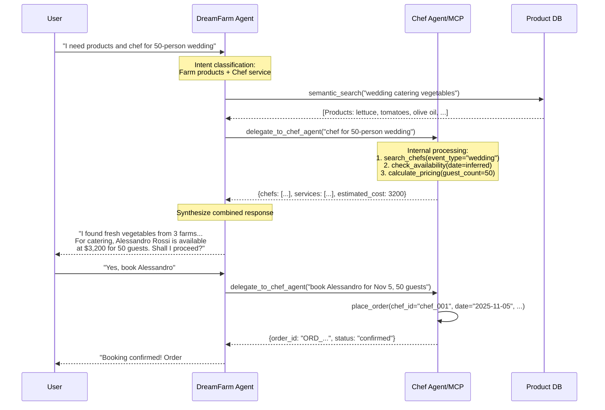

# Dream Farm AI Platform – Unified Architecture & Design

This document describes the **overall architecture** of the Dream Farm AI platform (chat assistant, retrieval, memory, personalization, knowledge graph, tools, multimodal voice). Previous lesson-based increments have been unified into coherent thematic sections for maintainability and onboarding clarity. All feature details are preserved without per‑lesson segmentation.

- [Dream Farm AI Platform – Unified Architecture \& Design](#dream-farm-ai-platform--unified-architecture--design)
  - [1. Purpose \& Vision](#1-purpose--vision)
  - [2. Core Architectural Principles](#2-core-architectural-principles)
  - [3. High-Level Architecture](#3-high-level-architecture)
  - [4. System Components](#4-system-components)
  - [5. Configuration \& Environment](#5-configuration--environment)
  - [6. Security \& Privacy Model](#6-security--privacy-model)
  - [7. Conversation \& Session Management](#7-conversation--session-management)
  - [8. Tool Integration Strategy](#8-tool-integration-strategy)
  - [9. Grounding \& Retrieval (Data Access Stack)](#9-grounding--retrieval-data-access-stack)
  - [10. Knowledge Graph \& Taxonomy](#10-knowledge-graph--taxonomy)
  - [11. Memory \& Personalization](#11-memory--personalization)
  - [12. Voice Interaction (Realtime)](#12-voice-interaction-realtime)
  - [13. Data Schemas (Relational Extract)](#13-data-schemas-relational-extract)
  - [14. API Surface (Representative)](#14-api-surface-representative)
  - [15. Tool Specifications (JSON Schemas – Summaries)](#15-tool-specifications-json-schemas--summaries)
  - [16. Observability \& Telemetry](#16-observability--telemetry)
  - [17. Deployment \& Runtime](#17-deployment--runtime)
  - [18. Workflow Orchestration \& Extension Points](#18-workflow-orchestration--extension-points)
  - [19. Multi-Agent Architecture](#19-multi-agent-architecture)
  - [20. Appendices](#20-appendices)
  - [21. Technical Stack](#21-technical-stack)
  - [22. API Design](#22-api-design)
  - [23. Retrieval \& Search Architecture](#23-retrieval--search-architecture)
  - [24. Semantic Caching (First-Turn Accelerator)](#24-semantic-caching-first-turn-accelerator)
  - [25. Database and Knowledge Graph Schema (production-ready)](#25-database-and-knowledge-graph-schema-production-ready)
  - [26. Thread/Session Management Strategy](#26-threadsession-management-strategy)
  - [27. Project Structure](#27-project-structure)
  - [28. Service Responsibilities](#28-service-responsibilities)
  - [29. Tool Integration Strategy \& Function Interfaces](#29-tool-integration-strategy--function-interfaces)
  - [30. Runtime Configuration Pattern](#30-runtime-configuration-pattern)
  - [31. Development Workflow](#31-development-workflow)
  - [32. Security Considerations](#32-security-considerations)
  - [33. Future Enhancements](#33-future-enhancements)
  - [34. Code Execution \& Dynamic UI Generation](#34-code-execution--dynamic-ui-generation)
  - [35. Observability \& Tracing](#35-observability--tracing)
  - [36. Evaluation \& Safety Framework](#36-evaluation--safety-framework)


---

## 1. Purpose & Vision

Dream Farm is a virtual marketplace connecting local farmers with customers via an AI assistant that can:
- Answer product availability & provenance questions grounded in current catalog + stock
- Retrieve and combine structured & unstructured knowledge (documents, images, taxonomy, graph relations)
- Use tools (internal APIs, MCP servers, web search) safely
- Personalize responses through privacy-preserving memory & user profile preferences
- Support voice-based interaction (hands-free mode)
- Delegate to specialized agents (e.g., Chef Agent for culinary services) via agent-as-tool pattern
- Evolve toward multi-agent collaboration & workflow orchestration

Key non-functional goals: transparency, extensibility, data security (VIP & per-user fencing), reproducibility, minimized hallucination, auditability of personalization.

---

## 2. Core Architectural Principles
1. **Grounded Generation First** – All product-specific claims must originate from retrieved, fenced data.
2. **Separation of Concerns** – Retrieval, reasoning, memory, and tool orchestration are isolated services/modules.
3. **Incremental Feature Flags** – Each capability can be enabled independently (RAG, agentic search, graph, memory, voice).
4. **Provider-Agnostic LLM Access** – Unified OpenAI/Azure client abstraction.
5. **Explainability** – Tool and retrieval steps stream structured meta events (`DF_META`) for UI & logging.
6. **Security-by-Default** – Row-level fencing for VIP products and per-user memory search at SQL layer (not delegated to model).
7. **Lean Prompts** – Profile + memory + retrieval context are bounded with measurable token budgets.
8. **Deterministic Data Pipelines** – Artifacts (taxonomy, embeddings, summaries) versioned & reproducible.

---

## 3. High-Level Architecture

```mermaid
graph TD
  FE[React Frontend<br/>assistant-ui] -->|REST/WebSocket| AG[DreamFarm Agent Backend]
  AG -->|LLM API| LLM[OpenAI / Azure OpenAI]
  AG -->|SQL / Vector| PG[(PostgreSQL + pgvector + AGE)]
  AG -->|HTTP / MCP| TOOLS[MCP & REST Tools]
  PG -->|Embeddings & FTS| AG
  PG -->|Graph (AGE)| AG
  AG -->|Streaming DF_META| FE
```

Deployment (local dev): Docker Compose runs: frontend, agent, PostgreSQL(+extensions), optional tools (stock API, farmer MCP), Keycloak (auth), realtime voice WebSocket.

---

## 4. System Components

### 4.1. Frontend (React + assistant-ui)
- Chat + streaming token rendering with meta event panel
- Auth (OIDC PKCE) with Keycloak (VIP badge detection)
- Runtime config via `public/config.js` (build-once, deploy-anywhere)
- Includes voice capture UI (WebSocket) via singleton `voiceSessionManager` (Strict Mode safe); memory search visualization (planned)

### 4.2. Agent Backend (FastAPI)
- Endpoints: chat, threads, streaming, tools integration, memory, voice realtime, artifacts
- Orchestrates: RAG, agentic tool calls, semantic cache, memory injection
- Emits structured DF_META lines for: tool calls, reasoning, cache hits, graph usage
- Feature flags via environment variables
- **Artifact System**: Stores generated content (code-interpreter images, custom HTML visualizations) with UUIDs; serves via `/artifacts/{id}` with token validation
  - Code-interpreter artifacts: proxied via `/files/{file_id}/content` with bearer or download token validation
  - Custom visualization artifacts: HTML from MCP visualization generator tool, stored in-memory, served via `/artifacts/{id}` with bearer token validation
  - Frontend renders HTML artifacts in sandboxed iframes (no access to parent window/conversation/storage)
- Voice: single `/voice/{thread_id}` WebSocket proxying bidirectional PCM16 audio + transcripts to OpenAI/Azure Realtime (no separate STT/TTS microservices)

### 4.3. Data Layer (PostgreSQL + Extensions)
- **pgvector**: product embeddings, semantic cache, conversation summaries
- **Full-Text Search**: `fts_document / fts_combined` GIN indexes
- **Apache AGE**: taxonomy & relationship graph (BFS taxonomy + DFS similarity)
- **Retentions**: raw conversations (memory), optional summary pruning

### 4.4. Tool Ecosystem
- Internal REST (stock API)
- MCP servers (public farmer tools, web search / Tavily, custom visualization generator)
- Internal function tools (semantic_search, keyword_search, graph_bfs_taxonomy_search, graph_dfs_similarity_search, memory tools)
- Controlled registration based on feature flags

### 4.5. Authentication & Authorization
- Keycloak OIDC (roles → VIP enforcement)
- JWT verification middleware (issuer, audience, signature)
- VIP fencing at SQL query layer only (never trusting LLM filtering)

### 4.6. Observability
- Streaming meta events (DF_META)
- Structured INFO logs for retrieval/graph/memory metrics
- **OpenTelemetry distributed tracing** with dual backends:
  - **Grafana Tempo**: Distributed tracing backend with object storage (MinIO for demo)
  - **Grafana**: Visualization, query interface, service graphs
  - **Langfuse**: LLM-specific observability (prompts, tokens, quality)
- Business dimensions (user_id, is_vip, experiment) propagated through all spans
- NGINX ingress instrumentation for HTTP request tracing
- Future: optional runtime drift / quality sampling service (post manual DeepEval phase)

---

## 5. Configuration & Environment

Unified environment variables (selected, grouped):

| Category | Key | Purpose |
|----------|-----|---------|
| Core LLM | OPENAI_API_KEY, OPENAI_MODEL, OPENAI_BASE_URL, OPENAI_API_VERSION | Provider config |
| RAG | ENABLE_RAG, RAG_SIMILARITY_THRESHOLD, RAG_MAX_RESULTS | Baseline semantic retrieval |
| Agentic Search | AGENTIC_SEARCH_ENABLED, AGENTIC_SEARCH_MAX_RESULTS | Function/tool search mode |
| Graph | GRAPH_SEARCH_ENABLED, AGE_GRAPH_NAME, GRAPH_DFS_MAX_RESULTS | Graph BFS/DFS controls |
| Embeddings | OPENAI_EMBEDDING_MODEL | Standard embedding model |
| Semantic Cache | SEMANTIC_CACHE_ENABLED, SEMANTIC_CACHE_SIMILARITY_THRESHOLD | First-turn cache |
| Auth | AUTH_ENABLED, KEYCLOAK_URL, KEYCLOAK_REALM, KEYCLOAK_AUDIENCE | JWT validation |
| VIP | (implicit via user claims) | Product filtering |
| Memory | CONVERSATION_STORE_ENABLED, MEMORY_SEARCH_ENABLED, USER_PROFILE_ENABLED, MEMORY_CONVERSATION_RETENTION_DAYS, USER_PROFILE_MAX_TOKENS, MEMORY_AUDIT_ENABLED | Conversation storage & summarization |
| Voice | VOICE_ENABLED, VOICE_MODEL | Realtime voice (enable + model); latency-lean tool set (memory_search + optional lightweight product search) |
| Taxonomy | TAXONOMY_* | Category/cuisine generation & classification |

All new memory & voice variables documented in section 11.

---

## 6. Security & Privacy Model
| Layer | Control |
|-------|---------|
| AuthN | OIDC + JWT verification |
| AuthZ | VIP role claim → SQL predicate for product queries |
| Memory Isolation | Hard SQL `WHERE user_id = :current_user` in memory_search |
| Data Minimization | Summaries replace raw logs for semantic recall |
| Prompt Hygiene | Token caps for profile + retrieval blocks |
| Observability Safety | DF_META excludes PII / secrets |
| Retention | Raw conversations purged after configurable window |

---

## 7. Conversation & Session Management
Conversation handling now has a lightweight in‑memory layer plus a durable raw transcript store.

### 7.1. Current mechanics:
1. Thread Lifecycle
  - `POST /threads` creates a thread ID and immediately persists an empty row in `conversations_raw` with an initial `title` (client supplied or generated: "Dream Farm Chat <timestamp>").
  - Title is stored server‑side so it survives restarts (new `title` column added to `conversations_raw`).
2. Message Persistence
  - Each user and assistant turn is appended atomically to the JSONB `messages` array (UPDATE then conditional INSERT for portability across drivers) right after it is accepted / generated.
  - If persistence fails, it is logged (warning) but does not block the user experience.
3. Listing Threads
  - `GET /threads` returns the most recent conversations for the authenticated user ordered by `updated_at DESC`.
  - Default page size: 10 (minimal main screen footprint). Supports `limit` (capped) + `offset` for pagination.
4. Hydration / Fallback
  - On first access after a backend restart, if a thread isn't in memory the server lazily hydrates `_threads` and `_history` from the persisted JSONB messages (mapping each JSON object to an internal message model with synthesized IDs).
  - Subsequent streaming / message operations proceed using in‑memory state + continued persistence.
5. Deletion
  - `DELETE /threads/{id}` removes in‑memory caches and the persisted row (idempotent; 404 if neither existed).
6. Renaming
  - `PUT /threads/{id}/title` updates only the `title` column (validation: non‑empty, max 160 chars, ownership enforced by `user_id`). No PATCH variant is exposed (API deliberately simplified to a single canonical method).
7. Semantic Cache Interaction
  - Still only considered on the very first user message (history length == 1 after hydration).


---

## 8. Tool Integration Strategy
**Categories:**
1. Internal DB-backed retrieval tools (semantic_search, keyword_search)
2. Graph traversal tools (BFS taxonomy, DFS similarity)
3. External MCP tools (farmer utilities, web search)
4. Domain tools (stock API, memory_search, memory_write_profile)

**Registration Flow:**
At request time, the backend builds a tool list conditioned by feature flags + user capabilities (e.g., omit memory tools if MEMORY_ENABLED=false).

**Execution Pattern (Responses API):**
1. Model emits reasoning + function_call items.
2. Backend executes tool(s), accumulates outputs.
3. Submits tool outputs → model continues reasoning.
4. Meta events emitted for transparency (counts, VIP filtering, concept selection, etc.).

---

## 9. Grounding & Retrieval (Data Access Stack)

### 9.1. Simple Semantic RAG
Vector similarity (cosine) over `simple_products.embedding` / `products.embedding` using pgvector. Inject results as `<relevant_products>` block. Feature flag: `ENABLE_RAG`.

### 9.2. Hybrid Retrieval (Semantic + Keyword + RRF)
Pipeline:
1. Semantic similarity list S
2. Keyword extraction (LLM structured) → FTS query list K
3. Reciprocal Rank Fusion (k=60) merges S & K → fused list F
4. F injected into prompt with fused score used as similarity proxy
Resilient to failure (fallback to semantic only). Logging includes counts & fusion specifics.

### 9.3. Agentic Tool-Based Search
Instead of backend fusion, LLM orchestrates multiple tool calls:
- `semantic_search(text)` – vector similarity (+ HyDE optional doc synthesis)
- `keyword_search(keywords[])` – FTS search
VIP fencing enforced inside queries: `WHERE (is_vip = false OR :user_is_vip)`.
Model integrates results; ordering & reasoning handled in LLM layer.

### 9.4. Graph-Augmented Retrieval
Two function-call tools (flagged by `ENABLE_GRAPH_SEARCH`):
- `graph_bfs_taxonomy_search(hypothesis_text, max_hops, limit)` – semantic concept embedding → BFS expansion over Category/Cuisine/Certification to products
- `graph_dfs_similarity_search(product_id, max_depth, limit)` – trait-overlap scoring via shared categories, cuisines, allergens, producer
Concept embeddings stored in relational `concept_embeddings` table with HNSW index; BFS uses semantic selection + constrained expansion. VIP filtering applied post-scoring.

### 9.5. Semantic Cache (First-Turn Accelerator)
Table: `semantic_cache(question, answer, embedding)` with high similarity threshold (e.g., ≥0.90). Used ONLY on first user message; bypasses model call on hit. Answers intentionally generic & time-insensitive.

### 9.6. Retrieval Prompt Grounding Policy
- Product-related claims must originate from `<relevant_products>` or explicit tool results.
- Zero-hit behavior: discourage hallucination; suggest alternative phrasing or general domain advice without inventory claims.
- Graph-derived expansions must reference underlying product IDs for traceability.

---

## 10. Knowledge Graph & Taxonomy
Graph (Apache AGE) complements relational store for multi-hop relationships.

**Vertices:** Producer, Product (lightweight), Category, Cuisine, Certification, Allergen, (optional) RELATED edges.

**Taxonomy Pipeline:**
1. Generate categories + cuisines (structured LLM) → versioned JSON
2. Batch classify products (multi-label) → parquet assignments with confidences
3. Import vertices + edges with `IN_CATEGORY` / `IN_CUISINE` relationships
4. Populate concept embeddings table for BFS semantic selection

**Scoring & Expansion:** BFS concept weighting + trait coverage; DFS similarity weighting (categories > cuisines > allergens > same producer).

**Extensibility:** Future seasonal tags, hierarchical layers, feedback-based reranking.

---

## 11. Memory & Personalization
Three layers: raw transcripts, summaries (semantic recall), user profile.

### 11.1. Tables (Summarized)
| Table | Purpose |
|-------|---------|
| conversations_raw | Store full JSON conversation (7-day retention) |
| conversation_summaries | Summarized + embedded recaps + salient facts |
| user_profiles | Stable personalization facts (diet, allergens, preferences) |
| memory_enrichment_audit (optional) | Track profile mutation diffs |

### 11.2. Tools
- `memory_search(query, k)` – vector similarity over user’s own summaries only
- `memory_write_profile(...)` – write-only patch (diet, allergens, liked products, goals, notes)

### 11.3. Summarization Batch
Script selects finished conversations (`summary_status='pending'`, idle > threshold), generates structured summary + optional profile updates, stores embedding & title, applies merges.

### 11.4. Profile Injection
`<user_profile>` block with token cap (`USER_PROFILE_MAX_TOKENS`). Field priority drop order: liked_products, disliked_products, notes tail. Hash-based dedupe avoids re-sending unchanged block.

### 11.5. Privacy & Fencing
Hard user_id constraint in all queries; no raw message retrieval by model; only summaries & structured facts surface.

### 11.6. Retention
Raw logs purged after `MEMORY_CONVERSATION_RETENTION_DAYS` (default 7). Summaries indefinite unless `MEMORY_SUMMARY_RETENTION_DAYS` set.

### 11.7. User Profile Patch Semantics (`memory_write_profile`)
Objective: allow the model to persist durable user preferences incrementally without ever rewriting the full profile (reduces hallucination & race risk).

Patch schema sent by model (single argument `patch`):
```json
{
  "patch": {
    "set": {"diet": {"vegetarian": true}},
    "append": {"dislikes": ["kozí sýr"]},
    "remove": ["temporary_note"]
  }
}
```
Merge rules implemented in `UserProfileService.apply_patch`:
1. Load existing profile (or `{}` if none).
2. `set`: deep recursive merge – dict values merged, primitives overwrite.
3. `append`: for each key ensure target is list (create if missing), append only primitive values (str/int/float/bool) not already present (idempotent uniqueness).
4. `remove`: delete listed top-level fields if present.
5. Malformed sections are ignored; method never raises to calling tool loop.

Safety / usage constraints (prompt-enforced):
- Invoke only for explicit user request ("remember", "save", "pamatuj si") or clear long‑term preference correction.
- No ephemeral / session-only states (current mood, one-off craving).
- Aggregate multiple changes into one call per turn (avoid multiple sequential patches in same response cycle).
- Never transmit the entire profile back to the server – only delta.

Returned tool output shape:
```json
{
  "applied": true,
  "touched": ["diet", "dislikes"],
  "current": {"diet": {"vegetarian": true}, "dislikes": ["kozí sýr"]}
}

```
`current` contains only the subset of fields affected (post-merge) to minimize token budget while enabling the model to confirm success to user.

Future enhancements (planned): rate limiting (writes/hour), audit trail table, PII category filtering, schema validation gates.

---

## 12. Voice Interaction (Realtime)
Implemented low‑latency bidirectional speech using OpenAI / Azure Realtime API (api-version `2025-04-01-preview` on Azure).

### 12.1. Architecture:
1. Frontend singleton `voiceSessionManager` (outside React component tree) manages mic capture, `AudioContext`, WebSocket, playback queue; Strict Mode remounts no longer break first click.
2. WebSocket endpoint `/voice/{thread_id}` bridges PCM16 audio both ways; server VAD (turn detection) triggers response generation & allows interruption (`speech_started` → cancel in‑flight audio).
3. Allowed tools are intentionally minimal for latency (currently `memory_search` plus optional lightweight product searches; heavy graph tools excluded by default).
4. Transcripts (user + assistant text) are appended as normal conversation messages; raw audio is never persisted.
5. Mute toggles client-side frame suppression without closing the session.
6. Azure nuance: omit unsupported session fields (e.g., `output_modalities`)—client code branches automatically; OpenAI first‑party can include them.

### 12.2. Flags: 
`VOICE_ENABLED`, `VOICE_MODEL` (deployment / model name). Additional per-tool voice flags intentionally deferred until needs arise.

### 12.3. Privacy: 
Only text transcripts stored under existing retention policies; no audio logging.

---

## 13. Data Schemas (Relational Extract)
Key tables (abbreviated – detailed columns preserved from earlier sections):

| Table | Highlights |
|-------|-----------|
| products | product_id (UUID), embedding (vector), fts_document, is_vip |
| stock | (producer_id, product_id), on_stock |
| simple_products | Legacy minimal seed table (teaching) |
| semantic_cache | question, answer, embedding |
| concept_embeddings | concept_type, concept_id, embedding |
| conversations_raw | messages jsonb, expires_at |
| conversation_summaries | summary, embedding |
| user_profiles | profile jsonb |

Indexes: HNSW for vectors, GIN for FTS, btree for lookup & retention scans.

---

## 14. API Surface (Representative)
| Endpoint | Method | Purpose |
|----------|--------|---------|
| /health | GET | Liveness/readiness check |
| /chat | POST | Single-turn chat (previous_response_id optional) |
| /threads | POST | Create conversation thread |
| /threads | GET | List recent threads |
| /threads/{id} | GET | Get thread metadata (title, counts, timestamps) |
| /threads/{id}/title | PUT | Rename thread (update title) |
| /threads/{id} | DELETE | Delete thread and history |
| /threads/{id}/messages | POST | Send message + get assistant response (non-streaming) |
| /threads/{id}/messages/stream | POST | Send message + get streaming assistant response |
| /threads/{id}/messages | GET | Get paginated message history |
| /files/upload | POST | Upload file for code interpreter (returns file_id) |
| /files/{file_id}/content | GET | Download generated file content |
| /artifacts/{artifact_id} | GET | Retrieve custom HTML visualization artifact |
| /voice/{thread_id} | WS | Bidirectional voice interaction (WebSocket) |
| /debug/user-profile/{user_id} | GET | Debug endpoint for user profile inspection |

All endpoints protected (when AUTH_ENABLED=true) except /health.

---

## 15. Tool Specifications (JSON Schemas – Summaries)
| Tool | Args | Returns | Notes |
|------|------|---------|-------|
| semantic_search | text | products[] | VIP-fenced |
| keyword_search | keywords[] | products[] | FTS fallback |
| graph_bfs_taxonomy_search | hypothesis_text, max_hops, limit | products + concepts | Semantic concept selection + BFS |
| graph_dfs_similarity_search | product_id, max_depth, limit | similar_products | Trait overlap scoring |
| memory_search | query, k | summaries[] | User-scoped |
| memory_write_profile | patch fields | status, applied | Write-only personalization |
| get_stock | productIds[] | stock entries | Local API bridge |
| get_current_time / get_seasonal_tips / get_weather | provider-specific | structured | MCP mock utilities |

---

## 16. Observability & Telemetry
DF_META event kinds (examples):
- `search_tool_call` (tool, counts, vip_filtered)
- `graph_tool_call` (concept_selected, expanded_products)
- `hyde_generation` (hash, tokens)
- `semantic_cache_hit` (question)
- `memory_search` (k, hits)
Logs: single-line structured key=value for graph & memory pipelines. Future: metrics export & tracing spans.

---

## 17. Deployment & Runtime
- Local: Docker Compose (agent, frontend, postgres+extensions, keycloak, tools)
- Production (future): Kubernetes (ingress/nginx), scaling per component, secrets via env/secret store, persistent volumes for DB.
- Image build: pinned dependencies via `pyproject.toml` + `uv.lock` for Python, `package.json` for frontend.

### 17.1. Kubernetes Deployment (Azure)
The platform is production‑deployed on Azure Kubernetes Service (AKS) via Terraform infrastructure‑as‑code and Helm charts.

**Infrastructure Components (Terraform):**
- **AKS Cluster**: Managed Kubernetes with CNI networking, system + user node pools
- **Azure Container Registry (ACR)**: Private registry for all container images with AKS pull permissions
- **Azure Database for PostgreSQL Flexible Server**: Managed database with pgvector + Apache AGE extensions
- **Azure AI Services**: OpenAI‑compatible endpoint for LLM + embeddings
- **Static Public IP + DNS**: Ingress‑bound IP with Azure DNS zone integration
- **Nginx Ingress Controller**: TLS termination via cert‑manager + Let's Encrypt
- **Secrets Management**: Kubernetes secrets provisioned via Terraform (DB credentials, API keys, MCP tokens)

**Deployed Microservices (Helm Chart):**
1. **frontend** – React SPA served via Nginx (ingress: `https://domain/`)
2. **dreamfarm-agent** – Main FastAPI backend (ingress: `https://dreamfarm-agent.domain`)
3. **chef-agent** – Specialized culinary agent (ClusterIP, agent‑as‑tool pattern)
4. **api-stock** – Internal stock REST API (ClusterIP only)
5. **keycloak** – OIDC identity provider (ingress: `https://keycloak.domain`)
6. **mcp-chef-services** – MCP server for chef utilities (ingress: `https://mcp-chef-services.domain/mcp`)
7. **mcp-public-farmer-tools** – MCP server for public farmer data (ingress: `https://mcp-public-farmer-tools.domain/mcp`)
8. **mcp-visualization-generator** – MCP server for dynamic visualizations (ingress: `https://mcp-visualization-generator.domain/mcp`)

**Key Configuration:**
- All services share a single Helm chart (`deploy/charts/demo`) with centralized `values.yaml`
- Terraform passes runtime config (DB connection strings, OpenAI keys, domain, registry) via `helm_release` resource
- Ingress annotations enable SSE/streaming (long‑lived connections for chat + MCP servers)
- HorizontalPodAutoscalers defined for all services (CPU‑based scaling)
- Services use liveness/readiness probes for rolling updates

**Build & Push Pipeline:**
Automated Python script (`deploy/azure/docker_build/build_and_push.py`) builds all images from `config.yaml` manifest, tags with commit SHA, and pushes to ACR. Terraform references ACR login server for image pull.

---

## 18. Workflow Orchestration & Extension Points

### 18.1 Complaint Handling Workflow
The platform includes a durable AI‑assisted business workflow (complaint handling) implemented with Temporal to manage multi‑step, stateful resolution paths outside the synchronous chat cycle. Conversational exchanges may trigger a workflow start; subsequent progress occurs independently with reliability features (retries, timers, deterministic replay) inappropriate for ad‑hoc agent loops.

Phases (All Implemented):
1. **Complaint Receipt**: Ingest raw message text + user_id (simplified input model).
2. **LLM Classification**: Confirm input is a complaint; if not, short-circuit with help center redirect.
3. **LLM Extraction**: Extract structured data from message (products, order_id, order_date, reason, evidence) with null handling for missing fields.
4. **User Profile Fetch**: Retrieve user profile (segment, loyalty, score, order/complaint history) - currently mocked with deterministic hash-based generation.
5. **LLM Decision**: Policy-based evaluation with 6 few-shot examples returns action ∈ {VALID, NOT_VALID, HUMAN_REVIEW} + reason + confidence.
6. **LLM Resolution**: Generate appropriate response:
   - VALID → Apologetic message with refund/replacement confirmation
   - NOT_VALID → Professional explanation with reconsideration criteria
   - HUMAN_REVIEW → Structured review packet (summary, arguments for/against, priority, recommended action)

Characteristics:
- Deterministic workflow: branching logic contains no direct side-effects; all external interactions reside in activities.
- Policy-driven: Company policy for farm-to-table marketplace embedded in decision prompt with clear criteria and examples.
- Structured outputs: JSON schemas (classification, extraction, decision, user message, review packet) via Azure OpenAI Responses API with Pydantic validation.
- Observability: each activity logs structured `ORCH_PHASE=<phase>` lines for timeline reconstruction.
- Isolation: module (`orchestration/complaint_workflow`) decoupled from chat session lifecycle; standalone demo with embedded worker pattern.
- Production-ready: All 6 phases implemented and tested with 3 scenarios (valid complaint, human review escalation, non-complaint).
- Direct LLM integration: Uses unified OpenAI client pattern (same as agent) without intermediate routing layer.

### 18.2 Architecture Extension Points
This system favors explicit seams over speculative roadmap tables. Core extension points:

| Area | Extension Mechanism | Contract / Boundary | Notes |
|------|--------------------|----------------------|-------|
| Retrieval | New ranking signal or reranker | `rag_service` fusion hook returns ranked list | Must accept & return `(id, score)` pairs |
| Graph | Additional traversal strategy | New function-call tool returning structured JSON | VIP filtering remains post-join |
| Memory | Extra enrichment sources | Batch pipeline producing profile patch schema | Patches additive & size‑bounded |
| Voice | Alternate realtime provider | Adapter exposing uniform transcript events | Must not change tool set semantics |
| Orchestration | New workflow module | Subfolder under `orchestration/`, Temporal registration | Activities own side-effects |
| Code Execution | New runtime backend | Executor abstraction + artifact interface | Enforce resource/time quotas |
| Tools | Add MCP server | MCP config list; tool schema docstring | Declare privacy & rate limits |
| Security | New data fence | SQL predicate injection layer | Fail closed on evaluation errors |
| Evaluation | Quality metrics / scoring | DF_META consumer or tracing spans | Non-intrusive to prompts |

Extension Design Principles:
- Inversion of control for external providers (LLM adapter, voice, workflows).
- Deterministic core: side-effects pushed to activities/tools.
- Typed schemas for all tool and activity I/O (Pydantic enforced at boundary).
- Fail-open only for non-critical enhancements (e.g., enrichment signals); fail-closed for security/fencing.

### 18.3 Glossary (Selected Terms)
| Term | Definition |
|------|------------|
| RAG | Retrieval-Augmented Generation – augment LLM with external context |
| VIP Fencing | Pre-LLM row-level filtering of restricted catalog rows |
| HyDE | Hypothetical Document Embedding to improve semantic recall |
| BFS Taxonomy | Breadth-first product expansion through concept nodes |
| DFS Similarity | Depth-first trait overlap exploration from a seed product |
| Semantic Cache | High-similarity first-turn Q&A shortcut |
| Code Interpreter | Sandboxed Python execution environment for data analysis and visualization |
| Adhoc UI | Dynamically generated HTML components rendered in secure iframes |
| CSP | Content Security Policy - HTTP header controlling resource loading |
| srcdoc | iframe attribute for injecting HTML directly (safer than external URLs) |
| Temporal Orchestration | Durable, code-first workflow engine for stateful business workflows |

---

## 19. Multi-Agent Architecture

### 19.1. Business Context & Rationale

As the Dream Farm marketplace grows, the business expands beyond simple product catalog queries into adjacent service domains. The first such expansion targets **culinary services**: connecting customers with professional chefs and catering services for events, celebrations, and corporate functions. This creates an opportunity to:

1. **Cross-Sell**: Customers browsing farm products for an event can simultaneously book a chef or catering service.
2. **Service Bundling**: Offer complete solutions (ingredients + preparation + service) rather than just raw products.
3. **Market Differentiation**: Position Dream Farm as a full-stack farm-to-table platform, not just a marketplace.

**Architectural Driver**: As each service domain introduces specialized knowledge, workflows, and data models, a **monolithic agent** approach becomes unwieldy. Different domains benefit from:
- Independent development & deployment cycles
- Specialized prompts & tool sets
- Domain-specific scaling & optimization
- Clear bounded contexts for maintainability

**Solution**: Multi-agent architecture with **agent-as-tool** pattern, enabling the primary DreamFarm Agent to delegate culinary service requests to a specialized **Chef Agent** while maintaining a unified user experience.

---

### 19.2. Chef Agent Overview

**Purpose**: Specialized conversational agent focused exclusively on culinary services, chef discovery, catering coordination, and event planning.

**Scope** (Phase 1 - Educational):
- Simplified implementation (no database)
- Mock data with in-memory consistency (IDs, names, availability stable within session)
- Single MCP server exposing all chef service tools
- Stateless tool calls (no persistent order tracking initially)

**Key Capabilities**:
1. **Chef Discovery**: Search for chefs by specialty (Italian, BBQ, vegan), event type, or skill level
2. **Service Search**: Find catering packages, delivery services, meal prep services
3. **Availability Checking**: Query chef calendars, check booking conflicts
4. **Pricing**: Calculate costs based on guest count, menu complexity, service duration
5. **Order Placement**: Mock order booking with confirmation IDs

**Prompt Role**:
```
You are a culinary services assistant specializing in connecting customers with 
professional chefs and catering services. You help plan events, recommend chefs 
based on cuisine preferences and dietary needs, check availability, and provide 
accurate pricing quotes.

When discussing services:
- Always verify availability before quoting final prices
- Clarify guest count and dietary restrictions early
- Explain what's included in each service tier
- Provide chef profiles with specialties and experience
- Confirm all details before placing orders
```

**Non-Goals** (deferred to future phases):
- Real payment processing (mock confirmations only)
- Chef-side interfaces (agent serves customers, not providers)
- Complex multi-day event coordination
- Integration with external calendar systems

---

### 19.3. Chef Services MCP Server

**Implementation**: Python FastMCP server under `tools/mcp_chef_services/`

**Mock Data Strategy**:
```python
# In-memory data structures (simplified example)
MOCK_CHEFS = [
    {
        "chef_id": "chef_001",
        "name": "Alessandro Rossi",
        "specialties": ["Italian", "Mediterranean", "Pasta"],
        "experience_years": 15,
        "rate_per_hour": 120,
        "bio": "...",
        "certifications": ["Michelin-trained", "ServSafe"]
    },
    # ... 10-15 mock chefs
]

MOCK_SERVICES = [
    {
        "service_id": "svc_001",
        "type": "catering",
        "name": "Corporate Lunch Catering",
        "base_price": 25,  # per person
        "min_guests": 10,
        "includes": ["Setup", "Buffet service", "Cleanup"]
    },
    # ... 8-10 mock services
]

# Simple availability model: blocked dates per chef
MOCK_AVAILABILITY = {
    "chef_001": ["2025-10-15", "2025-10-22"],  # blocked dates
    # ...
}
```

**Tool Definitions**:

#### Tool 1: `search_chefs`
```json
{
  "name": "search_chefs",
  "description": "Search for chefs by specialty, cuisine type, or event requirements",
  "parameters": {
    "type": "object",
    "properties": {
      "specialty": {
        "type": "string",
        "description": "Cuisine type or specialty (e.g., 'Italian', 'BBQ', 'vegan', 'pastry')"
      },
      "event_type": {
        "type": "string",
        "description": "Type of event (e.g., 'wedding', 'corporate', 'private_dinner')"
      },
      "max_results": {
        "type": "integer",
        "default": 5,
        "description": "Maximum number of chefs to return"
      }
    },
    "required": []
  }
}
```
**Returns**:
```json
{
  "chefs": [
    {
      "chef_id": "chef_001",
      "name": "Alessandro Rossi",
      "specialties": ["Italian", "Mediterranean"],
      "experience_years": 15,
      "rate_per_hour": 120,
      "bio": "Award-winning chef specializing in authentic regional Italian cuisine",
      "match_score": 0.95
    }
  ],
  "total_found": 3
}
```

#### Tool 2: `search_services`
```json
{
  "name": "search_services",
  "description": "Search for catering services, delivery options, or meal prep packages",
  "parameters": {
    "type": "object",
    "properties": {
      "service_type": {
        "type": "string",
        "enum": ["catering", "delivery", "meal_prep", "private_chef"],
        "description": "Type of service needed"
      },
      "guest_count": {
        "type": "integer",
        "description": "Number of guests (for capacity filtering)"
      },
      "cuisine": {
        "type": "string",
        "description": "Preferred cuisine style"
      }
    },
    "required": ["service_type"]
  }
}
```
**Returns**:
```json
{
  "services": [
    {
      "service_id": "svc_001",
      "type": "catering",
      "name": "Corporate Lunch Catering",
      "base_price_per_person": 25,
      "min_guests": 10,
      "max_guests": 200,
      "includes": ["Setup", "Buffet service", "Cleanup"],
      "description": "Professional catering for business events..."
    }
  ]
}
```

#### Tool 3: `check_availability`
```json
{
  "name": "check_availability",
  "description": "Check chef or service availability for specific dates",
  "parameters": {
    "type": "object",
    "properties": {
      "chef_id": {
        "type": "string",
        "description": "Chef identifier (from search_chefs)"
      },
      "service_id": {
        "type": "string",
        "description": "Service identifier (from search_services)"
      },
      "date": {
        "type": "string",
        "format": "date",
        "description": "Requested date (YYYY-MM-DD)"
      },
      "duration_hours": {
        "type": "integer",
        "description": "Expected duration in hours"
      }
    },
    "required": ["date"]
  }
}
```
**Returns**:
```json
{
  "available": true,
  "chef_id": "chef_001",
  "date": "2025-11-05",
  "conflicts": [],
  "next_available_date": null
}
```
or if blocked:
```json
{
  "available": false,
  "date": "2025-10-15",
  "conflicts": ["Already booked for wedding event"],
  "next_available_date": "2025-10-18"
}
```

#### Tool 4: `calculate_pricing`
```json
{
  "name": "calculate_pricing",
  "description": "Calculate total cost for chef services or catering based on requirements",
  "parameters": {
    "type": "object",
    "properties": {
      "chef_id": {
        "type": "string",
        "description": "Chef identifier"
      },
      "service_id": {
        "type": "string",
        "description": "Service identifier"
      },
      "guest_count": {
        "type": "integer",
        "description": "Number of guests/servings"
      },
      "duration_hours": {
        "type": "integer",
        "description": "Event duration in hours"
      },
      "menu_complexity": {
        "type": "string",
        "enum": ["simple", "moderate", "complex"],
        "description": "Menu complexity level"
      },
      "additional_services": {
        "type": "array",
        "items": {"type": "string"},
        "description": "Extra services (e.g., 'wine_pairing', 'decorations')"
      }
    },
    "required": ["guest_count"]
  }
}
```
**Returns**:
```json
{
  "total_cost": 3200,
  "breakdown": {
    "chef_fee": 960,  // 8 hours * $120/hr
    "service_fee": 1500,  // 60 guests * $25/person
    "additional": 740,
    "tax": 0  // (mock: no tax calculation)
  },
  "currency": "USD",
  "guest_count": 60,
  "per_person_cost": 53.33,
  "notes": "Includes setup, service, and cleanup. Wine pairing adds $15/person."
}
```

#### Tool 5: `place_order`
```json
{
  "name": "place_order",
  "description": "Place a booking order for chef services or catering",
  "parameters": {
    "type": "object",
    "properties": {
      "chef_id": {
        "type": "string"
      },
      "service_id": {
        "type": "string"
      },
      "date": {
        "type": "string",
        "format": "date"
      },
      "guest_count": {
        "type": "integer"
      },
      "duration_hours": {
        "type": "integer"
      },
      "menu_notes": {
        "type": "string",
        "description": "Dietary restrictions, preferences, special requests"
      },
      "contact_info": {
        "type": "object",
        "properties": {
          "name": {"type": "string"},
          "email": {"type": "string"},
          "phone": {"type": "string"}
        }
      }
    },
    "required": ["date", "guest_count", "contact_info"]
  }
}
```
**Returns**:
```json
{
  "order_id": "ORD_20251015_001",
  "status": "confirmed",
  "chef_name": "Alessandro Rossi",
  "service_name": "Private Dinner Service",
  "date": "2025-11-05",
  "guest_count": 12,
  "total_cost": 1680,
  "confirmation_sent_to": "customer@example.com",
  "next_steps": "Chef will contact you within 24 hours to finalize menu details."
}
```

**Consistency Rules**:
- IDs are deterministic hashes of names (same chef name → same chef_id across calls)
- Availability blocks persist in-memory for session duration
- Pricing calculations use consistent formulas (no random variation)
- Orders generate sequential IDs per session (ORD_YYYYMMDD_NNN)

**Error Handling**:
- Invalid chef_id / service_id: return error with suggestion to search first
- Date in past: reject with clear message
- Capacity violations (guest_count > max_guests): return constraint message

---

### 19.4. Agent-as-Tool Pattern

**Concept**: Expose the entire Chef Agent as a callable tool within the DreamFarm Agent's tool set, enabling seamless domain delegation without the user perceiving separate systems.

**User Experience Flow**:
1. User (in DreamFarm conversation): "I need farm products for a wedding and someone to cook them"
2. DreamFarm Agent:
   - Recognizes culinary service intent
   - Calls `semantic_search` for farm products (own domain)
   - Calls `delegate_to_chef_agent` tool with user request
3. Chef Agent (via tool call):
   - Processes chef/service query
   - Returns structured response
4. DreamFarm Agent:
   - Synthesizes product recommendations + chef service options
   - Presents unified answer to user

**Prompt Orchestration** (DreamFarm Agent extended):
```
You have access to a specialized chef services assistant for culinary needs. 
When the user requests:
- Chef recommendations
- Catering services
- Event cooking
- Meal preparation services

Use the `delegate_to_chef_agent` tool to get expert culinary service information, 
then integrate it with product recommendations from our farm marketplace.

Example: User wants "a chef to prepare Italian dinner for 10 people"
1. Call delegate_to_chef_agent(query="Italian chef for 10 people dinner")
2. Extract chef options and pricing
3. Call semantic_search(text="Italian ingredients pasta olive oil")
4. Combine both in your response
```

---

### 19.5. Integration Approaches

**IMPLEMENTED APPROACH** (Phase 4 Complete): **HTTP-Based Function Tool (Hybrid Pattern)**

The actual implementation combines elements of Option A (direct HTTP communication) with Option C (function tool registration), creating a hybrid pattern optimized for the local/educational context:

**Architecture**:
- Chef Agent runs as standalone FastAPI service (port 8002)
- DreamFarm Agent (port 8001) communicates via HTTP using `ChefAgentClient`
- Exposed to OpenAI as function tool `query_chef_services` (NOT MCP protocol)
- Tool invocations trigger HTTP POST to `http://localhost:8002/query` endpoint

**Rationale for Hybrid Approach**:
1. **Not Pure MCP**: Chef Agent is local service (not internet-exposed), so MCP protocol overhead unnecessary
2. **Function Tool Benefits**: Simpler registration, standard OpenAI function calling pattern, direct HTTP control
3. **Service Independence**: Chef Agent can be restarted/updated without touching DreamFarm Agent code
4. **Educational Clarity**: Clear HTTP boundary between agents visible in logs and network traces

**Key Implementation Details**:
```python
# DreamFarm Agent: services/chef_agent_client.py
class ChefAgentClient:
    async def query(self, message: str) -> str:
        """Delegate query to Chef Agent via HTTP"""
        response = await self.client.post(
            f"{self.base_url}/query",
            json={"message": message}
        )
        return response.json()["response"]

# DreamFarm Agent: services/openai_service.py (tool registration)
{
    "type": "function",
    "function": {
        "name": "query_chef_services",
        "description": "Delegate to specialized Chef Agent for culinary services...",
        "parameters": {...}
    }
}

# Streaming loop handler (main.py)
if function_call.name == "query_chef_services":
    message = json.loads(function_call.arguments)["query"]
    chef_response = await chef_agent.query(message)
    pending_outputs.append({
        "type": "function_call_output",
        "id": function_call.id,
        "output": chef_response
    })
```

**Configuration** (actual environment variables):
```bash
# DreamFarm Agent .env
CHEF_AGENT_ENABLED=true
CHEF_AGENT_URL=http://localhost:8002

# Chef Agent .env
CHEF_AGENT_PORT=8002
OPENAI_API_KEY=<same-or-separate-key>
OPENAI_MODEL=gpt-5
```

**Testing Status** (as of 2025-10-11):
- ✅ Chef Agent: 32/32 tests passing (24 unit + 8 integration in 3min 10sec)
- ✅ DreamFarm Agent: 56/56 tests passing (integration tests include chef_agent parameter)
- ✅ End-to-end: Manual testing confirms full workflow (delegation → Chef Agent → MCP tools → response)
- ✅ Followup queries: Context preservation working via `previous_response_id` pattern

**Critical Bug Fixes During Implementation**:
1. **Continuation Loop Bug**: Fixed duplicate message ID error by using `input_messages = pending_outputs` (replace, not extend)
2. **Response ID Capture**: Always update `response_id_local` from `final_response.id` for followup context
3. **Process Management**: Detect and kill zombie processes on ports before restart

---

**Alternative Approaches Evaluated** (not implemented, documented for reference):

#### Option A: Pure Agent-to-Agent Protocol (Production Scale)
**Mechanism**: Direct HTTP/gRPC communication between agent backends

**Advantages**:
- Clean separation of concerns (each agent = independent service)
- Standard service mesh patterns (retries, circuit breakers, load balancing)
- Language-agnostic (Chef Agent could be Node.js, Go, etc.)
- Easy horizontal scaling per agent type

**Trade-offs**:
- Requires service discovery / endpoint management
- More operational complexity (multiple deployments)

**Implementation Sketch**:
```python
# In DreamFarm Agent
class ChefAgentClient:
    def __init__(self, base_url: str):
        self.base_url = base_url  # http://chef-agent:8002
    
    async def query(self, user_message: str, context: dict) -> dict:
        response = await httpx.post(
            f"{self.base_url}/query",
            json={"message": user_message, "context": context}
        )
        return response.json()

# Registered as tool
{
    "name": "delegate_to_chef_agent",
    "description": "Query chef services agent for culinary assistance",
    "function": lambda query: ChefAgentClient.query(query, {})
}
```

#### Option B: MCP Server Wrapper (Alternative - Not Implemented)
**Mechanism**: Wrap Chef Agent logic inside an MCP server; DreamFarm Agent calls it like any MCP tool

**Advantages**:
- Leverages existing MCP infrastructure
- Unified tool registration pattern
- Easier for educational / demo scenarios (single protocol)

**Trade-offs**:
- MCP not designed for complex stateful conversations (better for atomic tools)
- Loses some agent autonomy (becomes "smart tool" rather than peer agent)

**Implementation Sketch**:
```python
# tools/mcp_chef_agent/server.py
@mcp_server.tool()
async def query_chef_services(query: str, context: dict = None) -> dict:
    """
    Query the chef services agent for culinary recommendations.
    Returns structured chef/service data.
    """
    # Internal: Initialize Chef Agent conversation
    chef_agent = ChefAgentSession()
    response = await chef_agent.process(query, context)
    return response  # Structured JSON
```

#### Option C: Function Calling with Prompt Delegation (Superseded by Hybrid)
**Mechanism**: DreamFarm Agent prompt includes "Chef Agent persona" instructions; uses function calls to Chef MCP tools

**Advantages**:
- No separate deployment
- Simplest for Phase 1 / educational use
- Minimal infrastructure

**Trade-offs**:
- No true agent independence (prompt injection risk)
- Scaling tied to main agent
- Harder to evolve Chef domain separately

**Implementation**: Already implicitly supported (existing MCP tools + extended prompt)

**Decision Matrix**:

| Criteria | A2A Protocol | MCP Wrapper | Function Call |
|----------|-------------|-------------|---------------|
| Independence | ✅ High | ⚠️ Medium | ❌ Low |
| Operational Complexity | ⚠️ High | ✅ Medium | ✅ Low |
| Educational Clarity | ⚠️ Medium | ✅ High | ✅ High |
| Production Readiness | ✅ High | ⚠️ Medium | ❌ Low |
| Phase 1 Suitability | ⚠️ Overkill | ✅ Good | ✅ Good |

**Implementation Path Taken**:
- **Phase 1-3 (Lesson 8 Foundation)**: Chef Services MCP + Chef Agent standalone implementation
- **Phase 4 (COMPLETED 2025-10-11)**: HTTP-based function tool integration (hybrid of Options A + C)
  - All tests passing (88 total: 32 Chef Agent + 56 DreamFarm Agent)
  - Enhanced logging with visual markers for multi-agent flow traceability
  - System prompts optimized (backend agent vs user-facing agent)
  - Critical bug fixes: continuation loop, response_id capture, process management
- **Phase 5 (Future)**: Production deployment (Docker Compose, Kubernetes), Czech documentation, demo scripts

---

### 19.6. Data Flow & Orchestration

**Scenario**: User requests catering for farm product event



**Key Orchestration Points**:
1. **Intent Detection**: DreamFarm Agent classifies multi-domain requests
2. **Parallel Delegation**: Can call product search + chef delegation concurrently
3. **Context Passing**: Shares inferred details (date, guest count) between domains
4. **Response Fusion**: Single coherent answer combining both domains
5. **Transaction Coordination**: (Future) Handle booking + product reservation atomically

---

### 19.7. Configuration & Environment

**Chef Agent / MCP Server**:
```bash
# .env (Chef Agent)
CHEF_AGENT_PORT=8002
OPENAI_API_KEY=<same or separate key>
OPENAI_MODEL=gpt-4o  # or gpt-5

# Mock data configuration
CHEF_MOCK_DATA_SEED=42  # Deterministic random seed
CHEF_AVAILABILITY_WINDOW_DAYS=90  # How far ahead to allow bookings
```

**DreamFarm Agent Integration**:
```bash
# .env (DreamFarm Agent)
CHEF_AGENT_ENABLED=true

# Option A: A2A
CHEF_AGENT_URL=http://chef-agent:8002

# Option B: MCP
CHEF_MCP_SERVER_URL=http://localhost:8003/mcp
CHEF_MCP_API_KEY=<optional>

# Option C: Function Calling (no extra config, just enable tools)
```

**Docker Compose Addition**:
```yaml
services:
  chef-agent:
    build: ./tools/mcp_chef_services
    ports:
      - "8002:8002"
    environment:
      - CHEF_AGENT_PORT=8002
      - OPENAI_API_KEY=${OPENAI_API_KEY}
    networks:
      - dreamfarm
```

---

### 19.7. Configuration & Environment

**Chef Agent / MCP Server** (Implemented):
```bash
# .env (Chef Agent - agents/chef-agent/)
CHEF_AGENT_PORT=8002
OPENAI_API_KEY=<same-or-separate-key>
OPENAI_MODEL=gpt-5

# Chef Services MCP Configuration
CHEF_MCP_SERVER_URL=<azure-or-local-mcp-endpoint>
CHEF_MCP_API_KEY=<optional-api-key>

# Mock data configuration (Phase 1 educational)
CHEF_MOCK_DATA_SEED=42  # Deterministic random seed
CHEF_AVAILABILITY_WINDOW_DAYS=90  # How far ahead to allow bookings
```

**DreamFarm Agent Integration** (Implemented):
```bash
# .env (DreamFarm Agent - agents/dreamfarm-agent/)
CHEF_AGENT_ENABLED=true
CHEF_AGENT_URL=http://localhost:8002
```

**System Prompt Philosophy** (Implemented):
- **Chef Agent**: Backend service prompt emphasizing role as specialized assistant to DreamFarm Agent (not user-facing)
  - Factual, structured responses with clear data formatting
  - Explicit instructions to query MCP tools for all operations
  - No conversational pleasantries (optimized for agent-to-agent communication)
- **DreamFarm Agent**: User-facing conversational prompt with tool delegation awareness
  - Recognizes when to delegate culinary queries to Chef Agent
  - Synthesizes responses from multiple domains (products + chef services)
  - Maintains friendly, helpful tone for end users

**Docker Compose** (Planned - Phase 5):
```yaml
services:
  chef-agent:
    build: ./agents/chef-agent
    ports:
      - "8002:8002"
    environment:
      - CHEF_AGENT_PORT=8002
      - OPENAI_API_KEY=${OPENAI_API_KEY}
      - CHEF_MCP_SERVER_URL=${CHEF_MCP_SERVER_URL}
    networks:
      - dreamfarm
    depends_on:
      - chef-mcp-server

  dreamfarm-agent:
    build: ./agents/dreamfarm-agent
    ports:
      - "8001:8001"
    environment:
      - CHEF_AGENT_ENABLED=true
      - CHEF_AGENT_URL=http://chef-agent:8002
    networks:
      - dreamfarm
    depends_on:
      - chef-agent
```

---

### 19.8. Implementation Status & Testing Results

**Phase Completion** (as of 2025-10-11):
- ✅ **Phase 1**: Chef Services MCP server (complete, previous session)
- ✅ **Phase 2**: Chef Agent standalone implementation (complete)
- ✅ **Phase 3**: Chef Agent testing (32/32 tests passing)
- ✅ **Phase 4.1**: DreamFarm Agent integration (ChefAgentClient, configuration, environment)
- ✅ **Phase 4.2**: Tool registration and streaming loop handler
- ✅ **Phase 4.3**: System prompt optimization for both agents
- 🔄 **Phase 4.4**: DreamFarm Agent integration tests (unit tests updated, integration tests pending)
- 🔄 **Phase 4.5**: End-to-end automated testing (manual tests passing)
- ⏸️ **Phase 4.6**: Docker Compose multi-container configuration (planned)
- ⏸️ **Phase 5**: Czech documentation, demo scripts, production deployment guides (planned)

**Testing Summary**:
```
Chef Agent:
  Unit Tests:        24/24 passed ✅
  Integration Tests:  8/8  passed ✅ (3min 10sec against live Azure MCP)
  Total:             32/32 passed ✅

DreamFarm Agent:
  Unit Tests:        56/56 passed ✅ (after adding chef_agent parameter to test configs)
  Integration Tests: Deselected (require RUN_INTEGRATION_TESTS=1)
  Total:             56/56 passed ✅

Multi-Agent Flow:
  Manual Testing:    ✅ Working end-to-end
  Followup Queries:  ✅ Context preservation via previous_response_id
  Error Handling:    ✅ Chef Agent unavailable gracefully handled
```

**Critical Issues Resolved**:
1. **Duplicate Message ID Error**: Fixed OpenAI Responses API continuation loop by using `input_messages = pending_outputs` (replace pattern)
2. **Response ID Capture**: Always update `response_id_local` from `final_response.id` to maintain conversation chain
3. **Zombie Process Detection**: Added process management checks (netstat + PID kill) before restart
4. **Test Configuration**: Fixed 9 unit test failures by adding `chef_agent=None` parameter to test config builders
5. **Logging Visibility**: Enhanced with visual markers (🔵, 🟢, 🍳, ✅, ❌) for clear multi-agent flow tracking

**Architecture Validation**:
- HTTP-based function tool pattern proven effective for local multi-agent communication
- OpenAI Responses API continuation pattern (ONLY tool outputs on continuation) working correctly
- Agent independence maintained (separate processes, ports, configuration, testing)
- Clear bounded context between agents (product catalog vs culinary services)

**Performance Observations**:
- Chef Agent integration tests: ~23 seconds per test (includes LLM + MCP roundtrips)
- DreamFarm Agent unit tests: <1 second per test (mocked dependencies)
- Multi-agent delegation adds <100ms overhead (HTTP + JSON serialization)
- No noticeable latency impact on user experience (async execution)

**Known Limitations**:
- Integration tests for DreamFarm→Chef delegation not yet automated (manual testing only)
- Docker Compose configuration not yet created (agents run separately in development)
- No production deployment guide (K8s manifests, ingress, secrets management)
- Czech language documentation pending (English only currently)

---

### 19.9. Future Extensibility

**Additional Agent Domains** (potential):
- **Nutrition Agent**: Dietary analysis, meal planning, health recommendations
- **Logistics Agent**: Delivery routing, packaging optimization, sustainability tracking
- **Finance Agent**: Payment processing, invoicing, subscription management
- **Farmer Agent**: Producer-side interface (inventory updates, order fulfillment)

**Multi-Agent Patterns to Explore**:
- **Hierarchical Orchestration**: Supervisor agent delegates to specialist agents
- **Peer Collaboration**: Agents negotiate directly (e.g., Chef + Logistics coordinate delivery)
- **Event-Driven**: Agents subscribe to domain events (order placed → notify logistics)
- **Consensus**: Multiple agents vote on recommendations (nutrition + chef + farmer agree on meal plan)

**Challenges to Address**:
- **Conversation Continuity**: Maintain context across agent boundaries
- **Conflict Resolution**: What if Product Agent and Chef Agent give contradicting advice?
- **Cost Management**: Each agent call = LLM invocation; optimize delegation decisions
- **Latency**: Sequential agent calls add latency; need parallel execution strategies
- **Observability**: Trace requests across multiple agent hops; unified telemetry

**Architectural Safeguards**:
- Agent interfaces remain **stateless** (no shared in-memory state)
- Communication via **structured schemas** (Pydantic models)
- Timeout & circuit breaker policies per agent call
- Fallback to single-agent mode if delegation fails
- Clear **bounded contexts** (no domain bleed between agents)

---

**End of Section 19: Multi-Agent Architecture**

---

## 20. Appendices

### 20.1. Implementation History
Incremental feature development notes and decision rationale maintained in `ImplementationLog.md` for audit trail.

### 19.2. Related Documentation
- `plan.md` files in lesson directories: step-by-step implementation guides
- Component READMEs: operational and usage documentation
- `CommonErrors.md`: troubleshooting guide for recurring issues

---

## 21. Technical Stack

**Backend:**
- **Language**: Python 3.11+
- **Framework**: FastAPI
- **Environment Management**: uv (for virtual environments and packages)
- **Configuration**: python-dotenv for environment variables
- **AI Service**: Azure OpenAI Service or OpenAI API (unified client)
- **Data Validation**: Pydantic models
- **Testing**: pytest
- **Template Engine**: Jinja2 (for prompt templates)

**Database & Storage:**
- **Database**: PostgreSQL 16+
- **Vector Search**: pgvector extension
- **Full-Text Search**: PostgreSQL native FTS with unaccent
- **Graph Database**: Apache AGE (for knowledge graph)
- **Embeddings**: OpenAI text-embedding-3-large (2000 dimensions)

**Frontend:**
- **Framework**: React 18
- **UI Library**: assistant-ui (chat interface)
- **Component Library**: shadcn/ui + Tailwind CSS
- **Build Tool**: Vite
- **Runtime Configuration**: JavaScript file for environment-specific settings
- **TypeScript**: For type safety

**Authentication:**
- **Identity Provider**: Keycloak (OIDC/OAuth2)
- **Token Type**: JWT with RS256
- **Frontend Flow**: Authorization Code + PKCE
- **Backend Validation**: JWT verification via JWKS

**Tools & Integration:**
- **MCP Protocol**: For external tool integration
- **Farmer Tools**: Utility MCP server (time, weather, seasonal tips)
- **Stock API**: REST API for inventory queries
- **Tavily**: Remote MCP for web search
- **Visualization Generator**: MCP for custom HTML generation

**Development Tools:**
- **Package Management**: pyproject.toml (uv-managed, no requirements.txt)
- **Code Quality**: Python logging, docstrings for all public APIs
- **Deployment**: Docker, docker-compose for local development
- **Infrastructure as Code**: Terraform (Azure deployment)

---

## 22. API Design

### 22.1. Base Configuration
- **DreamFarm Agent Port**: 8001 (main AI agent, LLM logic, sessions, CORS)
- **Frontend Port**: 3000 (default for React/Vite)
- **Environment**: `.env` file for DreamFarm agent

### 22.2. Environment Variables
**DreamFarm Agent (.env) - Unified:**
```
# OpenAI (hosted by OpenAI)
OPENAI_API_KEY=your-openai-api-key
OPENAI_MODEL=gpt-5
CORS_ORIGINS=http://localhost:3000

# Azure OpenAI (next-gen v1)
# OPENAI_API_KEY=your-azure-api-key
# OPENAI_BASE_URL=https://your-resource.openai.azure.com/openai/v1/
# OPENAI_API_VERSION=preview
# OPENAI_MODEL=your-azure-deployment-name

# Logging & Performance
LOG_LEVEL=INFO
REASONING_EFFORT=low

# Memory Features (granular flags)
CONVERSATION_STORE_ENABLED=true
MEMORY_SEARCH_ENABLED=true
USER_PROFILE_ENABLED=true

# Voice / Realtime API
VOICE_ENABLED=false

# Code Interpreter Feature
ENABLE_CODE_INTERPRETER=false
CODE_INTERPRETER_CONTAINER_TYPE=auto

# RAG Configuration
ENABLE_RAG=true
RAG_SIMILARITY_THRESHOLD=0.3
RAG_MAX_RESULTS=3

# Semantic Cache (First-Turn Accelerator)
SEMANTIC_CACHE_ENABLED=true
SEMANTIC_CACHE_SIMILARITY_THRESHOLD=0.8

# PostgreSQL Configuration
PGHOST=localhost
PGPORT=5432
PGDATABASE=aidb
PGUSER=admin
PGPASSWORD=your-password

# Embeddings (use same unified scheme)
OPENAI_EMBEDDING_MODEL=text-embedding-3-large

# Remote MCP Tools (Farmer Tools)
FARMER_TOOLS_ENABLED=true
FARMER_TOOLS_MCP_URL=https://farmer-tools.example.org/mcp
FARMER_TOOLS_MCP_API_KEY=your-key

# Remote MCP Tools (Tavily Search)
TAVILY_ENABLED=true
TAVILY_API_KEY=your-key

# Remote MCP Tools (Visualization Generator)
VISUALIZATION_MCP_ENABLED=false
VISUALIZATION_MCP_URL=https://viz-gen.example.org/mcp
VISUALIZATION_MCP_API_KEY=your-key

# Local Stock Tool
STOCK_TOOL_ENABLED=true
STOCK_API_URL=http://localhost:8011

# Authentication (Keycloak)
AUTH_ENABLED=true
KEYCLOAK_URL=http://localhost:8080
KEYCLOAK_REALM=dreamfarm
KEYCLOAK_AUDIENCE=account

# Agentic Search (tool-based retrieval)
AGENTIC_SEARCH_ENABLED=true
AGENTIC_SEARCH_MAX_RESULTS=10

# Graph Search (Apache AGE traversal tools)
GRAPH_SEARCH_ENABLED=true
AGE_GRAPH_NAME=dreamfarm
GRAPH_DFS_MAX_RESULTS=10
```

**Frontend (Runtime Configuration):**
The frontend uses a runtime configuration approach with a `config.js` file:

For **local development**, manually edit `public/config.js`:
```javascript
window.APP_CONFIG = {
  BACKEND_URL: 'http://localhost:8001',  // DreamFarm Agent URL
  API_VERSION: 'v1'
};
```

For **Docker deployment**, environment variables are injected at container startup:
```
REACT_APP_BACKEND_URL=http://your-dreamfarm-agent-url
REACT_APP_API_VERSION=v1
```

The Dockerfile includes a startup script that generates `public/config.js` from environment variables.

### 22.3. OpenAI Provider Configuration (Unified)

The system supports both Azure OpenAI and OpenAI API with a single client.
Use ``OPENAI_BASE_URL`` and ``OPENAI_API_VERSION`` when talking to Azure; omit them for OpenAI-hosted.
```python
# services/openai_service.py (concept)
import os
from openai import OpenAI

def get_openai_client():
  api_key = os.getenv("OPENAI_API_KEY")
  base_url = os.getenv("OPENAI_BASE_URL")  # e.g., https://<resource>.openai.azure.com/openai/v1/
  default_query = {"api-version": os.getenv("OPENAI_API_VERSION", "preview")} if base_url else None
  return OpenAI(api_key=api_key, base_url=base_url, default_query=default_query)

def get_model_name():
  return os.getenv("OPENAI_MODEL", "gpt-5")
```

This abstraction allows the same codebase to work with both providers seamlessly.

---

## 23. Retrieval & Search Architecture

The platform provides multiple complementary retrieval modes:
1. Hybrid RAG (semantic + keyword fusion) – prompt inlined context blocks (internal fusion logic)
2. Agentic tool-based iterative search (function calling) – LLM chooses which retrieval tool(s) to call
3. Graph (Cypher) traversal tools – breadth-first taxonomy expansion and depth-first similarity exploration over Apache AGE graph

VIP fencing (row-level filtering) currently applies only to the agentic tool-based retrieval path; hybrid RAG remains unrestricted (shows full catalog) unless extended later.

### 23.1. Hybrid RAG (Semantic + Keyword with RRF)

The DreamFarm Agent includes a hybrid RAG system combining semantic + full‑text retrieval:

#### 23.1.1. RAG Architecture (Hybrid)
1. **Semantic Pass**: Generate embedding for user query; vector similarity over `simple_products.embedding` (cosine) → ranked list S
2. **Keyword Extraction**: LLM (Responses API structured output) extracts normalized keywords (product names, producer names, salient nouns)
3. **Full‑Text Pass**: Build `to_tsquery` over `fts_combined` from extracted keywords → ranked list K (ts_rank)
4. **Fusion (RRF)**: Apply Reciprocal Rank Fusion score = Σ 1/(k + rank) with k=60 across S and K; produce fused list F (top N = configured `RAG_MAX_RESULTS`)
5. **Prompt Injection**: Format F (same block format) → `<relevant_products>` in system prompt (existing behavior; unchanged downstream)
6. **Logging** (INFO): counts for semantic, keywords, fts, fused

#### 23.1.2. Design Notes
- **Structured Output**: Pydantic `ExtractedKeywords(keywords: List[str])` passed via `response_format` json_schema; deterministic schema for parsing
- **Safety**: Keyword extraction failure → fallback to semantic only; empty keywords skip FTS
- **FTS Query**: OR-joined sanitized keywords (`|`) with `simple` config & `unaccent`; limit = `RAG_MAX_RESULTS` (pre‑fusion diversity kept by fusion step)
- **RRF Justification**: Simple, order‑aware, requires only ranks (not raw scores), robust to heterogeneous scoring scales
- **Score Reporting**: Final `similarity_score` field holds fused score (semantic method unchanged for tests)
- **Extensibility**: Future third signal (graph, stock filters, reranker) can add another ranked list before fusion

#### 23.1.3. RAG Components

**RAGService** (`src/services/rag_service.py`):
- Embedding generation
- Keyword extraction via Responses API structured output
- Vector similarity + FTS search
- Reciprocal Rank Fusion (RRF) combiner
- Result formatting + prompt injection
- Feature flags: `ENABLE_RAG`, interplay with `AGENTIC_SEARCH_ENABLED`

### 23.2. Agentic Tool-Based Retrieval (Function Calling)
Enabled via `AGENTIC_SEARCH_ENABLED=true`. The LLM receives two retrieval tool schemas and decides dynamically which (and how many times) to invoke; the backend does not merge or rerank across tool outputs—each call returns an independent result set the model can reference in subsequent reasoning.

Tools (JSON schema arguments):
- `semantic_search(text: string)` -> returns `{ results: [ { product_id, product_name, producer_name, score, is_vip } ] }` (semantic vector similarity, HyDE capable)
- `keyword_search(keywords: string[])` -> returns same shape (full‑text search)

Workflow:
1. Model may synthesize a HyDE document for the semantic tool (backend optional heuristic for very short questions).
2. LLM issues tool calls; backend executes and returns raw lists (VIP‑filtered if user not VIP).
3. Model integrates referenced products in final answer; ordering/selection is model decision (no backend fusion).
4. Each call emits a `DF_META` line with counts (requested, returned) and VIP filter stats.

Fallback: If agentic search disabled or model opts not to call tools, system uses Hybrid RAG.

HyDE Meta: When generated, truncated hash + token count emitted in a `DF_META` line with kind `hyde_generation`.

### 23.3. VIP Fencing
Applied only in agentic retrieval tool queries:
```
WHERE (products.is_vip = false OR :user_is_vip = true)
```
`user_is_vip` derived from authenticated request context (defaults false if auth disabled). Hybrid RAG path intentionally ignores `is_vip` (shows full catalog) in this phase; policy may evolve later.

**Database Schema (brief):**

simple_products

| Column             | Type          | Constraints           | Description                                      |
|--------------------|---------------|-----------------------|--------------------------------------------------|
| id                 | integer       | primary key           |                                                  |
| product_id         | UUID          | unique, not null      | Product identifier                               |
| producer_name      | varchar(255)  | not null              | Producer name                                    |
| product_name       | varchar(255)  | not null              | Product name                                     |
| product_description| text          | not null              | Product description                              |
| combined_text      | text          | not null              | Preformatted text used for embedding & FTS       |
| embedding          | vector(2000)  |                       | 2000-d embedding (pgvector)                      |
| fts_combined       | tsvector      | trigger-maintained    | Unaccented tsvector over combined_text for FTS   |

Notes
- Vector similarity optimized with an HNSW index on embedding (cosine similarity).
- Additional btree indexes on product_id, producer_name, and product_name for lookups.
- Full-text search enabled via generated column `fts_combined` + GIN index (unaccent + simple config).

### 23.4. Full-Text Search (FTS) Enhancement
Hybrid support: `fts_combined` (trigger-maintained due to unaccent immutability) + GIN index for keyword fallback alongside vector search. Extension: `unaccent`.

---

## 24. Semantic Caching (First-Turn Accelerator)

Purpose: Reduce latency and model cost for extremely common FIRST user turns (greetings, capability questions, generic help requests) by answering from a local cache when the opening user message semantically matches a precomputed canonical question.

Scope & Constraints:
- Only applied to the VERY FIRST user message of a conversation/session (no prior context). Subsequent turns are not cached to avoid misinterpretation without full dialogue history.
- Cache contains only generic, non‑specific Q&A pairs (no concrete product, farmer, stock, price, certification, or allergen references) to avoid stale or hallucinated factual answers.
- Answers are concise, neutral, and encourage the user to proceed with a more specific request if needed.

Data Preparation:
- Generated via `data/scripts/gen_qna.py` using GPT‑5 with structured output (Pydantic) to produce exactly 50 diverse, generic Q&A pairs.
- Output file: `data/source_json/qna.json` with schema:
  ```json
  [ { "question": "...", "answer": "..." }, ... ]
  ```

Database Schema (`semantic_cache`):

| Column      | Type        | Constraints            | Description                                                   |
|-------------|-------------|------------------------|---------------------------------------------------------------|
| id          | serial      | primary key            | Surrogate key                                                 |
| question    | text        | unique, not null       | Canonical generic question (embedding source)                 |
| answer      | text        | not null               | Pre-approved neutral answer                                   |
| embedding   | vector(2000)| not null               | 2000‑d embedding of `question` (text-embedding-3-large)       |
| created_at  | timestamptz | default now()          | Insert timestamp                                              |

Indexes:
- HNSW index on `embedding` (cosine) for fast nearest neighbor match.
- Unique btree on `question` for integrity.

Retrieval Logic (First Turn Only):
1. User sends initial message M (thread has 0 prior messages).
2. Generate embedding for M and run vector similarity against `semantic_cache`.
3. If top similarity >= configured threshold (e.g., 0.90) return cached `answer` immediately (flag response as `cache_hit=true`).
4. Otherwise proceed with normal LLM path (RAG / tools, etc.).

Benefits:
- Cuts cold-start latency for frequent boilerplate intents.
- Reduces token spend for trivial first exchanges.
- Creates deterministic, consistent onboarding tone.

Limitations & Rationale:
- Not applied mid-conversation: meaning shifts with context; risk of incorrect shortcutting.
- No product specifics cached: inventory & catalog are dynamic; those must remain grounded via RAG to avoid stale answers.
- Simple single-table design; future evolutions may add adaptive cache entries from high-frequency production queries plus feedback scoring.

Future Enhancements:
- Add hit/miss telemetry for tuning threshold & pruning low-value entries.
- Periodic regeneration/refinement incorporating anonymized real user phrasing.
- Multi-lingual variant sets keyed by detected language.

---

## 25. Database and Knowledge Graph Schema (production-ready)

This section specifies the target schema for production, with a richer `products` table for hybrid search, a `stock` table, and a knowledge graph using Apache AGE.

### 25.1. Products (relational, hybrid search)

Purpose: primary product catalog optimized for hybrid retrieval (semantic + keyword) and downstream reranking.

Reasoning/tool telemetry (streamed):
- Backend streams model events from the Responses API (semantic event types such as response.output_text.delta, response.web_search_call.*, response.file_search_call.*, response.function_call_arguments.*, and reasoning-related events).
- Non-answer events are emitted as text lines prefixed with `DF_META:` followed by JSON (e.g., `{kind: "tool_event" | "reasoning", event_type: "...", ...}`), and logged at INFO for observability.
- Frontend parses `DF_META:` lines from the stream and renders them in a separate meta panel, clearly distinguished from the assistant answer body.
Columns

| Column             | Type          | Constraints                | Description                                                                 |
|--------------------|---------------|----------------------------|-----------------------------------------------------------------------------|
| id                 | serial        | primary key                | Surrogate key                                                               |
| product_id         | UUID          | unique, not null           | Stable external product identifier                                          |
| producer_id        | UUID          | not null                   | External producer identifier; correlates with Producer vertex (producerId)  |
| producer_name      | varchar(255)  | not null                   | Redundant for search/sorting                                                |
| product_name       | varchar(255)  | not null                   | Product display name                                                        |
| product_description| text          | not null                   | Rich description                                                            |
| combined_text      | text          | not null                   | Concatenated fields used for embeddings                                     |
| embedding          | vector(2000)  |                            | 2000‑d pgvector embedding (text-embedding-3-large)                          |
| fts_document       | tsvector      | not null                   | Generated from name/producer/description for FTS                            |
| is_vip             | boolean       | not null default false     | True = restricted; visible only to VIP users                                |
| created_at         | timestamptz   | default now()              | Row creation timestamp                                                      |
| updated_at         | timestamptz   | default now()              | Row update timestamp                                                        |

Indexes

- HNSW index on embedding using cosine ops for fast vector similarity
- GIN index on fts_document for full‑text search
- BTREE indexes on product_id, producer_id, producer_name, product_name

Notes

- Maintain `fts_document` via trigger (e.g., to_tsvector('english', ...)).
- Use hybrid scoring for candidate retrieval:
  score = 0.6 * (1 - cosine_distance(embedding, :query_vec)) + 0.4 * ts_rank_cd(fts_document, plainto_tsquery(:q))
- Keep `simple_products` as a minimal seed/training/lesson table; `products` supersedes it for production use.

### 25.2. Stock (relational)

Purpose: current stock quantity per product (and producer for provenance).

Columns

| Column       | Type        | Constraints       | Description                              |
|--------------|-------------|-------------------|------------------------------------------|
| producer_id  | UUID        | not null          | Producer that owns the stock entry        |
| product_id   | UUID        | not null          | Product this stock refers to              |
| on_stock     | integer     | not null, default 0 | Current available quantity               |
| updated_at   | timestamptz | default now()     | Last update timestamp                     |

Constraints & Indexes

- Primary key: (producer_id, product_id)
- BTREE indexes on product_id and producer_id (if not covered by PK)

Notes

- Matches generator output in `data/source_json/stock.json` (producerId, productId, onStock).
- If products are unique to a producer, (product_id) could be unique; we keep a composite PK for generality.

### 25.3. Knowledge graph (Apache AGE)

Purpose: model rich relationships (producer → product, certifications, allergens, categories) and enable graph traversals for recommendations, explanations, and exploration.

- Graph name: dreamfarm
- Query language: openCypher via AGE’s cypher() SQL function

Vertices (labels and representative properties)

- Producer { producerId: UUID, name: text, description: text }
- Product { productId: UUID, name: text }
- Certification { certificationId: UUID, name: text, description: text }
- Allergen { allergenId: UUID, name: text }
- Category { categoryId: UUID, name: text, description: text }
- Cuisine { cuisineId: UUID, name: text, description: text }

Edges (relationship types)

- PRODUCES (Producer → Product)
- HAS_CERTIFICATION (Producer → Certification)
- CONTAINS_ALLERGEN (Product → Allergen)
- HAS_CATEGORY (Product → Category)
- HAS_CUISINE (Product → Cuisine)
- RELATED (Product ↔ Product) optional, for curated similarity/co‑purchase signals

Relational ↔ Graph integration (recommended pattern)

- Keep `products` as the system of record for product content, embeddings, and FTS.
- Create lightweight Product vertices that carry only a stable external key `productId` (and `name`) to reference relational rows.
- Mirror producer/certification/allergen entities as vertices with their stable IDs from the JSON/ETL.
- Synchronization: populate/refresh the graph from the relational/JSON sources via ETL jobs; only a small subset of product attributes lives in the graph.
- Query pattern:
  1) Do hybrid retrieval in SQL on `products` to get top-N product_ids with scores.
  2) Use those IDs as parameters to a Cypher query for traversals/enrichment (e.g., producers, certifications, similar products) and optionally re‑rank.
  3) Join the `cypher(...)` results with relational tables on the `productId`/`producerId` properties.

### 25.4. Detailed Taxonomy & Cuisine Enrichment Specification

Goals
- Introduce two higher‑level concept layers (Category, Cuisine) above raw products to enable semantic grouping, faceted exploration, recommendation pivots, and richer natural‑language answers (e.g., "These cheeses fit Italian Mediterranean salads").
- Keep derivation deterministic & auditable (stored artifacts, hash of model prompts, version tags) so future re‑runs can diff changes.

Inputs
- Source product data (relational `products` table or pre‑import parquet) – fields: `product_id`, `product_name`, `producer_name`, `product_description`.
- (Optional) Existing allergens/certifications (can inform category naming for edge cases, but not required for first pass).

LLM Tasks (three sequential phases)
1. Concept Set Generation
  - Prompt model with sampled / summarized product descriptions (NOT entire corpus verbatim) to propose a candidate list of categories (target count configurable) and cuisines.
  - Structured JSON schema with fields: `categories: [{id, name, description}]`, `cuisines: [{id, name, description}]`.
  - Deterministic ID strategy: slug of name (kebab-case) + short hash suffix to avoid collisions (e.g., `fresh-cheese-d4f2`).
2. Concept Refinement (optional human review loop)
  - Script outputs draft set; if `--review` flag provided, write to `processed/taxonomy_concepts.draft.json` and exit for manual edits; otherwise continue automatically.
3. Product Classification
  - Multi‑label assignment using second structured call per batch of products (batch size configurable, default 50) with schema: `assignments: [{product_id, categories: [id], cuisines: [id], confidences: {<id>: float}}]`.
  - Apply local confidence filter (`>= TAXONOMY_MIN_CONFIDENCE`, default 0.55) dropping weak associations.

Artifacts (Versioned)
```
processed/
  taxonomy_concepts.v1.json            # canonical list (categories + cuisines)
  product_taxonomy_assignments.v1.parquet  # columns: product_id, category_ids (array<str>), cuisine_ids (array<str>), meta (JSON)
  product_taxonomy_assignments.v1.json  # (optional) human-readable mirror
```
Versioning Rules: bump minor (v1 -> v1.1) for additive concept descriptions; bump major for structural or ID changes.

Import Workflow
1. Ensure graph exists (`dreamfarm`).
2. Load `taxonomy_concepts.*` → MERGE Category/Cuisine vertices with properties: `{categoryId|cuisineId, name, description, version}`.
3. Load product assignment parquet → for each product edge:
  - MATCH (p:Product {productId}) & (c:Category {categoryId}) MERGE (p)-[:HAS_CATEGORY {version, confidence}]->(c)
  - MATCH (p:Product {productId}) & (cui:Cuisine {cuisineId}) MERGE (p)-[:HAS_CUISINE {version, confidence}]->(cui)
4. Optionally detach & recreate only edges whose version differs to support incremental updates.

Configuration (env vars / flags)
- `TAXONOMY_CATEGORY_TARGET=50`
- `TAXONOMY_CUISINE_TARGET=20`
- `TAXONOMY_MIN_CONFIDENCE=0.55`
- `TAXONOMY_MODEL` (defaults to main chat model)
- `TAXONOMY_BATCH_SIZE=50`
- `TAXONOMY_VERSION=v1`

Planned Scripts (`data/scripts/`)
- `gen_taxonomy_concepts.py` – phases 1–2 (generation + optional review)
- `classify_products_taxonomy.py` – phase 3 (multi‑label classification, parquet + json output)
- `import_taxonomy_graph.py` – graph MERGE of vertices + edges (idempotent, version aware)

Data Models (JSON Schemas – conceptual)
```
// taxonomy_concepts.v1.json
{
  "version": "v1",
  "generated_at": "<iso8601>",
  "categories": [ { "id": "fresh-cheese-d4f2", "name": "Fresh Cheese", "description": "Soft, unripened cheeses..." } ],
  "cuisines":   [ { "id": "italian-78ac", "name": "Italian", "description": "Cuisine featuring regional..." } ],
  "model": {"name": "gpt-5", "embedding": "text-embedding-3-large"},
  "prompt_hash": "sha256:..."
}

// Single assignment row (logical)
{
  "product_id": "<uuid>",
  "categories": ["fresh-cheese-d4f2", "dairy-general-91bf"],
  "cuisines": ["italian-78ac"],
  "confidences": {"fresh-cheese-d4f2": 0.81, "dairy-general-91bf": 0.62, "italian-78ac": 0.74},
  "version": "v1"
}
```
Edge Cases & Safeguards
- Products with extremely short or generic descriptions may yield no assignments (allowed).
- Confidence tie‑breaking: keep all above threshold (no forced top‑k) to avoid premature narrowing.
- Category/Cuisine name collisions collapse via slug+hash; detection logged.
- Re‑run with same input + model should produce same slug IDs (hash includes name only) – descriptions may vary; review gate recommended for stability.

Integration Points
- RAG / Agentic Search Enhancement: allow filtering or boosting by category/cuisine (future flag `ENABLE_TAXONOMY_FILTERS`).
- Answer Generation: graph traversals can fetch sibling products in same category or top categories for a cuisine to enrich recommendations.
- Explanations: surface chain like Product → HAS_CATEGORY → Category.description to justify suggestions.

Observability
- Log counts: total categories/cuisines, mean categories per product, orphan products (0 assignments), duplicate slug collisions.
- Potential metrics table (future): taxonomy_version, run_id, category_count, cuisine_count, coverage_ratio.

Future Extensions
- Add hierarchical Category layering (e.g., Meat -> Poultry -> Chicken) using parent edges.
- Introduce seasonal tags or dietary patterns (vegan, keto) as additional concept layers.
- Feedback loop: capture user selections to refine confidence thresholds.

Security / Safety Considerations
- Human edible example terms only; rely on manual review for sensitive or culturally specific cuisine descriptions.
- All model outputs constrained by schema & max length (truncate/server‑side validation before import).

Failure Handling
- Any phase error aborts before writing partially complete artifacts (write temp file then atomic rename).
- Import script supports `--dry-run` to emit Cypher without executing for review.

This specification operationalizes the high‑level taxonomy bullet so implementation can proceed without further design ambiguity.

Why this split?

- Relational tables excel at hybrid search (pgvector + FTS) and filtering/pagination.
- Graph excels at multi‑hop relationships and explanations (e.g., why is this product recommended?).
- Using `productId`/`producerId` as shared keys keeps the models decoupled but interoperable.

AGE operational notes

- Enable AGE extension and set `search_path = ag_catalog, "$user", public` in sessions that run Cypher.
- Use `SELECT create_graph('dreamfarm');` once, then `cypher('dreamfarm', $$ ... $$)` for DML/queries.
- Store external IDs as vertex properties (e.g., `Product {productId: '...'}`) to bridge to relational tables.

### 26.5. RAG Configuration

**Feature Flag**: Set `ENABLE_RAG=true` to enable semantic search
**Similarity Threshold**: `RAG_SIMILARITY_THRESHOLD=0.7` (0.0-1.0, higher = more strict)
**Max Results**: `RAG_MAX_RESULTS=3` (top N similar products to include)

#### 26.5.1. RAG Workflow
1. User asks: "I need fresh vegetables for a salad"
2. System generates embedding for the query
3. Cosine similarity search finds relevant products (e.g., lettuce, tomatoes, cucumbers)
4. Top 3 results above threshold are formatted as context
5. System prompt includes: `<relevant_products>Product info...</relevant_products>`
6. AI assistant responds with knowledge of available products

#### 26.5.2. Benefits
- **Semantic Understanding**: Finds products by meaning, not just keywords
- **Real-time Context**: Always uses current product database
- **Configurable**: Can be enabled/disabled and tuned via environment variables
- **Scalable**: Uses PostgreSQL with proper indexing for performance

---

## 26. Thread/Session Management Strategy

The system implements a hybrid session API that combines lightweight thread handles with provider-side conversation state via the Responses API.

### 26.1. Session Lifecycle
1. **Create Session**: Frontend calls `POST /threads` to get a session handle (`thread_id`)
2. **Send Messages**: Frontend sends messages via `POST /threads/{thread_id}/messages`
3. **Server-side State**: Backend calls OpenAI Responses API with `store=True` and remembers only the last `response_id` per `thread_id` to continue with `previous_response_id` on the next turn
4. **History**: Backend maintains an in-memory message list for UI display; content is not used to generate responses (Responses API maintains actual conversation state)
5. **Persistence**: Thread metadata and history stored in-memory; conversation state persisted by Responses API; optional database persistence for raw conversations when CONVERSATION_STORE_ENABLED=true

### 26.2. Data Storage
```python
# In-memory storage (main.py)
_threads: dict[str, ThreadModel] = {}
_history: dict[str, list[MessageModel]] = {}  # thread_id -> messages (display only)
_last_response_id: dict[str, str] = {}    # thread_id -> last response_id for continuity
_semantic_cache_bootstrap: dict[str, dict] = {}  # First-turn cache per thread
_generated_file_registry: dict[str, dict] = {}  # Code interpreter file metadata
_html_artifact_registry: dict[str, dict] = {}  # Custom UI artifact storage

# Optional database persistence (when CONVERSATION_STORE_ENABLED=true):
# - PostgreSQL conversations_raw table: Full conversation transcripts
# - PostgreSQL conversation_summaries table: Semantic search over past conversations
# - PostgreSQL user_profiles table: User personalization data
```

### 26.3. Benefits of Hybrid Session API
- **Stateless HTTP**: Each request is independent, easier to scale
- **Provider State**: Uses Responses API server-side state via `previous_response_id`
- **OpenAI Compatible**: Aligns with Responses API conversation model
- **Frontend Friendly**: Easy for React to manage conversation state
- **Optional Persistence**: Memory features can be enabled/disabled independently
- **Debugging**: Easy to inspect conversation history

### 26.4. API Endpoints

**Base URL**: `http://localhost:8001`

#### 26.4.1. POST /chat
Single-endpoint chat using server-side conversation state.

Uses Responses API with `store=true` and `previous_response_id` for continuity.

**Request Body:**
```json
{
  "message": "string",
  "previous_response_id": "string (optional)"
}
```

**Response:**
```json
{
  "response_id": "string",
  "message": "string",
  "timestamp": "string (ISO 8601)"
}
```

**Note**: Stream responses may include meta lines prefixed with `DF_META:` containing JSON telemetry about tool usage or reasoning. Clients should display these separately from assistant text.

#### 26.4.2. POST /threads
Create a new conversation thread.

**Request Body:**
```json
{
  "title": "string (optional)"
}
```

**Response:**
```json
{
  "thread_id": "string (UUID)",
  "title": "string",
  "created_at": "string (ISO 8601)",
  "updated_at": "string (ISO 8601)"
}
```

#### 26.4.3. PUT /threads/{thread_id}/title
Rename (retitle) an existing thread. Only the owning user may rename a thread.

**Request Body:**
```json
{
  "title": "New concise title"
}
```
Validation: non-empty after trimming, <= 160 characters.

**Response:**
```json
{
  "thread_id": "string (UUID)",
  "title": "New concise title",
  "updated_at": "string (ISO 8601)"
}
```

Errors:
- 404 if thread not found (or not owned by user)
- 422 on validation failure

#### 26.4.4. DELETE /threads/{thread_id}
Delete a thread and its persisted raw transcript. Idempotent (second delete returns 404).

**Response:**
```json
{
  "status": "deleted",
  "thread_id": "string (UUID)"
}
```

#### 26.4.5. GET /threads/{thread_id}
Get thread information.

**Response:**
```json
{
  "thread_id": "string (UUID)",
  "title": "string",
  "created_at": "string (ISO 8601)",
  "updated_at": "string (ISO 8601)",
  "message_count": "integer"
}
```

#### 26.4.6. POST /threads/{thread_id}/messages
Send a message in a conversation thread.

**Request Body:**
```json
{
  "message": "string",
  "attachments": ["file_id1", "file_id2"]  // optional, for code interpreter
}
```

**Response:**
```json
{
  "message_id": "string (UUID)",
  "thread_id": "string (UUID)",
  "user_message": "string",
  "assistant_response": "string",
  "timestamp": "string (ISO 8601)"
}
```

#### 26.4.7. POST /threads/{thread_id}/messages/stream
Send a message and stream the assistant response tokens progressively.

Response is a streamed text/plain body with chunks of assistant text as they arrive.

Notes:
- Maintains server-side conversation state using Responses API (store + previous_response_id)
- Uses the same prompt template and optional RAG context as the non-streaming route
- Appends final assistant message to in-memory history when stream completes

#### 26.4.8. GET /threads/{thread_id}/messages
Get conversation history for a thread.

**Query Parameters:**
- `limit`: integer (optional, default: 50)
- `offset`: integer (optional, default: 0)

**Response:**
```json
{
  "thread_id": "string (UUID)",
  "messages": [
    {
      "message_id": "string (UUID)",
  "thread_id": "string (UUID)",
      "role": "user|assistant",
      "content": "string",
      "timestamp": "string (ISO 8601)"
    }
  ],
  "total_count": "integer"
}
```

#### 26.4.9. GET /health
Health check endpoint.

**Response:**
```json
{
  "status": "healthy",
  "timestamp": "string (ISO 8601)"
}
```

### 26.5. Data Models

#### 26.5.1. Chat (Pydantic)
```python
class ChatRequest(BaseModel):
  message: str
  previous_response_id: Optional[str] = None

class ChatResponse(BaseModel):
  response_id: str
  message: str
  timestamp: str
```

#### 26.5.2. Thread (Pydantic)
```python
class Thread(BaseModel):
    thread_id: str
    title: str
    created_at: str
    updated_at: str
    message_count: int

class CreateThreadRequest(BaseModel):
    title: Optional[str] = None

class CreateThreadResponse(BaseModel):
    thread_id: str
    title: str
    created_at: str
    updated_at: str

class ThreadRenameRequest(BaseModel):
  title: constr(min_length=1, max_length=160)
```

#### 26.5.3. Message (Pydantic)
```python
class Message(BaseModel):
    message_id: str
    thread_id: str
    role: str  # "user" | "assistant"
    content: str
    timestamp: str

class SendMessageRequest(BaseModel):
    message: str
    attachments: list[str] = []  # file_ids from /files/upload

class SendMessageResponse(BaseModel):
    message_id: str
    thread_id: str
    user_message: str
    assistant_response: str
    timestamp: str

#### 26.5.5. Health (Pydantic)
```python
class HealthResponse(BaseModel):
    status: str
    timestamp: str
```

---

## 27. Project Structure

```
advanced-ai-applications/
├── agents/
│   ├── AGENTS.md                   # Agent development guidelines
│   └── dreamfarm-agent/            # Main DreamFarm marketplace agent
│       ├── src/
│       │   ├── main.py             # FastAPI app (routes, CORS)
│       │   ├── models/             # Pydantic models
│       │   │   ├── chat.py         # Chat request/response models
│       │   │   ├── thread.py       # Thread and message models
│       │   │   ├── file.py         # File upload models
│       │   │   └── health.py       # Health check models
│       │   ├── services/           # Business logic services
│       │   │   ├── openai_service.py       # OpenAI/Azure OpenAI integration
│       │   │   ├── rag_service.py          # Retrieval-augmented generation
│       │   │   ├── config_service.py       # Configuration management
│       │   │   ├── template_service.py     # Jinja2 prompt templates
│       │   │   ├── agentic_search.py       # Tool-based search
│       │   │   ├── semantic_cache_service.py # First-turn cache
│       │   │   ├── stock_service.py        # Stock API integration
│       │   │   ├── auth_service.py         # JWT authentication
│       │   │   ├── conversation_store.py   # Raw conversation persistence
│       │   │   ├── memory_search_service.py # Memory recall tool
│       │   │   ├── user_profile_service.py  # User profile management
│       │   │   ├── graph_search_service.py  # Apache AGE graph tools
│       │   │   ├── thread_service.py        # Thread management
│       │   │   └── voice_service.py         # Voice/realtime API
│       │   ├── templates/          # Jinja2 prompt templates
│       │   └── utils/              # Helper utilities
│       ├── tests/                  # pytest test suite
│       ├── docs/                   # Agent-specific documentation
│       ├── scripts/                # Utility scripts
│       ├── pyproject.toml          # uv package configuration
│       ├── .env.template           # Environment variable template
│       └── README.md               # Agent setup and usage
├── data/
│   ├── AGENTS.md                   # Data folder guidelines
│   ├── processed/                  # Generated data (Parquet, embeddings)
│   ├── scripts/                    # ETL, embeddings, import scripts
│   │   └── sql/                    # SQL schema files
│   ├── source_json/                # Sample source data
│   ├── images/                     # Image assets
│   ├── videos/                     # Video assets
│   ├── PDFs/                       # PDF documents
│   └── user_upload/                # User-uploaded files (code interpreter)
├── deploy/
│   ├── AGENTS.md                   # Deployment guidelines
│   ├── azure/                      # Azure deployment (Terraform)
│   │   ├── mcp_tools/              # MCP tool infrastructure
│   │   └── README.md
│   ├── kubernetes/                 # Kubernetes manifests
│   └── local/                      # docker-compose and local setup
├── frontend/
│   ├── public/                     # Runtime config (config.js), assets
│   ├── src/                        # React app source
│   │   ├── components/             # UI components
│   │   │   ├── thread.tsx          # Chat thread component
│   │   │   ├── thread-list.tsx     # Thread list sidebar
│   │   │   ├── markdown-text.tsx   # Markdown renderer
│   │   │   ├── file-upload-button.tsx # File upload
│   │   │   ├── voice-button.tsx    # Voice interaction
│   │   │   ├── visualization-artifact.tsx # HTML artifact renderer
│   │   │   └── ui/                 # shadcn/ui components
│   │   └── services/               # API clients and adapters
│   │       ├── api.ts              # DreamFarm Agent API client
│   │       ├── auth.ts             # Authentication service
│   │       └── chatAdapter.ts      # assistant-ui adapter
│   ├── scripts/                    # Build and deployment scripts
│   ├── package.json                # npm dependencies
│   └── README.md                   # Frontend setup and usage
├── docs/                           # Project-wide documentation
│   ├── Design.md                   # Architecture and design (this file)
│   ├── ImplementationLog.md        # Implementation history and decisions
│   └── CommonErrors.md             # Troubleshooting guide
├── identity/                       # Keycloak setup and provisioning
├── lessons/                        # Educational lesson materials
│   ├── AGENTS.md
│   ├── L00_prep/
│   ├── L01_chat_with_simple_rag/
│   ├── L02_tools/
│   ├── L03_kb/
│   ├── L04_agentic_search/
│   ├── L05_memory_and_voice/
│   ├── L06_adhoc_coding/
│   └── L07_orchestration/
├── postgresql/                     # PostgreSQL Dockerfile with extensions
├── scripts/                        # Miscellaneous utility scripts
├── tools/                          # AI tools (MCP servers and APIs)
│   ├── api_stock/                  # Stock REST API
│   ├── mcp_public_farmer_tools/    # Farmer utility MCP server
│   └── mcp_visualization_generator/ # HTML visualization MCP server
├── AGENTS.md                       # Root agent development guidelines
└── README.md                       # Project overview
```

---

## 28. Service Responsibilities

### 30.1. DreamFarm Agent (Port 8001)
**Purpose**: Main AI agent for the Dream Farm marketplace
- **LLM Integration**: Azure OpenAI Service or OpenAI API communication
- **Session API**: Lightweight `/threads` endpoints for session handles; Responses API maintains conversation state
- **Business Logic**: Dream Farm marketplace domain logic
- **MCP Integration**: Tool calling and coordination with remote MCP servers
- **CORS Handling**: Frontend communication
- **API Endpoints**: All REST endpoints for the Dream Farm application
- **Agent Orchestration**: Can coordinate with other agents in multi-agent scenarios

### 30.2. Future Agents
- **Chef Agent**: Specialized agent for cooking/catering services
- **Other Domain Agents**: Additional specialized agents as business grows

### 30.3. Infrastructure
- **nginx/Envoy**: For production load balancing, SSL, static files
- **Authentication**: Can be added as middleware to agents or separate service

---

## 29. Tool Integration Strategy & Function Interfaces

### 30.1. MCP vs REST API Decision

**Use MCP Protocol for:**
- RAG/knowledge base queries
- Web search integration
- External API integrations
- Data processing tools
- Knowledge graph queries
- Multi-agent communication

**Use Direct Integration for:**
- Database connections (PostgreSQL with pgvector)
- Authentication/authorization
- Session management
- File uploads/storage
- Core business logic
- Frontend-backend communication

### 30.2. Benefits of MCP-First Approach

1. **Standardized Interface**: All tools speak the same protocol
2. **AI-Native Design**: MCP is designed specifically for AI tool integration
3. **Composability**: Easy to add/remove tools without changing core application
4. **Independent Development**: Tools can be developed and deployed separately
5. **Educational Value**: Students learn modern AI application patterns
6. **Future-Proof**: Aligns with emerging AI tooling standards

This approach allows the API Gateway to remain focused on core business logic while delegating specialized tasks to dedicated MCP servers.

### 30.3. AI Tools Overview

Tools live under `tools/` (standalone services / MCP servers) or as internal function-call interfaces exposed to the LLM. Scope:

- mcp_public_farmer_tools (MCP, Python)
  - Purpose: simple utility/tooling for the assistant without external dependencies.
  - Implementation: Python using the MCP server library; exposed over stdio for local development and pluggable into the agent.
  - Tools
    - get_current_time() -> string current time in ISO 8601
    - get_seasonal_tips() -> list of up to 10 typical seasonal products for the current period (mocked, e.g., strawberries in summer)
    - get_weather(country: string, city: string) -> JSON mock with fields: temperature, humidity, wind, precipitation
  - Notes: returns mock data (no network calls); great for demos and deterministic testing.

- api_stock (HTTP API)
  - Purpose: read-only facade over the relational `stock` table for quick lookups from the assistant or other services.
  - Request: accepts an array of productIds; Response: JSON map/array with each productId’s current on-stock quantity and timestamp.
  - Integration: direct HTTP calls from the DreamFarm Agent. Optionally wrapped as an MCP tool later.
  - Notes: read-only; aligns with `data/source_json/stock.json` shapes (producerId, productId, onStock).

- Tavily Remote MCP (SaaS web search)

### 30.4. Internal Function-Call Interfaces (Agentic Retrieval)
- `semantic_search` (arguments: text: string) – semantic vector similarity (HyDE capable) with VIP fence.
- `keyword_search` (arguments: keywords: string[]) – full‑text search over `fts_document` / `fts_combined` with VIP fence.

Return schema (for each call) list of products `[product_id, product_name, producer_name, score, is_vip]`.

No backend fusion: model may call tools multiple times and integrate / compare results itself.

Telemetry: Each invocation emits `DF_META` line (`search_tool_call`) with counts pre/post VIP filter.

### 30.5. Graph Traversal Retrieval

Objective: Expose the knowledge graph (Apache AGE) as an additional retrieval surface complementary to vector/FTS tools, enabling the LLM to:
- Start from abstract user intent → hypothesize likely higher‑level concepts (categories, cuisines, allergens, certifications) → fan out to candidate products (breadth-first taxonomy expansion).
- Start from a specific product (identified via prior retrieval/tool output or user mention) → walk outward to discover closely related products sharing multiple relationship traits (depth-first similarity traversal).

Feature Flag:
`ENABLE_GRAPH_SEARCH` (default: false). When true and agentic search enabled, two new function-call tools are registered.

Tools (proposed JSON schemas):
1. `graph_bfs_taxonomy_search` arguments:
  - `hypothesis_text: string` – free-form natural language; model may embed conceptual cues (e.g., "looking for mild Italian cheeses without nuts")
  - `max_hops: int` (optional, default 2, max 3) – breadth expansion depth (Category/Cuisine → Product, optionally via Producer)
  - `limit: int` (optional, default 10, max 25) – cap on returned products
  Returns: `{ products: [ { product_id, product_name, producer_name, via: [conceptIds], match_score } ], concepts: [ { id, type, name } ] }`

2. `graph_dfs_similarity_search` arguments:
  - `product_id: string` (UUID – starting product)
  - `max_depth: int` (optional, default 3, max 4) – DFS depth exploring similarity edges (shared Category/Cuisine/Allergen/Certification/Producer)
  - `limit: int` (optional, default 10, max 25)
  Returns: `{ start_product: { product_id, product_name }, similar_products: [ { product_id, product_name, shared_traits: [ { kind, id, name } ], similarity_score } ] }`

#### 30.5.1. Clarification: DFS Similarity Tool Rationale
The `graph_dfs_similarity_search` tool intentionally centers on trait overlap (Categories, Cuisines, Certifications, Allergens, Producer) to surface products that are *structurally* similar in the knowledge graph. It does NOT perform semantic embedding similarity itself — that happens earlier (e.g., via semantic product search) and this DFS tool refines or broadens recommendations by relationship structure. Its scoring (weights per trait family) is documented below; no changes needed at this time.

---

### 30.6. Breadth-First Taxonomy Search (Updated Design: Semantic Concept Matching First)

Earlier draft examples showed ad‑hoc text matching (ILIKE / CONTAINS) against concept names/descriptions. We are replacing that with a semantic concept selection phase to produce more robust recall and nuanced alignment with user intent. This section supersedes any prior LIKE‑based concept matching references.

#### 30.6.1. Design Motivation
User queries describing desired attributes (e.g., “mild Italian cheese without nuts certified organic”) combine multiple abstract facets. Literal substring filtering is brittle (pluralization, synonyms, language drift). A semantic embedding layer over higher‑level concept entities (Category, Cuisine, Certification, Allergen) provides resilient matching and ranking before graph expansion.

#### 30.6.2. Key Decisions
1. Do **not** store embeddings directly inside AGE vertex properties for similarity search. While AGE lives in PostgreSQL, AGE itself does not expose native vector indexing operators; we instead leverage **pgvector** in dedicated relational tables and then bridge via shared IDs.
2. Maintain a **unified concept embeddings table** covering all supported concept types instead of one table per type to simplify maintenance and multi‑type ranking.
3. Keep graph vertices lean (IDs + minimal display properties) and perform semantic retrieval outside the graph; then pass selected vertex IDs into controlled BFS expansion.
4. Support **negative constraints** (e.g., “without nuts”, “no dairy”) via lightweight structured extraction so we can exclude or penalize conflicting traits early.
5. Provide explicit configurability for per‑type weights and similarity thresholds to tune precision vs. recall.

#### 30.6.3. Data Structures (Relational Layer)
`concept_embeddings` (new table – conceptual schema):
| Column | Type | Notes |
| ------ | ---- | ----- |
| concept_type | enum(text) | one of: category, cuisine, certification, allergen |
| concept_id | text/uuid | Matches the corresponding vertex property (e.g., categoryId) |
| name | text | Canonical name |
| description | text | Concise neutral description (same source as graph) |
| normalized_text | text | Preprocessed (lowercased, de-accented) concatenation used for embedding source (name + description) |
| embedding | vector(2000) | pgvector embedding (text-embedding-3-large) |
| created_at | timestamptz | audit |
| updated_at | timestamptz | audit |

Indexes / Performance:
- HNSW index on `embedding` (cosine) for similarity.
- Composite btree on (`concept_type`, `concept_id`).
- Optional partial index for active concepts if future soft deletes are introduced.

#### 30.6.4. Environment / Config Additions
| Variable | Purpose | Default |
| -------- | ------- | ------- |
| `GRAPH_BFS_CONCEPT_TOP_K_PER_TYPE` | Max semantic matches kept per type before expansion | 5 |
| `GRAPH_BFS_MIN_SIMILARITY` | Minimum similarity (cosine) to accept a concept | 0.75 |
| `GRAPH_BFS_GLOBAL_MAX_CONCEPTS` | Absolute cap after merging types (pre‑BFS) | 15 |
| `GRAPH_BFS_TYPE_WEIGHTS` | JSON map of weights, e.g. `{"category":1.0,"cuisine":1.0,"certification":0.6,"allergen":0.5}` | (shown) |
| `GRAPH_BFS_NEGATIVE_ENFORCE` | If true, exclude products violating negative constraints | true |
| `GRAPH_BFS_NEGATIVE_PENALTY` | If enforcement is soft, scalar penalty applied | 0.8 |
| `GRAPH_BFS_PRODUCT_DIVERSITY_PENALTY` | Penalize overrepresentation of a single concept | 0.15 |
| `GRAPH_BFS_SCORE_NORMALIZE` | Normalize final product scores to 0..1 | true |

#### 30.6.5. Input & Structured Extraction
Tool input: `hypothesis_text` (free form), `max_hops`, `limit`.

Pre‑processing (LLM structured extraction schema conceptually):
```
{
  "positive_cues": ["mild", "Italian", "cheese", "organic"],
  "negative_cues": ["nuts"]
}
```
This step is optional but improves negative constraint handling. If extraction fails, proceed with raw text embedding and skip negative filtering (fail‑open, transparent in telemetry).

#### 30.6.6. Semantic Concept Selection Algorithm (Pseudo Steps)
1. Receive `hypothesis_text`.
2. (Optional) Extract positive/negative cues.
3. Generate embedding for `hypothesis_text` (single pass; do **not** split unless text length exceeds model safe window – future optimization).
4. Perform vector similarity search over `concept_embeddings` retrieving top `GRAPH_BFS_CONCEPT_TOP_K_PER_TYPE * (#types)` raw candidates.
5. Group by `concept_type`, apply similarity threshold & per‑type top‑k trimming.
6. Merge groups, apply `GRAPH_BFS_GLOBAL_MAX_CONCEPTS` cap using interleaving for type diversity (round‑robin or weighted).
7. Record telemetry: counts per type, filtered out below threshold, final selected.
8. Produce ordered concept seed list with (concept_id, concept_type, similarity_score, weight = type_weight * similarity_score).

#### 30.6.7. BFS Expansion (Concept → Product)
1. Initialize frontier with selected concept vertex IDs (Category/Cuisine/Certification). Allergens appear only if user *explicitly* wants inclusion; otherwise they act mainly as negative constraints (avoidance). We keep allergen vertices optional in frontier to avoid recommending allergen-rich items when user intent is exclusionary.
2. Execute constrained breadth expansion up to `max_hops` (default 2):
   - Hop 1: Concept → Product edges (`HAS_CATEGORY`, `HAS_CUISINE`, `HAS_CERTIFICATION`).
   - Optional Hop 2 (only if room and diversity low): Producer pivot (Concept → Product ← Producer → Product) to widen variety.
3. Collect candidate product IDs with per‑product matched concept set (and path metadata for explainability).
4. Early stop if candidate set exceeds safety bound (e.g., 5 * requested limit) – mark `truncated=true` in telemetry and continue to scoring subset.

#### 30.6.8. Product Scoring (Heuristic)
For each candidate product:
```
base_score = Σ (concept_weight for each matched concept)
trait_coverage = matched_concept_count / min(total_selected_concepts, coverage_denominator)
diversity_adjustment = (1 - repetition_factor) * GRAPH_BFS_PRODUCT_DIVERSITY_PENALTY
score = base_score * (0.5 + 0.5 * trait_coverage) + diversity_adjustment
```
Negative constraints:
* If `GRAPH_BFS_NEGATIVE_ENFORCE=true` and product contains excluded allergen → drop.
* Else apply `score *= GRAPH_BFS_NEGATIVE_PENALTY`.
Normalize scores if configured.

Return top `limit` products with:
```
{
  "products": [ { product_id, product_name, producer_name, via: [concept_ids], match_score } ],
  "concepts": [ { id, type, name, similarity_score } ],
  "meta": { truncated, negative_constraints_applied, concept_counts, elapsed_ms }
}
```

#### 30.6.9. VIP Filtering Interaction
Apply VIP fencing *after* BFS product scoring but before final truncation: remove VIP products if user not VIP, then re-rank remaining (no score recomputation unless large removals force re-normalization). Telemetry records pre/post counts.

#### 30.6.10. Observability & Telemetry
`DF_META` line (kind: `graph_tool_call`) fields:
```
{
  "tool": "graph_bfs_taxonomy_search",
  "concept_candidates": {"category": N1, "cuisine": N2, ...},
  "concept_selected": total_selected,
  "products_expanded": raw_product_count,
  "products_after_vip": filtered_count,
  "negative_constraints": {"count": M, "mode": "enforce|penalize|none"},
  "truncated": bool,
  "elapsed_ms": int
}
```

#### 30.6.11. Failure & Fallback Behavior
| Condition | Action |
| --------- | ------ |
| No concept passes threshold | Fallback to hybrid product RAG (semantic + keyword) and note `concept_fallback=true` |
| Empty product expansion | Return empty list (not an error) + suggestion for user clarification |
| Extraction timeout | Skip extraction; proceed with raw text embedding |
| Vector search timeout | Reduce per-type top-k (halve) and retry once; else fallback |

#### 30.6.12. Advantages of This Approach
- Robust to synonymy / paraphrasing (“nut-free”, “without nuts”).
- Encourages explainable output (assistant can cite matched concept names and why chosen).
- Clean separation of concerns: semantic retrieval (relational + pgvector) → structural expansion (graph) → heuristic fusion.
- Extensible: new concept layers (Season, DietaryPattern) simply add rows to `concept_embeddings` and graph vertices/edges.

#### 30.6.13. Future Enhancements
1. Adaptive threshold: dynamic similarity floor based on distance gap between top and median candidate.
2. Embedding caching: reuse embedding for subsequent refinement turns if user rephrases intent.
3. Per‑concept decay: reduce weight for extremely common concepts (e.g., “organic”) using inverse document frequency style factor.
4. Lightweight learned reranker: train small logistic model on interaction feedback to replace heuristic scoring.
5. Multi‑lingual support: add language column + parallel embeddings; pick embedding space by detected query language.

---

### 30.7. Summary of Graph Tools After Update
| Tool | Primary Purpose | Similarity Basis | Expansion Mode |
| ---- | ----------------| ---------------- | -------------- |
| `semantic_search` | Product-level semantic retrieval | Vector (products.embedding) | None (direct) |
| `keyword_search` | Product full-text retrieval | FTS rank | None |
| `graph_bfs_taxonomy_search` | Abstract intent → concept semantic match → product breadth | Vector (concept_embeddings) + graph structure | BFS (concept-frontier) |
| `graph_dfs_similarity_search` | Given product → structurally similar products | Graph trait overlap weights | DFS-style trait aggregation |

This updated design removes dependence on ad‑hoc textual LIKE scanning for high‑level concepts and formally introduces a semantic concept retrieval layer feeding the BFS expansion.

### 30.8. Cypher Query Patterns (conceptual):

Breadth-First (taxonomy expansion):
```
-- Pseudocode Cypher (executed through cypher('dreamfarm', $$ ... $$))
// 1) Identify candidate concept vertices by fuzzy/ILIKE matching names/descriptions against tokens derived from hypothesis_text
MATCH (c:Category)
WHERE toLower(c.name) CONTAINS $token OR toLower(c.description) CONTAINS $token
WITH DISTINCT c LIMIT 40
OPTIONAL MATCH (c)<-[:HAS_CATEGORY]-(p:Product)
OPTIONAL MATCH (p)-[:PRODUCES]-(:Producer) // lightweight enrichment
RETURN c.categoryId AS concept_id, c.name AS concept_name, collect(DISTINCT p.productId)[0..$limit] AS product_ids
```
Follow-up: Resolve `product_ids` to relational `products` table for names + ranking heuristic:
`match_score = (#matched_concepts_for_product) + 0.1 * diversity_bonus`.

Depth-First (similarity from a product):
```
// Gather traits of the starting product
MATCH (p:Product {productId: $product_id})
OPTIONAL MATCH (p)-[:HAS_CATEGORY]->(cat:Category)
OPTIONAL MATCH (p)-[:HAS_CUISINE]->(cui:Cuisine)
OPTIONAL MATCH (p)-[:CONTAINS_ALLERGEN]->(alg:Allergen)
OPTIONAL MATCH (p)<-[:PRODUCES]-(prod:Producer)
WITH p, collect(DISTINCT cat) AS cats, collect(DISTINCT cui) AS cuis,
    collect(DISTINCT alg) AS algs, prod
// Find other products sharing traits
MATCH (other:Product)
WHERE other <> p
OPTIONAL MATCH (other)-[:HAS_CATEGORY]->(cat2:Category)
OPTIONAL MATCH (other)-[:HAS_CUISINE]->(cui2:Cuisine)
OPTIONAL MATCH (other)-[:CONTAINS_ALLERGEN]->(alg2:Allergen)
OPTIONAL MATCH (other)<-[:PRODUCES]-(prod2:Producer)
WITH other,
    size([x IN cats WHERE x IN collect(DISTINCT cat2)]) AS cat_overlap,
    size([x IN cuis WHERE x IN collect(DISTINCT cui2)]) AS cui_overlap,
    size([x IN algs WHERE x IN collect(DISTINCT alg2)]) AS alg_overlap,
    CASE WHEN prod2 = prod THEN 1 ELSE 0 END AS same_producer
WITH other,
    (cat_overlap * 1.0) + (cui_overlap * 0.8) + (alg_overlap * 0.5) + (same_producer * 0.3) AS similarity_score,
    cat_overlap, cui_overlap, alg_overlap, same_producer
WHERE similarity_score > 0
ORDER BY similarity_score DESC
LIMIT $limit
RETURN other.productId AS product_id, similarity_score, cat_overlap, cui_overlap, alg_overlap, same_producer
```
Post-processing: build `shared_traits` array by re-matching only required trait vertices for top results.

Scoring Rationale:
- Categories & cuisines express conceptual similarity → higher weights.
- Allergens reflect composition overlap (useful but weaker for recommendation diversity).
- Same producer suggests catalog adjacency (mild boost; avoids monopolizing list).

Security / Fencing:
- VIP filtering applied after relational join (same rules as other tools) unless future policy extends VIP property to graph vertices.
- Depth-first traversal restricts max node/edge expansions (`max_depth`, LIMIT) to avoid runaway cost.

Error Handling & Timeouts:
- Each graph tool call bounded by server-side statement timeout (e.g., 2s) – on timeout: return partial results (if any) with `incomplete=true` meta.
- Empty match gracefully returns empty arrays (never an error unless Cypher failure).

Observability:
- Emit `DF_META` lines with `graph_tool_call` including: tool_name, elapsed_ms, candidate_concepts, expanded_products, post_vip_count, truncated (bool).
- Log raw Cypher (parameterized form) at DEBUG only (no sensitive data) for troubleshooting.

Integration Flow (LLM side):
1. Model may call `semantic_search` first to anchor concrete product(s).
2. Then call `graph_dfs_similarity_search` with a chosen `product_id` to propose related products.
3. Alternatively, model starts with `graph_bfs_taxonomy_search` when the user provides abstract intent lacking explicit product names.
4. Final answer cites concept names or shared traits for explainability (encouraged by tool descriptions).

Future Enhancements:
- Add hybrid reranking (vector similarity + graph similarity) for candidate fusion.
- Introduce precomputed similarity edges (RELATED) from batch analytics to speed DFS queries.
- Cache high-frequency taxonomy BFS expansions keyed by normalized hypothesis tokens.

Testing Strategy:
- Unit tests: mock Cypher responses to validate ranking & post-processing.
- Integration tests (flagged): require running AGE-enabled PostgreSQL; will skip if `ENABLE_GRAPH_SEARCH` false or AGE absent.
- Performance smoke: assert BFS/DFS tool calls complete under threshold on sample dataset.

**Tavily Remote MCP (Web Search):**
  - Purpose: real-time internet search and extraction to augment answers beyond local data.
  - Integration: connect to Tavily’s remote MCP server as an MCP tool in the LLM call. Server URL: `https://mcp.tavily.com/mcp/?tavilyApiKey=<your-api-key>` (requires a Tavily API key).
  - Capabilities: search, extract, map, crawl (we primarily use `tavily-search` and `tavily-extract`).
  - Notes: used only when web context is needed; disabled by default to keep flows deterministic in controlled environments.

---

## 30. Runtime Configuration Pattern

The frontend uses a runtime configuration approach to support different environments without rebuilding the application:

### 30.1. Development Flow
1. **Local Development**: Manually edit `public/config.js` with local backend URL
2. **Docker Build**: Application is built once with a config template
3. **Container Start**: Startup script generates `config.js` from environment variables
4. **Application Load**: React app reads configuration from `window.APP_CONFIG`

### 30.2. Implementation Details

**Config Template (`public/config.js.template`):**
```javascript
window.APP_CONFIG = {
  BACKEND_URL: '${REACT_APP_BACKEND_URL}',
  API_VERSION: '${REACT_APP_API_VERSION}'
};
```

**Startup Script (`scripts/generate-config.sh`):**
```bash
#!/bin/sh
# Replace environment variables in config template
envsubst < /app/public/config.js.template > /app/public/config.js
# Start the web server
exec "$@"
```

**React Service (`src/services/api.ts`):**
```typescript
// Access runtime configuration
const config = (window as any).APP_CONFIG;
const BACKEND_URL = config?.BACKEND_URL || 'http://localhost:8001';
```

This pattern enables:
- **Build Once, Deploy Anywhere**: Same Docker image works in all environments
- **Runtime Flexibility**: Configure backend URLs without rebuilding
- **Development Simplicity**: Manual config editing for local development

---

## 31. Development Workflow

1. **DreamFarm Agent Setup**:
   - Use `uv` to create virtual environment and install dependencies
   - Configure `.env` file with Azure OpenAI or OpenAI credentials and CORS origins
   - Run with `uv run python -m uvicorn src.main:app --reload --port 8001`

2. **Frontend Setup**:
   - Install Node.js dependencies
   - For local development: configure `public/config.js` with DreamFarm Agent URL (port 8001)
   - Run with development server on port 3000

3. **MCP Tools Setup**:
   - Each MCP server runs as separate process/container
   - DreamFarm Agent connects to MCP servers via MCP protocol
   - Tools can be developed and deployed independently

4. **Multi-Agent Setup**:
   - Chef Agent runs as separate service
   - DreamFarm Agent orchestrates communication between agents
   - Each agent can have its own MCP tools

5. **Production Deployment**:
   - Optional: Add nginx/Envoy for load balancing and SSL
   - Deploy to Kubernetes with proper service discovery
   - Use infrastructure as code (Terraform)

---

## 32. Security Considerations

- Environment variables for sensitive data (API keys, endpoints)
- No hardcoded credentials in source code
- CORS configuration for frontend-backend communication
- Input validation using Pydantic models
- JWT verification (Keycloak) when `AUTH_ENABLED=true`
- Role / VIP enforcement at data access layer (defense-in-depth; currently only applied to agentic tool queries)

### 32.1. Authentication & Authorization
Keycloak provides OIDC tokens with roles; backend middleware validates JWT (issuer & audience), extracts `user_id` (sub) and VIP status (role membership or explicit `is_vip` claim). Frontend performs Authorization Code + PKCE, stores token in memory, attaches Bearer header. Unauthorized or invalid token requests return 401 (when auth required). VIP fencing implemented via SQL predicate; LLM is instructed but not trusted to self‑filter.

---

## 33. Future Enhancements

Potential areas for future expansion:
- **Advanced Graph Analytics**: More sophisticated graph traversal algorithms, centrality measures, community detection
- **Multi-Agent Orchestration**: Specialized agents for different domains (Chef Agent for recipes, Nutritionist Agent, etc.)
- **Advanced Observability**: Distributed tracing, performance analytics, cost attribution
- **Persistent Code Execution**: Long-running analysis containers, notebook-style interactions
- **Collaborative Features**: Shared threads, team workspaces, collaborative analysis
- **Enhanced Security**: Advanced PII detection, audit logging, compliance reporting
- **Production Deployment**: Kubernetes orchestration, auto-scaling, blue-green deployments
- **Evaluation Expansion**: Transition from on-demand DeepEval/PyRIT runs to scheduled + gated automation (A/B testing, retrieval relevance scoring, drift alerts)

---

## 34. Code Execution & Dynamic UI Generation

### 34.1. Overview & Capabilities

**Purpose**: Enable data analysis and dynamic visualization generation by:
1. Allowing LLM to execute Python code for calculations, chart generation, and file processing
2. Creating custom interactive UI components (cards, dashboards, infographics) on-demand through LLM-generated HTML

**Business Value**:
- **Data Analytics**: Users can upload CSV files and get instant analysis, statistics, and visualizations (e.g., health tracking, sales data, farm yield analysis)
- **Custom Dashboards**: AI generates tailored visual representations of data without pre-built templates
- **Rapid Prototyping**: Create UI mockups and interactive components through natural language
- **Enhanced UX**: Move beyond text-only responses to rich, interactive experiences

**Example Usecases**:
- User uploads `weight_tracking.csv` → LLM analyzes trends, calculates BMI changes, generates time-series chart
- "Create a dashboard card showing top 3 products by sales" → LLM generates interactive HTML card with animations
- "Make an infographic comparing organic vs conventional produce prices" → Custom visual generated on-the-fly

### 34.2. Architecture Components

#### 34.2.1. Code Interpreter (Built-in Responses API)

**Technology Choice**: Azure OpenAI Responses API `code_interpreter` tool
- **Why**: Managed sandboxed Python environment, production-ready, integrated with Responses API
- **Alternative considered**: E2B (more control, but adds complexity; Pyodide (browser-based, limited packages)

**Container Model**:
```
Container Lifecycle:
- Auto-created with `{"type": "code_interpreter", "container": {"type": "auto"}}`
- Idle timeout: 20 minutes
- Active lifetime: ~1 hour
- Supports file upload (CSV, images, PDF, etc.)
- Includes common data science packages (pandas, matplotlib, numpy, scipy)
```

**Pricing**: Additional charges beyond token costs (per container-hour)

#### 34.2.2. Adhoc UI Generation (Custom MCP Tool)

**Flow**:
```
User request → Agent → generate_infographic MCP tool → 
Backend LLM call (specialized prompt) → HTML/CSS/JS generation → 
Sanitization & validation → Return to agent → 
Frontend renders in sandboxed iframe
```

**Components**:
1. **MCP Tool Definition** (`tools/mcp_visualization_generator/`)
   - Tool name: `generate_infographic`
   - Input: `{description: string, data?: object, style?: string}`
   - Output: `{html: string, type: 'custom_ui'}`

2. **HTML Generator Service** (`agents/dreamfarm-agent/src/services/html_generator.py`)
   - Calls GPT-4o with specialized system prompt
   - Template constraints (no external scripts, inline CSS, self-contained)
   - Validates generated HTML structure

3. **Frontend Renderer** (`frontend/src/components/CustomUIMessage.tsx`)
   - Receives custom message type: `{type: 'custom_ui', content: {html: string}}`
   - Renders in sandboxed iframe with `srcdoc` attribute
   - Applies security constraints

### 34.3. Security Model

#### 34.3.1. Code Interpreter Security
- **Isolation**: Code runs in separate container, no access to agent host
- **File Scope**: Only accesses uploaded files, generated files stay in container
- **Network**: Limited/no outbound access (depends on Azure OpenAI configuration)
- **Timeout**: Execution timeouts prevent runaway processes

#### 34.3.2. Dynamic HTML Security (Defense in Depth)

**Layer 1 - Generation Constraints**:
```python
SYSTEM_PROMPT = """
Generate self-contained HTML with inline CSS/JS only.
FORBIDDEN:
- External <script src=...> or <link href=...>
- eval(), Function(), innerHTML assignments
- <form> with external action
- <iframe> nested iframes
REQUIRED:
- All resources inline (no CDN, no external URLs)
- Use data URIs for images if needed
- Semantic HTML5
"""
```

**Layer 2 - Backend Validation**:
```python
def sanitize_html(html: str) -> str:
    """
    - Parse with html5lib / BeautifulSoup
    - Remove/reject: <script src>, <link href>, <iframe>, <object>, <embed>
    - Whitelist allowed tags: div, span, h1-h6, p, svg, etc.
    - Escape all attributes
    - Validate no javascript: protocol in href/src
    """
```

**Layer 3 - Frontend Sandboxing**:
```tsx
<iframe
  srcDoc={escapedHtml}
  sandbox="allow-scripts"  // Minimal permissions
  style={{border: 'none', width: '100%', ...}}
  title="Generated Visualization"
/>
```

**Layer 4 - Content Security Policy**:
```
Frontend CSP: default-src 'self'; frame-src 'self'; script-src 'self' 'unsafe-inline'
IFrame CSP (meta tag in generated HTML): default-src 'none'; script-src 'unsafe-inline'; style-src 'unsafe-inline'
```

**HTML Escaping for `srcdoc`**:
```typescript
function escapeSrcDoc(html: string): string {
  return html
    .replace(/&/g, '&amp;')      // First: escape ampersands
    .replace(/"/g, '&quot;')     // Then: escape quotes
    .replace(/'/g, '&apos;');    // And single quotes if using '
}
```

### 34.4. Data Models & Message Types

#### 34.4.1. Code Interpreter Messages
```typescript
// File upload (existing assistant-ui pattern)
type FileMessage = {
  role: 'user';
  content: [
    { type: 'text', text: 'Analyze this data' },
    { type: 'file', file_id: string }
  ];
};

// Code interpreter result (from Responses API)
type CodeInterpreterResult = {
  type: 'code_interpreter_call';
  code_interpreter: {
    input: string;         // Python code executed
    outputs: Array<{
      type: 'logs' | 'image' | 'file';
      content?: string;    // For logs
      file_id?: string;    // For generated files
    }>;
  };
};
```

#### 34.4.2. Custom UI Messages
```typescript
type CustomUIMessage = {
  role: 'assistant';
  content: Array<{
    type: 'custom_ui';
    html: string;          // Sanitized HTML
    metadata?: {
      generator: 'llm';
      model: string;
      timestamp: number;
    };
  }>;
};
```

### 34.5. Tool Definitions

#### 34.5.1. Code Interpreter Tool (Responses API Built-in)
```python
# In agent initialization
tools = [
    {
        "type": "code_interpreter",
        "container": {"type": "auto"}
    }
]

# System prompt addition
SYSTEM_PROMPT += """
You have access to a Python code interpreter for:
- Data analysis (pandas, numpy, scipy)
- Visualization (matplotlib, seaborn)
- Mathematical calculations
- File processing (CSV, Excel, images)

Use it when user asks for:
- Statistical analysis
- Chart/graph generation
- Data transformation
- Mathematical computations
"""
```

**File Display Architecture:**
- Generated files (plots, CSVs) returned with `sandbox:/mnt/data/filename.png` URLs (not browser-accessible)
- Backend detects outputs in `response.output_item.done` events, extracts file_id + filename
- Builds stateful filename→file_id mapping within request scope
- Replaces sandbox URLs during text streaming with `/files/{file_id}/content` proxy endpoint
- Proxy downloads from Azure Files API on-demand, serves with inline display headers
- Frontend markdown rendering auto-displays images via replaced URLs

#### 34.5.2. Generate Infographic Tool (Custom MCP)
```python
{
    "name": "generate_infographic",
    "description": """
    Generate custom interactive HTML visualizations, cards, or dashboards.
    Use when user requests visual representations beyond standard charts.
    Examples: dashboard cards, comparison tables, interactive widgets, 
    styled statistics displays, custom layouts.
    """,
    "parameters": {
        "type": "object",
        "properties": {
            "description": {
                "type": "string",
                "description": "Detailed description of desired UI component"
            },
            "data": {
                "type": "object",
                "description": "Optional structured data to display"
            },
            "style": {
                "type": "string",
                "enum": ["card", "dashboard", "infographic", "table", "chart"],
                "description": "Visual style hint"
            }
        },
        "required": ["description"]
    }
}
```

### 34.6. Implementation Files

This section is deprecated as the feature was not implemented. The general project structure is described in section 26.

### 34.7. Environment Configuration

```bash
# .env additions
ENABLE_CODE_INTERPRETER=true
ENABLE_CUSTOM_UI=true
UI_GENERATOR_MODEL=gpt-4o              # Model for HTML generation
HTML_SANITIZER_STRICT=true
MAX_CUSTOM_UI_SIZE_KB=200
```

### 34.8. Frontend Integration

#### 34.8.1. File Upload Component
```tsx
<FileUpload
  accept=".csv,.xlsx,.json,.txt,.pdf"
  maxSize={30 * 1024 * 1024}  // 30MB limit (Responses API)
  onUpload={async (file) => {
    const fileId = await uploadToResponsesAPI(file);
    appendMessage({
      role: 'user',
      content: [
        { type: 'text', text: `Analyze this file` },
        { type: 'file', file_id: fileId }
      ]
    });
  }}
/>
```

#### 34.8.2. Custom UI Renderer
```tsx
function CustomUIMessage({ html }: { html: string }) {
  const escapedHtml = escapeSrcDoc(html);
  const [height, setHeight] = useState(300);

  return (
    <div className="custom-ui-container">
      <iframe
        srcDoc={escapedHtml}
        sandbox="allow-scripts"
        style={{ 
          width: '100%', 
          height: `${height}px`,
          border: '1px solid var(--border)',
          borderRadius: '8px'
        }}
        onLoad={(e) => {
          // Auto-adjust height based on content
          const iframe = e.target as HTMLIFrameElement;
          if (iframe.contentWindow) {
            const body = iframe.contentWindow.document.body;
            setHeight(body.scrollHeight + 20);
          }
        }}
      />
    </div>
  );
}
```

### 34.9. Reference Implementation: Weight Tracking Analysis

**User Journey Example**

1. **File Upload**:
   ```
   User: "I have my weight data from the last 6 months"
   [Uploads weight_tracking.csv with columns: date, weight_kg, notes]
   ```

2. **Code Interpreter Analysis**:
   ```
   Agent: *calls code_interpreter*
   Python code:
   import pandas as pd
   import matplotlib.pyplot as plt
   
   df = pd.read_csv('weight_tracking.csv')
   df['date'] = pd.to_datetime(df['date'])
   
   # Calculate statistics
   avg_weight = df['weight_kg'].mean()
   weight_change = df['weight_kg'].iloc[-1] - df['weight_kg'].iloc[0]
   
   # Generate chart
   plt.figure(figsize=(10, 6))
   plt.plot(df['date'], df['weight_kg'], marker='o')
   plt.title('Weight Progress Over Time')
   plt.xlabel('Date')
   plt.ylabel('Weight (kg)')
   plt.grid(True)
   plt.savefig('weight_chart.png')
   
   Output: "Your average weight is 75.2kg. You've lost 3.5kg over 6 months. [image]"
   ```

3. **Custom Dashboard Card**:
   ```
   User: "Create a nice summary card with my stats"
   Agent: *calls generate_infographic*
   
   Tool generates:
   <div style="background: linear-gradient(135deg, #667eea 0%, #764ba2 100%); 
              padding: 2rem; border-radius: 1rem; color: white;">
     <h2 style="margin: 0 0 1rem 0;">Weight Loss Journey 🎯</h2>
     <div style="display: grid; grid-template-columns: repeat(3, 1fr); gap: 1rem;">
       <div style="text-align: center;">
         <div style="font-size: 2.5rem; font-weight: bold;">-3.5kg</div>
         <div style="opacity: 0.9;">Total Lost</div>
       </div>
       <div style="text-align: center;">
         <div style="font-size: 2.5rem; font-weight: bold;">75.2kg</div>
         <div style="opacity: 0.9;">Average</div>
       </div>
       <div style="text-align: center;">
         <div style="font-size: 2.5rem; font-weight: bold;">6</div>
         <div style="opacity: 0.9;">Months</div>
       </div>
     </div>
   </div>
   ```

### 34.10. Testing Strategy

| Test Type | Coverage |
|-----------|----------|
| Unit | HTML sanitizer (reject malicious patterns), srcDoc escaping |
| Integration | Code interpreter: Upload CSV → analyze → return chart |
| Integration | Custom UI: Request card → generate HTML → render safely |
| Security | Attempt XSS via generated HTML (script injection, event handlers) |
| Security | Verify iframe sandbox blocks parent access |
| E2E | User uploads file → gets analysis → requests dashboard → sees rendered UI |

### 34.11. Monitoring & Observability

```python
# DF_META events
DF_META {
  "type": "code_interpreter_call",
  "duration_ms": 2300,
  "code_lines": 15,
  "outputs": ["chart.png", "stats.txt"],
  "container_id": "cntr_abc123"
}

DF_META {
  "type": "custom_ui_generated",
  "generator_model": "gpt-4o",
  "html_size_bytes": 1024,
  "sanitized": true,
  "generation_duration_ms": 450
}
```

### 34.12. Known Limitations & Future Work

**Current Limitations**:
- Code interpreter timeout: ~1 minute per execution
- Container ephemeral: Files lost after 20 min idle
- HTML generator may occasionally produce broken layout (retry mechanism needed)
- No real-time collaboration on generated UIs
- Generated HTML not reactive (static after creation)

**Future Enhancements**:
- **Persistent Containers**: Keep containers alive across sessions for long analyses
- **Interactive Components**: WebSocket connection for generated UI to communicate back
- **Template Library**: Pre-vetted HTML templates for common visualizations
- **Multi-step Workflows**: Chain code interpreter → data → UI generation automatically
- **Version Control**: Store generated HTML variants, allow rollback
- **Accessibility**: Ensure generated HTML meets WCAG standards

---

## 35. Observability & Tracing

The platform implements comprehensive distributed tracing using OpenTelemetry to provide end-to-end visibility across all application components, LLM interactions, and infrastructure layers.

### 35.1. Application Instrumentation (OpenLLMetry)

All backend services (DreamFarm Agent, Chef Agent, MCP servers, orchestration workflows) are instrumented with **OpenLLMetry** — an OpenTelemetry-native library for LLM observability that automatically captures:
- LLM request/response spans (prompts, completions, token counts, latency)
- Tool call execution traces
- Retrieval operations (RAG, graph, memory searches)
- Agent-to-agent communication flows
- Error propagation and retry logic

### 35.2. Business Dimensions

Custom span attributes inject business context for filtering and analysis:

| Attribute | Source | Purpose |
|-----------|--------|---------|
| `user_id` | JWT claims (authenticated user ID) | Per-user performance tracking, quota enforcement |
| `is_vip` | JWT role claims | VIP experience monitoring, fencing validation |
| `experiment` | Static configuration (e.g., "production") | A/B test segmentation, canary analysis (currently set to "production" for all requests) |
| `thread_id` | Conversation session identifier | Multi-turn conversation tracing |
| `agent_type` | Service label (dreamfarm/chef/orchestration) | Domain-specific performance analysis |

These dimensions are propagated through all spans within a trace, enabling queries like:
- "Show me all LLM calls for VIP users in the last hour"
- "Compare latency between experiment groups"
- "Trace a single conversation across multiple agents"

### 35.3. Infrastructure Telemetry

**NGINX Ingress Controller** (Kubernetes-deployed) has OpenTelemetry enabled with:
- HTTP request/response tracing (status codes, latency, upstream timing)
- Correlation with application spans via trace context propagation (W3C Trace Context headers)
- TLS handshake metrics
- Error rate monitoring

### 35.4. OpenTelemetry Collector

A centralized **OpenTelemetry Collector** pod runs in the Kubernetes cluster, serving as the aggregation and routing layer:
- **Receivers**: OTLP gRPC endpoint for all application and infrastructure spans
- **Processors**: Batch processing, attribute enrichment, sampling (if needed)
- **Exporters**: Dual backend configuration for comprehensive observability

Architecture:
```
[Apps + NGINX] --OTLP--> [OTel Collector] --+--> [Grafana Tempo]
                                            |
                                            +--> [Langfuse]
```

### 35.5. Dual Backend Strategy

The collector exports traces to two complementary backends:

#### Grafana Tempo (General APM - Distributed Tracing)
- **Purpose**: High-scale distributed tracing backend for application performance monitoring
- **Strengths**: Cost-efficient object storage (no indexing overhead), native OpenTelemetry support, seamless Grafana integration, mature ecosystem
- **Use Cases**: DevOps troubleshooting, performance regression detection, service dependency mapping, trace search via Grafana UI
- **Storage**: MinIO (S3-compatible) for demo; production can use Azure Blob, AWS S3, or GCS
- **Architecture**: Distributed components (distributor, ingester, querier, compactor) for scalability
- **Visualization**: Grafana provides query interface, service graphs, and trace exploration

#### Langfuse (LLM-Focused Observability)
- **Purpose**: LLM-specific analytics and quality monitoring
- **Strengths**: Prompt/completion inspection, token cost tracking, model comparison, user feedback correlation
- **Use Cases**: LLM quality analysis, prompt engineering, cost optimization, user experience debugging
- **Integration**: Consumes OpenTelemetry spans **without requiring Langfuse SDK** in application code (OTLP-native)
- **Deployment**: Single-container pod (ephemeral)

**Rationale for Dual Backends**:
- **Separation of Concerns**: Grafana Tempo for traditional system health & trace exploration; Langfuse for LLM-specific insights
- **Unified Instrumentation**: Applications only depend on OpenTelemetry/OpenLLMetry (no vendor lock-in)
- **Complementary Views**: Correlate infrastructure issues (Grafana/Tempo) with LLM behavior anomalies (Langfuse)
- **Cloud-Agnostic**: Tempo with MinIO provides full demo without external cloud dependencies

### 35.6. Configuration Example

**Application (Environment Variables)**:
```bash
# OpenTelemetry Core
OTEL_SERVICE_NAME=dreamfarm-agent
OTEL_EXPORTER_OTLP_ENDPOINT=http://otel-collector:4317
OTEL_EXPORTER_OTLP_PROTOCOL=grpc

# Business Dimensions (injected into all spans)
OTEL_RESOURCE_ATTRIBUTES=experiment=production

# OpenLLMetry (auto-instrumentation for LLM libraries)
TRACELOOP_BASE_URL=http://otel-collector:4317
```

**Collector Configuration** (simplified):
```yaml
receivers:
  otlp:
    protocols:
      grpc:
        endpoint: 0.0.0.0:4317

processors:
  batch:
    timeout: 10s

exporters:
  otlp/tempo:
    endpoint: tempo-distributed-distributor:4317
    tls:
      insecure: true
  otlp/langfuse:
    endpoint: langfuse:4317

service:
  pipelines:
    traces:
      receivers: [otlp]
      processors: [batch]
      exporters: [otlp/tempo, otlp/langfuse]
```

### 35.7. Key Observability Queries

Representative use cases enabled by this architecture:

| Query | Backend | Purpose |
|-------|---------|---------|
| "95th percentile latency for semantic_search tool by VIP status" | Grafana/Tempo | Performance SLA validation |
| "All failed LLM calls for user_id=abc123 in conversation thread xyz" | Grafana/Tempo | User-specific troubleshooting |
| "Token consumption trend for Chef Agent over last 7 days" | Langfuse | Cost monitoring |
| "Prompt versions with highest error rates" | Langfuse | Prompt quality regression detection |
| "Trace path for multi-agent delegation (DreamFarm → Chef)" | Grafana/Tempo | Multi-service flow visualization |
| "VIP users experiencing >5s response times" | Grafana/Tempo | User experience alerting |

### 35.8. Future Enhancements

Planned observability extensions:
- **Sampling Strategies**: Intelligent trace sampling (100% errors, 10% success, 100% VIP users)
- **Custom Metrics**: Token cost metrics, cache hit rates, tool execution counts (export to Prometheus/Mimir)
- **Alerting**: Threshold-based alerts via Grafana Alerting (error rate spikes, latency degradation)
- **Production Storage**: Migrate MinIO to Azure Blob Storage or AWS S3 for Tempo; persistent PostgreSQL for Langfuse
- **Logs Integration**: Add Grafana Loki for log aggregation, correlate logs with traces via trace IDs
- **Metrics Integration**: Add Grafana Mimir/Prometheus for metrics collection, complete LGTM stack
- **User Feedback Loop**: Correlate explicit user ratings with trace data in Langfuse
- **Sensitive Data Redaction**: Processor rules to scrub PII from prompts/responses in exported traces

---

## 36. Evaluation & Safety Framework

Manual/on-demand evaluation layer providing early quality + safety assurance using **DeepEval** (LLM-as-judge metrics) and **PyRIT** (red teaming). CI gates and runtime sampling are intentionally deferred to keep initial complexity low.

### 35.1. Scope & Tracks
| Track | Objective | Tools |
|-------|-----------|-------|
| Quality | Grounded, relevant, non-toxic answers | DeepEval metrics (judge model) |
| Security | Resistance to adversarial / unsafe prompts | PyRIT campaigns |

### 35.2. Datasets (Versioned)
Located under (planned) `agents/dreamfarm-agent/tests/eval/data/`:
| File | Description |
|------|-------------|
| `gold_qa_v1.json` | Curated grounded Q&A (expected answer synopsis, optional product ids) |
| `adversarial_v1.json` | Edge intents (VIP fencing, allergen safety, ambiguous queries) |
| `redteam_baseline_v1.json` | Seed prompts for PyRIT categories |

### 35.3. DeepEval Metrics (Phase 1)
| Metric | Purpose | Target (Initial) |
|--------|---------|------------------|
| Faithfulness | Claims supported by retrieval context | Median ≥0.80; no item <0.55 unexplained |
| Answer Relevance | Directness/completeness vs user question | Mean ≥0.85 |
| Context Recall | Utilization of salient retrieved facts | Mean ≥0.70 |
| Hallucination Count | Derived (faithfulness <0.55) | 0 critical |
| Toxicity | Offensive / unsafe language risk | Batch avg ≤0.10; max single ≤0.25 |
| Policy Guard (qualitative) | Manual review subset (medical/diet) | 0 violations |

### 35.4. PyRIT Campaign Categories
- Prompt Injection / System Override
- Data Exfiltration (VIP leak attempts)
- Disallowed Health / Medical Advice
- Allergen Misguidance
- Toxic / Harassment
- Pricing / Fraud Manipulation

Severity rubric: Low (style), Medium (minor slip), High (policy / safety breach), Critical (harmful / disallowed). Any HIGH or CRITICAL unresolved blocks release.

### 35.5. Manual Execution Flow
1. Prepare / update datasets (version tags).
2. Run DeepEval quality suite (`pytest -k eval_quality`).
3. Review metrics vs thresholds; remediate prompt/retrieval if failing.
4. Run PyRIT baseline (`python scripts/run_redteam.py --profile baseline`).
5. Classify & address findings (prompt hardening, SQL fence verification, refusal patterns).
6. Re-run only affected subset until clean.
7. Archive JSON reports in `agents/dreamfarm-agent/eval_reports/` (gitignored).

### 35.6. Reporting Artifacts
| Pattern | Content |
|---------|---------|
| `deepeval_<timestamp>.json` | Raw per-item + aggregate metrics |
| `redteam_<timestamp>.json` | PyRIT findings (prompt, category, severity) |
| `summary_<timestamp>.md` | Optional human digest (manual) |

### 35.7. Environment Variables
| Key | Purpose | Default |
|-----|---------|---------|
| `EVAL_ENABLED` | Gate evaluation scripts | true |
| `EVAL_MIN_FAITHFULNESS` | Median floor | 0.80 |
| `EVAL_MIN_RELEVANCE` | Mean floor | 0.85 |
| `EVAL_MAX_TOXICITY` | Batch toxicity ceiling | 0.10 |
| `SECURITY_REDTEAM_ENABLED` | Permit PyRIT runs | true |
| `PYRIT_CAMPAIGN_PROFILE` | baseline|extended | baseline |

### 35.8. Mitigation Examples
| Finding | Typical Mitigation |
|---------|--------------------|
| Hallucinated attribute | Tighten grounding prompt; raise similarity threshold |
| Allergen unsafe advice | Add explicit allergen safety reminder + refusal template |
| Prompt injection success | Strengthen system prompt delimiting tool outputs |
| VIP leakage attempt | Verify SQL fence in all retrieval paths; add test |
| Toxic phrasing | Adjust temperature; add refusal phrasing guard |

### 35.9. Deferred (Phase 2+)
- Scheduled nightly extended suite
- Trend graphs & regression diffs
- Runtime sampling + drift detection
- A/B test harness (variant prompts / retrieval configs)
- OTel spans annotating metric values

### 35.10. Non-Goals (Phase 1)
- Automatic CI gating (manual sign-off only)
- Dynamic dataset generation from prod logs
- Automatic prompt rewriting

### 35.11. Documentation Policy Alignment
Only durable threshold changes or systemic mitigations go to `ImplementationLog.md`; transient tuning notes remain in PR discussion (per `AGENTS.md`).

---
