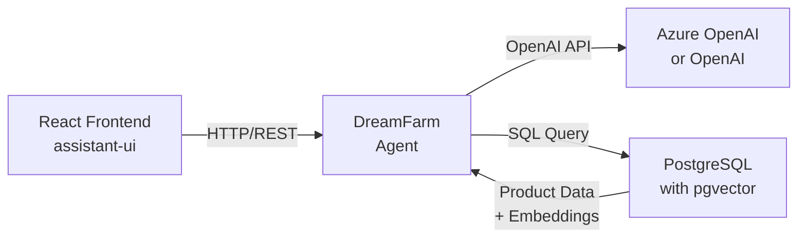
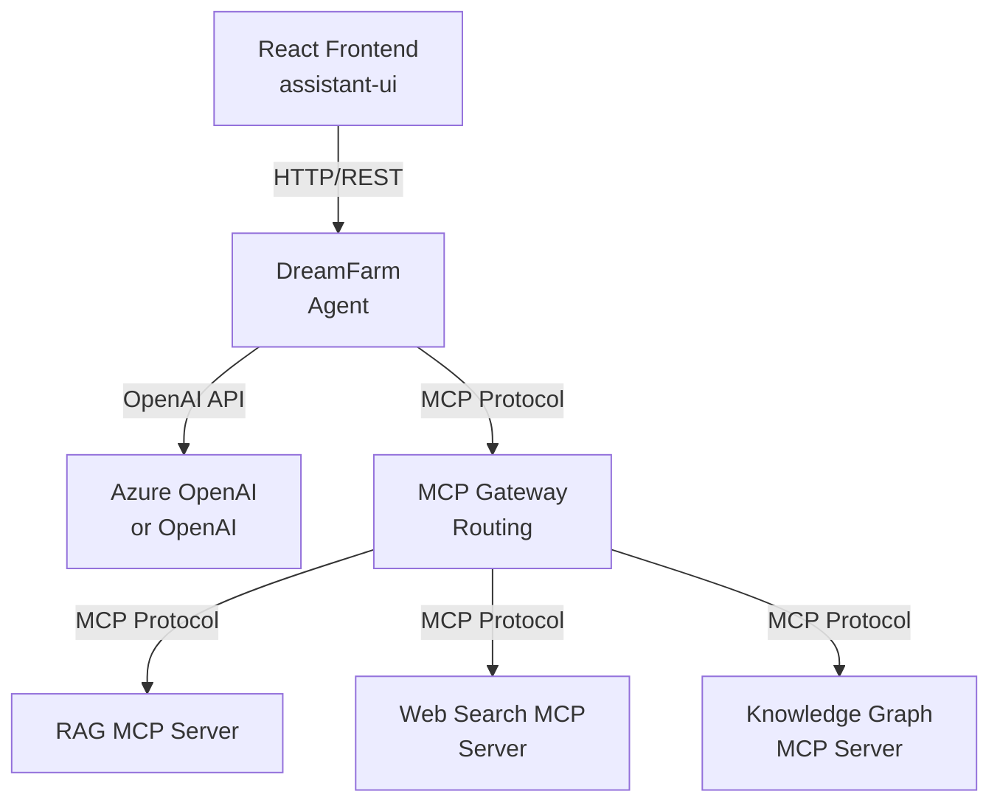
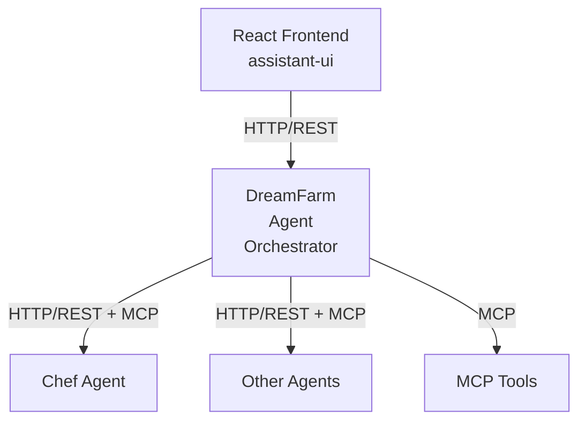

# Advanced AI Applications - Design Document

## Overview

This document describes the architecture and design of our advanced AI applications project - **Dream Farm**, a virtual farmers' marketplace that connects local farmers with customers through AI-powered assistance.

## Current Phase: Lesson 1 - Basic Architecture

### Business Requirements

- Create a basic chatbot interface for the Dream Farm marketplace
- Allow customers to interact with an AI assistant about farm products
- Provide a foundation for future enhancements (RAG, tools, multimodal features)

### Architecture Overview

**Lesson 1 - Simple Architecture with RAG:**


**Lesson 2+ - MCP Tool Integration:**


**Lesson 8+ - Multi-Agent Architecture:**


**Optional: nginx/Envoy for Production (Lesson 10):**
For production deployment, you can add nginx or Envoy for load balancing, SSL, and static files - but not as a custom service, just as infrastructure.

### Technical Stack

**Backend:**
- **Language**: Python 3.11+
- **Framework**: FastAPI
- **Environment Management**: uv (for virtual environments and packages)
- **Configuration**: python-dotenv for environment variables
- **AI Service**: Azure OpenAI Service or OpenAI API
- **Data Validation**: Pydantic models
- **Testing**: pytest

**Frontend:**
- **Framework**: React
- **UI Library**: assistant-ui (for chat interface)
- **Build Tool**: Vite (recommended for React projects)
- **Runtime Configuration**: JavaScript file for environment-specific settings

**Development Tools:**
- **Package Management**: pyproject.toml (no requirements.txt)
- **Code Quality**: Follow project coding standards
- **Documentation**: Docstrings for all public methods and classes

### API Design

#### Base Configuration
- **DreamFarm Agent Port**: 8001 (main AI agent, LLM logic, sessions, CORS)
- **Frontend Port**: 3000 (default for React/Vite)
- **Environment**: `.env` file for DreamFarm agent

#### Environment Variables
**DreamFarm Agent (.env) - Unified:**
```
# OpenAI (hosted by OpenAI)
OPENAI_API_KEY=your-openai-api-key
OPENAI_MODEL=gpt-5
CORS_ORIGINS=http://localhost:3000

# Azure OpenAI (next-gen v1)
# OPENAI_API_KEY=your-azure-api-key
# OPENAI_BASE_URL=https://your-resource.openai.azure.com/openai/v1/
# OPENAI_API_VERSION=preview
# OPENAI_MODEL=your-azure-deployment-name

# RAG Configuration
ENABLE_RAG=true
RAG_SIMILARITY_THRESHOLD=0.7
RAG_MAX_RESULTS=3

# PostgreSQL Configuration
PGHOST=localhost
PGPORT=5432
PGDATABASE=aidb
PGUSER=admin
PGPASSWORD=Admin12345678

# Embeddings (use same unified scheme)
OPENAI_EMBEDDING_MODEL=text-embedding-3-large
```

**Frontend (Runtime Configuration):**
The frontend uses a runtime configuration approach with a `config.js` file:

For **local development**, manually edit `public/config.js`:
```javascript
window.APP_CONFIG = {
  BACKEND_URL: 'http://localhost:8001',  // DreamFarm Agent URL
  API_VERSION: 'v1'
};
```

For **Docker deployment**, environment variables are injected at container startup:
```
REACT_APP_BACKEND_URL=http://your-dreamfarm-agent-url
REACT_APP_API_VERSION=v1
```

The Dockerfile includes a startup script that generates `public/config.js` from environment variables.

### OpenAI Provider Configuration (Unified)

The system supports both Azure OpenAI and OpenAI API with a single client.
Use ``OPENAI_BASE_URL`` and ``OPENAI_API_VERSION`` when talking to Azure; omit them for OpenAI-hosted.
```python
# services/openai_service.py (concept)
import os
from openai import OpenAI

def get_openai_client():
  api_key = os.getenv("OPENAI_API_KEY")
  base_url = os.getenv("OPENAI_BASE_URL")  # e.g., https://<resource>.openai.azure.com/openai/v1/
  default_query = {"api-version": os.getenv("OPENAI_API_VERSION", "preview")} if base_url else None
  return OpenAI(api_key=api_key, base_url=base_url, default_query=default_query)

def get_model_name():
  return os.getenv("OPENAI_MODEL", "gpt-5")
```

This abstraction allows the same codebase to work with both providers seamlessly.

### RAG (Retrieval-Augmented Generation) Implementation

The DreamFarm Agent includes a simple RAG system for semantic product search:

#### RAG Architecture
1. **User Message Processing**: When a user sends a message, the system generates an embedding for the query
2. **Semantic Search**: The query embedding is compared against product embeddings in PostgreSQL using pgvector
3. **Context Injection**: Relevant products (above similarity threshold) are formatted and injected into the system prompt
4. **Enhanced Response**: The AI assistant generates responses with access to relevant product information

#### RAG Components

**RAGService** (`src/services/rag_service.py`):
- Manages embedding generation using OpenAI/Azure OpenAI
- Performs vector similarity search in PostgreSQL
- Formats search results for system prompt injection
- Feature flag support via `ENABLE_RAG` environment variable

**Database Schema**:
```sql
-- simple_products table with pgvector extension
CREATE TABLE simple_products (
    id SERIAL PRIMARY KEY,
    product_id UUID NOT NULL UNIQUE,
    producer_name VARCHAR(255) NOT NULL,
    product_name VARCHAR(255) NOT NULL,
    product_description TEXT NOT NULL,
    combined_text TEXT NOT NULL,
    embedding vector(2000)  -- 2000-dimensional embeddings
);

-- HNSW index for fast cosine similarity search
CREATE INDEX idx_simple_products_embedding_cosine 
ON simple_products 
USING hnsw (embedding vector_cosine_ops);
```

#### RAG Configuration

**Feature Flag**: Set `ENABLE_RAG=true` to enable semantic search
**Similarity Threshold**: `RAG_SIMILARITY_THRESHOLD=0.7` (0.0-1.0, higher = more strict)
**Max Results**: `RAG_MAX_RESULTS=3` (top N similar products to include)

#### RAG Workflow
1. User asks: "I need fresh vegetables for a salad"
2. System generates embedding for the query
3. Cosine similarity search finds relevant products (e.g., lettuce, tomatoes, cucumbers)
4. Top 3 results above threshold are formatted as context
5. System prompt includes: `<relevant_products>Product info...</relevant_products>`
6. AI assistant responds with knowledge of available products

#### Benefits
- **Semantic Understanding**: Finds products by meaning, not just keywords
- **Real-time Context**: Always uses current product database
- **Configurable**: Can be enabled/disabled and tuned via environment variables
- **Scalable**: Uses PostgreSQL with proper indexing for performance

### Thread/Session Management Strategy

For Lesson 1, we implement a simple session API consumed by the frontend while keeping conversation state on the provider via the Responses API:

#### Session Lifecycle
1. **Create Session**: Frontend calls `POST /threads` to get a session handle (`thread_id`)
2. **Send Messages**: Frontend sends messages via `POST /threads/{thread_id}/messages`
3. **Server-side State**: Backend calls OpenAI Responses API with `store=True` and remembers only the last `response_id` per `thread_id` to continue with `previous_response_id` on the next turn
4. **History (Optional)**: Backend maintains a lightweight in-memory message list for UI display only; content is not used to generate responses
5. **Persistence**: In-memory for Lesson 1; later lessons may add DB/Redis for durability

#### Data Storage (Lesson 1)
```python
# In-memory storage for simplicity
threads: Dict[str, Thread] = {}
messages: Dict[str, List[Message]] = {}  # thread_id -> messages (display only)
last_response_id: Dict[str, str] = {}    # thread_id -> last response_id for Responses API continuity

# Later lessons will replace with:
# - PostgreSQL for persistent storage
# - Redis for session caching
# - User authentication and authorization
```

#### Benefits of Hybrid Session API
- **Stateless**: Each request is independent, easier to scale
- **Provider State**: Uses Responses API server-side state via `previous_response_id`
- **OpenAI Compatible**: Aligns with Responses API conversation model
- **Frontend Friendly**: Easy for React to manage conversation state
- **Future Ready**: Can easily add user sessions, persistence, sharing
- **Debugging**: Easy to inspect conversation history

#### API Endpoints

**Base URL**: `http://localhost:8001`

##### POST /threads
Create a new conversation thread.

**Request Body:**
```json
{
  "title": "string (optional)"
}
```

**Response:**
```json
{
  "thread_id": "string (UUID)",
  "title": "string",
  "created_at": "string (ISO 8601)",
  "updated_at": "string (ISO 8601)"
}
```

##### GET /threads/{thread_id}
Get thread information.

**Response:**
```json
{
  "thread_id": "string (UUID)",
  "title": "string",
  "created_at": "string (ISO 8601)",
  "updated_at": "string (ISO 8601)",
  "message_count": "integer"
}
```

##### POST /threads/{thread_id}/messages
Send a message in a conversation thread.

**Request Body:**
```json
{
  "message": "string"
}
```

**Response:**
```json
{
  "message_id": "string (UUID)",
  "thread_id": "string (UUID)",
  "user_message": "string",
  "assistant_response": "string",
  "timestamp": "string (ISO 8601)"
}
```

##### GET /threads/{thread_id}/messages
Get conversation history for a thread.

**Query Parameters:**
- `limit`: integer (optional, default: 50)
- `offset`: integer (optional, default: 0)

**Response:**
```json
{
  "thread_id": "string (UUID)",
  "messages": [
    {
      "message_id": "string (UUID)",
      "role": "user|assistant",
      "content": "string",
      "timestamp": "string (ISO 8601)"
    }
  ],
  "total_count": "integer"
}
```

##### GET /health
Health check endpoint.

**Response:**
```json
{
  "status": "healthy",
  "timestamp": "string (ISO 8601)"
}
```

### Data Models

#### Thread (Pydantic)
```python
class Thread(BaseModel):
    thread_id: str
    title: str
    created_at: str
    updated_at: str
    message_count: int = 0

class CreateThreadRequest(BaseModel):
    title: Optional[str] = None

class CreateThreadResponse(BaseModel):
    thread_id: str
    title: str
    created_at: str
    updated_at: str
```

#### Message (Pydantic)
```python
class Message(BaseModel):
    message_id: str
    thread_id: str
    role: Literal["user", "assistant"]
    content: str
    timestamp: str

class SendMessageRequest(BaseModel):
    message: str

class SendMessageResponse(BaseModel):
    message_id: str
    thread_id: str
    user_message: str
    assistant_response: str
    timestamp: str

class GetMessagesResponse(BaseModel):
    thread_id: str
    messages: List[Message]
    total_count: int
```

#### Health (Pydantic)
```python
class HealthResponse(BaseModel):
    status: str
    timestamp: str
```

### Project Structure

```
advanced-ai-applications/
├── agents/
│   ├── dreamfarm-agent/         # Main DreamFarm marketplace agent
│   │   ├── src/
│   │   │   ├── __init__.py
│   │   │   ├── main.py          # FastAPI agent application (includes routes & CORS)
│   │   │   ├── models/
│   │   │   │   ├── __init__.py
│   │   │   │   ├── thread.py    # Thread and message Pydantic models
│   │   │   │   └── health.py    # Health check models
│   │   │   └── services/
│   │   │       ├── __init__.py
│   │   │       ├── openai_service.py # OpenAI/Azure OpenAI integration
│   │   │       ├── thread_service.py # Thread/conversation management
│   │   │       └── mcp_client.py    # MCP client (added in lesson 2)
│   │   ├── tests/
│   │   ├── .env
│   │   ├── pyproject.toml
│   │   └── README.md
│   └── chef-agent/              # Cooking/catering agent (added in lesson 8)
│       ├── src/
│       │   ├── __init__.py
│       │   ├── main.py          # FastAPI agent application
│       │   ├── models/
│       │   └── services/
│       ├── tests/
│       ├── .env
│       ├── pyproject.toml
│       └── README.md
├── tools/                       # MCP servers (added in lesson 2+)
│   ├── rag-mcp-server/         # RAG and knowledge base (lesson 3+)
│   ├── web-search-mcp-server/  # Web search integration (lesson 2)
│   ├── knowledge-graph-mcp-server/ # Knowledge graph (lesson 4)
│   └── shared/
│       └── mcp-utils/          # Common MCP utilities
├── frontend/
│   ├── public/
│   │   ├── config.js           # Runtime configuration (generated)
│   │   └── config.js.template  # Template for Docker generation
│   ├── src/
│   │   ├── components/
│   │   │   └── ChatInterface.tsx
│   │   ├── services/
│   │   │   └── api.ts          # DreamFarm Agent calls
│   │   ├── App.tsx
│   │   └── main.tsx
│   ├── scripts/
│   │   └── generate-config.sh  # Docker startup script
│   ├── package.json
│   ├── vite.config.ts
│   ├── Dockerfile
│   └── README.md
├── infrastructure/             # Added in lesson 10
│   ├── terraform/
│   ├── k8s/
│   └── nginx.conf              # Optional: nginx config for production
├── docs/
│   ├── Design.md               # This document
│   └── ImplementationLog.md    # Implementation progress
└── README.md                   # Project overview
```

### Service Responsibilities

#### DreamFarm Agent (Port 8001)
**Purpose**: Main AI agent for the Dream Farm marketplace
- **LLM Integration**: Azure OpenAI Service or OpenAI API communication
- **Session API**: Lightweight `/threads` endpoints for session handles; Responses API maintains conversation state
- **Business Logic**: Dream Farm marketplace domain logic
- **MCP Integration**: Tool calling and coordination (Lesson 2+)
- **CORS Handling**: Frontend communication
- **API Endpoints**: All REST endpoints for the Dream Farm application
- **Agent Orchestration**: Coordinate with other agents (Lesson 8+)

#### Future Agents (Later Lessons)
- **Chef Agent** (Lesson 8): Specialized agent for cooking/catering services
- **Other Domain Agents**: Additional specialized agents as business grows

#### Infrastructure (Later Lessons)
- **nginx/Envoy** (Lesson 10): For production load balancing, SSL, static files
- **Authentication**: Can be added as middleware to agents or separate service

### Tool Integration Strategy

#### MCP vs REST API Decision

**Use MCP Protocol for:**
- RAG/knowledge base queries (Lesson 3+)
- Web search integration (Lesson 2)
- External API integrations (Lesson 2)
- Data processing tools
- Knowledge graph queries (Lesson 4)
- Multi-agent communication (Lesson 8)

**Use Direct Integration for:**
- Database connections (PostgreSQL with pgvector)
- Authentication/authorization
- Session management
- File uploads/storage
- Core business logic
- Frontend-backend communication

#### Benefits of MCP-First Approach

1. **Standardized Interface**: All tools speak the same protocol
2. **AI-Native Design**: MCP is designed specifically for AI tool integration
3. **Composability**: Easy to add/remove tools without changing core application
4. **Independent Development**: Tools can be developed and deployed separately
5. **Educational Value**: Students learn modern AI application patterns
6. **Future-Proof**: Aligns with emerging AI tooling standards

This approach allows the API Gateway to remain focused on core business logic while delegating specialized tasks to dedicated MCP servers.

### Runtime Configuration Pattern

The frontend uses a runtime configuration approach to support different environments without rebuilding the application:

#### Development Flow
1. **Local Development**: Manually edit `public/config.js` with local backend URL
2. **Docker Build**: Application is built once with a config template
3. **Container Start**: Startup script generates `config.js` from environment variables
4. **Application Load**: React app reads configuration from `window.APP_CONFIG`

#### Implementation Details

**Config Template (`public/config.js.template`):**
```javascript
window.APP_CONFIG = {
  BACKEND_URL: '${REACT_APP_BACKEND_URL}',
  API_VERSION: '${REACT_APP_API_VERSION}'
};
```

**Startup Script (`scripts/generate-config.sh`):**
```bash
#!/bin/sh
# Replace environment variables in config template
envsubst < /app/public/config.js.template > /app/public/config.js
# Start the web server
exec "$@"
```

**React Service (`src/services/api.ts`):**
```typescript
// Access runtime configuration
const config = (window as any).APP_CONFIG;
const BACKEND_URL = config?.BACKEND_URL || 'http://localhost:8001';
```

This pattern enables:
- **Build Once, Deploy Anywhere**: Same Docker image works in all environments
- **Runtime Flexibility**: Configure backend URLs without rebuilding
- **Development Simplicity**: Manual config editing for local development

### Development Workflow

1. **DreamFarm Agent Setup** (Start here for Lesson 1):
   - Use `uv` to create virtual environment and install dependencies
   - Configure `.env` file with Azure OpenAI or OpenAI credentials and CORS origins
   - Run with `uv run python -m uvicorn src.main:app --reload --port 8001`

2. **Frontend Setup**:
   - Install Node.js dependencies
   - For local development: configure `public/config.js` with DreamFarm Agent URL (port 8001)
   - Run with development server on port 3000

3. **MCP Tools Setup** (Lesson 2+):
   - Each MCP server runs as separate process/container
   - DreamFarm Agent connects to MCP servers via MCP protocol
   - Tools can be developed and deployed independently

4. **Multi-Agent Setup** (Lesson 8+):
   - Chef Agent runs as separate service
   - DreamFarm Agent orchestrates communication between agents
   - Each agent can have its own MCP tools

5. **Production Deployment** (Lesson 10):
   - Optional: Add nginx/Envoy for load balancing and SSL
   - Deploy to Kubernetes with proper service discovery
   - Use infrastructure as code (Terraform)

### Security Considerations

- Environment variables for sensitive data (API keys, endpoints)
- No hardcoded credentials in source code
- CORS configuration for frontend-backend communication
- Input validation using Pydantic models

### Future Enhancements (Later Lessons)

This basic architecture will be extended with:
- RAG (Retrieval-Augmented Generation) with PostgreSQL and pgvector
- MCP (Model Context Protocol) for external tools
- Multimodal capabilities (voice, images, documents)
- Knowledge graphs and advanced search
- Multi-agent systems
- Security and evaluation frameworks
- Kubernetes deployment and observability

### Notes

- Start extremely simple - no RAG, no database, just basic chat functionality
- Focus on clean architecture that can be easily extended
- Use established patterns and frameworks
- Document all public APIs and methods
- Follow project coding standards throughout development