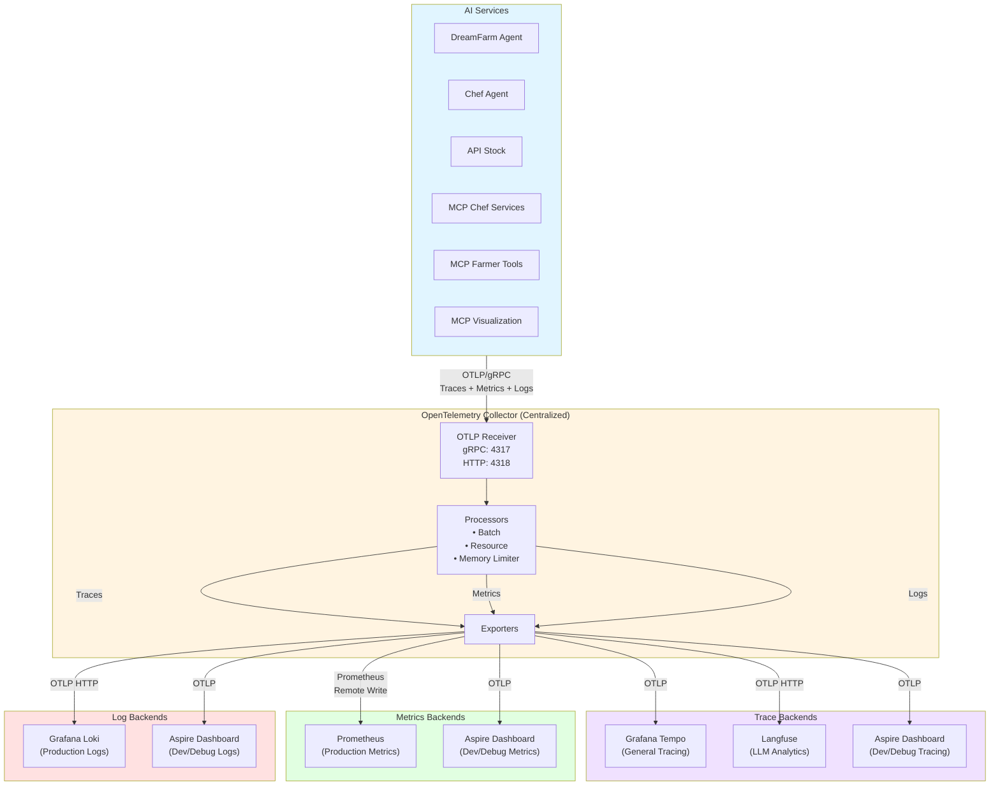
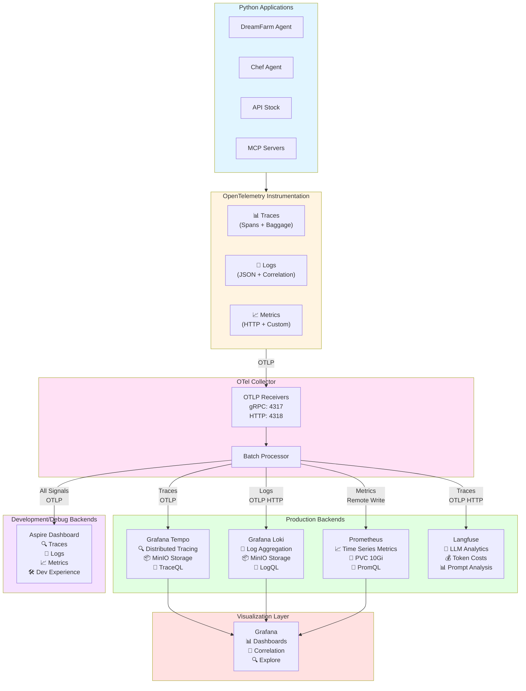

# Observability Strategy

## Overview

This document describes our comprehensive observability strategy using OpenTelemetry for distributed tracing across all services in the DreamFarm AI application. Our approach focuses on standardization, flexibility, and deep visibility into AI agent behavior.

## Architecture

### High-Level Design



**Key Design Principles**:

1. **Centralized Collection**: All services send traces to a single OpenTelemetry Collector
2. **Multiple Backends**: Collector routes traces to multiple backends (Tempo for general tracing, Langfuse for LLM-specific analysis)
3. **Auto-Instrumentation**: Automatic instrumentation for common frameworks (FastAPI, SQLAlchemy, PostgreSQL, OpenAI)
4. **Business Context**: Custom dimensions propagated via OpenTelemetry Baggage API (user.id, session.id, is_vip, agent_type, experiment)
5. **Cross-Service Context**: W3C Baggage headers automatically propagate business dimensions to all downstream services
6. **Semantic Conventions**: Using OpenTelemetry semantic conventions (user.id, session.id) for standardized attributes
7. **Standard Conventions**: Prefer OpenTelemetry GenAI semantic conventions for long-term compatibility

---

## Auto-Instrumentation Strategy

### Components Instrumented

We auto-instrument four critical components in every service:

#### 1. **FastAPI** (HTTP Server)
- **Library**: `opentelemetry-instrumentation-fastapi`
- **What it traces**: HTTP requests, response status codes, latency, headers
- **Span name format**: `GET /chat`, `POST /threads/{thread_id}/messages`
- **Key attributes**: `http.method`, `http.route`, `http.status_code`, `http.target`

#### 2. **SQLAlchemy** (ORM)
- **Library**: `opentelemetry-instrumentation-sqlalchemy`
- **What it traces**: Database queries, transactions, connection pooling
- **Span name format**: `SELECT`, `INSERT`, `UPDATE`
- **Key attributes**: `db.system=postgresql`, `db.statement` (SQL query)

#### 3. **Psycopg2** (PostgreSQL Driver)
- **Library**: `opentelemetry-instrumentation-psycopg2`
- **What it traces**: Low-level database operations, connection management
- **Span name format**: `postgresql.query`
- **Key attributes**: `db.name`, `db.user`, `db.connection_string`

#### 4. **OpenAI SDK** (LLM Calls)
- **Library**: Two options available (see next section)
- **What it traces**: LLM API calls, token usage, prompts/completions, tool calls
- **Span name format**: `openai.chat.completions`, `openai.responses.create`
- **Key attributes**: Model, tokens, messages (if enabled)

---

## OpenAI Instrumentation: Dual Provider Strategy

### Problem Statement

We use OpenAI's **Responses API with streaming** (`responses.create(stream=True)`), which is a newer API feature. This creates a compatibility challenge:

- **Standard OpenTelemetry**: Uses GenAI semantic conventions (ideal for Langfuse), but doesn't support Responses API streaming yet ([GitHub PR #3396](https://github.com/traceloop/openllmetry/pull/3396))
- **OpenInference**: Supports Responses API streaming NOW, but uses custom semantic conventions (may not be fully compatible with Langfuse)

### Solution: Environment-Based Switching

We implement **both** instrumentation providers and switch between them via environment variable:

```python
# In pyproject.toml - install both packages
dependencies = [
    # Standard OpenTelemetry (GenAI semantic conventions)
    "opentelemetry-instrumentation-openai>=0.47.3",
    
    # OpenInference (custom semantic conventions, streaming support)
    "openinference-instrumentation-openai>=0.1.34",
]

# In src/main.py - conditional instrumentation
otel_provider = os.getenv("OTEL_INSTRUMENTATION_PROVIDER", "opentelemetry").lower()

if otel_provider == "openinference":
    from openinference.instrumentation.openai import OpenAIInstrumentor
    OpenAIInstrumentor().instrument(tracer_provider=provider)
    print("[OK] OpenAI instrumented with OpenInference")
else:
    from opentelemetry.instrumentation.openai import OpenAIInstrumentor
    OpenAIInstrumentor().instrument(tracer_provider=provider)
    print("[OK] OpenAI instrumented with standard OpenTelemetry")
```

### Configuration

**Helm Chart (values.yaml)**:
```yaml
otel:
  # Default to standard OTel (future-compatible)
  instrumentationProvider: "opentelemetry"
```

**Terraform Override (kubernetes.demo.tf)**:
```terraform
# Temporarily use OpenInference for Responses API streaming
set {
  name  = "otel.instrumentationProvider"
  value = "openinference"  # Switch to "opentelemetry" once PR #3396 merges
}
```

**Local Development (.env)**:
```bash
# Use OpenInference for immediate streaming support
OTEL_INSTRUMENTATION_PROVIDER=openinference

# Or use standard OTel (default)
# OTEL_INSTRUMENTATION_PROVIDER=opentelemetry
```

### Semantic Convention Differences

| Attribute | Standard OTel (GenAI) | OpenInference |
|-----------|----------------------|---------------|
| **Input tokens** | `gen_ai.usage.input_tokens` | `llm.token_count.input` |
| **Output tokens** | `gen_ai.usage.output_tokens` | `llm.token_count.output` |
| **Total tokens** | `gen_ai.usage.total_tokens` | `llm.token_count.total` |
| **Model name** | `gen_ai.request.model` | `llm.model_name` |
| **Messages** | `gen_ai.input.messages` | `llm.input_messages` |
| **System prompt** | `gen_ai.system` | `llm.system` |

**Implications**:
- **Grafana Tempo**: Works with both (trace visualization doesn't depend on attribute names)
- **Langfuse**: Expects standard GenAI conventions for LLM-specific features (cost tracking, prompt management)
- **Custom Queries**: Must account for different attribute names when filtering/aggregating

### Migration Timeline

```
┌─────────────────────────────────────────────────────────────┐
│ Phase 1: Current (Oct 2025)                                 │
│ - Use OpenInference (OTEL_INSTRUMENTATION_PROVIDER=openinference) │
│ - Responses API streaming works NOW                         │
│ - Limited Langfuse compatibility                            │
└─────────────────────────────────────────────────────────────┘
                            │
                            ▼
┌─────────────────────────────────────────────────────────────┐
│ Phase 2: After PR #3396 Merges (Q1 2026 estimated)          │
│ - Switch to standard OTel (OTEL_INSTRUMENTATION_PROVIDER=opentelemetry) │
│ - Test Responses API streaming with standard instrumentation│
│ - Verify Langfuse integration works correctly                │
└─────────────────────────────────────────────────────────────┘
                            │
                            ▼
┌─────────────────────────────────────────────────────────────┐
│ Phase 3: Long-term (Q2 2026)                                │
│ - Remove OpenInference dependency from pyproject.toml       │
│ - Standardize on OpenTelemetry GenAI conventions             │
│ - Full Langfuse feature compatibility                        │
└─────────────────────────────────────────────────────────────┘
```

**Tracking**: Monitor [PR #3396](https://github.com/traceloop/openllmetry/pull/3396) for merge status.

---

## Implementation Details

### Consolidated Tracing Module

To improve code readability and maintainability, all tracing initialization logic has been consolidated into a single reusable module: `utils/otel_tracing.py` (or `src/utils/otel_tracing.py` for agents with `src/` structure).

**Key Components**:

```python
# utils/otel_tracing.py

class BaggageSpanProcessor(SpanProcessor):
    """Copies OpenTelemetry Baggage values to span attributes for all spans.
    
    Ensures that user/session context set via Baggage API is available as
    queryable attributes on all spans. Baggage propagates across service
    boundaries via W3C headers automatically.
    
    Baggage keys using OpenTelemetry semantic conventions:
    - user.id: User identifier (OpenTelemetry semantic convention)
    - session.id: Session identifier (OpenTelemetry semantic convention, uses thread_id value)
    - is_vip: VIP status for filtering premium users
    - agent_type: Service identifier
    - experiment: A/B test identifier
    - thread_id: Conversation thread identifier
    """
    
    BAGGAGE_KEYS = ["user.id", "session.id", "is_vip", "agent_type", "experiment", "thread_id"]
    
    def on_start(self, span, parent_context=None):
        # Automatically inject baggage values into every span
        # See "Custom Business Dimensions" section below

def configure_otel_tracing(
    service_name: str,
    otlp_endpoint: str,
    instrument_openai: bool = False,
    instrument_psycopg2: bool = False,
    instrument_sqlalchemy: bool = False
) -> bool:
    """One-function tracing initialization.
    
    Configures:
    1. TracerProvider with service name resource
    2. BaggageSpanProcessor for business dimensions propagation
    3. OTLP exporter (gRPC) to collector
    4. Conditional auto-instrumentation based on flags
    
    Returns True if successful, False otherwise.
    """
```

**Simplified Service Initialization** (before, ~150 lines → after, ~20 lines):

```python
# Load environment variables FIRST
load_dotenv()

service_name = os.getenv("OTEL_SERVICE_NAME", "dreamfarm-agent")
otlp_endpoint = os.getenv("OTEL_EXPORTER_OTLP_ENDPOINT", "").strip()
otel_enabled = otlp_endpoint != ""

if otel_enabled:
    try:
        # All tracing setup in one function call
        from src.utils.otel_tracing import configure_otel_tracing
        configure_otel_tracing(
            service_name=service_name,
            otlp_endpoint=otlp_endpoint,
            instrument_openai=True,        # Enable for services using OpenAI
            instrument_psycopg2=True,      # Enable for services using psycopg2
            instrument_sqlalchemy=True     # Enable for services using SQLAlchemy
        )
        print(f"[OK] OpenTelemetry tracing initialized: service={service_name}")
        
        # Configure logging + metrics (see respective sections)
        from src.utils.otel_logging import configure_otel_logging
        logger = configure_otel_logging(service_name, otlp_endpoint)
        
        from src.utils.otel_metrics import configure_otel_metrics
        meter_provider, meter = configure_otel_metrics(service_name, otlp_endpoint)
        
    except Exception as e:
        print(f"[WARNING] OpenTelemetry initialization failed: {e}")
        otel_enabled = False

# NOW import FastAPI and other libraries AFTER initialization
from fastapi import FastAPI
```

**Service-Specific Instrumentation Flags**:

| Service | OpenAI | psycopg2 | SQLAlchemy | Notes |
|---------|--------|----------|------------|-------|
| **dreamfarm-agent** | ✅ | ✅ | ✅ | Full stack (LLM + DB + ORM) |
| **chef-agent** | ✅ | ❌ | ❌ | LLM only (remote MCP tools) |
| **api_stock** | ❌ | ✅ | ❌ | Database only (raw SQL) |
| **mcp_chef_services** | ❌ | ❌ | ❌ | Pure logic (mock data) |
| **mcp_public_farmer_tools** | ❌ | ❌ | ❌ | Pure logic (mock data) |
| **mcp_visualization_generator** | ✅ | ❌ | ❌ | LLM only (HTML generation) |

**Benefits**:
- **Code Reduction**: ~600 lines of duplicated code eliminated across 6 services
- **Consistency**: All services use identical tracing setup
- **Maintainability**: Single source of truth for tracing configuration
- **Flexibility**: Service-specific instrumentation via boolean flags

### Initialization Order (Critical!)

OpenTelemetry auto-instrumentation **must** be initialized **before** importing instrumented libraries. Our implementation follows this strict order:

```python
# 1. Load environment variables FIRST
load_dotenv()

# 2. Initialize OpenTelemetry TracerProvider via consolidated module
from src.utils.otel_tracing import configure_otel_tracing
configure_otel_tracing(
    service_name="dreamfarm-agent",
    otlp_endpoint="http://otel-collector:4317",
    instrument_openai=True,
    instrument_psycopg2=True,
    instrument_sqlalchemy=True
)

# 3. NOW import FastAPI and services (auto-instrumentation active)
from fastapi import FastAPI
from src.services.openai_service import OpenAIService
```

**Why This Order Matters**:
- Instrumentors patch library code at import time
- If you import before instrumenting, patching won't work
- Result: Missing spans, incomplete traces

### FastAPI Instrumentation

FastAPI is instrumented automatically after initialization:

```python
# After app creation
from opentelemetry.instrumentation.fastapi import FastAPIInstrumentor

app = FastAPI(title="DreamFarm Agent")

# Instrument FastAPI app (if OTel enabled)
if otel_enabled:
    FastAPIInstrumentor.instrument_app(app)
    print("[OK] FastAPI instrumented for HTTP tracing")
```

This creates spans for:
- All HTTP requests (GET, POST, etc.)
- Request/response headers
- Status codes
- Latency measurements

---

## Custom Business Dimensions

We enrich traces with business context using FastAPI middleware and OpenTelemetry Baggage API. Baggage enables automatic cross-service propagation via W3C headers, allowing filtering traces by user type, experiment, or agent across the entire distributed system.

### Middleware Implementation

```python
@app.middleware("http")
async def add_business_dimensions(request: Request, call_next):
    """Add business context attributes to OpenTelemetry spans and propagate via baggage.
    
    Uses OpenTelemetry Baggage API for cross-service propagation of business dimensions.
    Baggage is automatically propagated via W3C headers to downstream services.
    """
    if otel_enabled:
        from opentelemetry import baggage, context as otel_context, trace as otel_trace
        
        span = otel_trace.get_current_span()
        ctx = otel_context.get_current()
        
        if span and span.is_recording():
            # Extract user context from JWT
            auth_header = request.headers.get("Authorization", "")
            user_id = "anonymous"
            is_vip = False
            
            if auth_header.startswith("Bearer ") and auth_service is not None:
                try:
                    token = auth_header.split(" ", 1)[1].strip()
                    claims = auth_service.validate(token)
                    username, is_vip = auth_service.extract_identity(claims)
                    user_id = username
                except Exception:
                    pass
            
            # Extract thread_id from URL path
            thread_id = None
            path = request.url.path
            if "/threads/" in path:
                parts = path.split("/")
                if len(parts) > 2 and parts[1] == "threads":
                    thread_id = parts[2]
            
            # Generate session_id (use thread_id for conversation sessions)
            experiment = os.getenv("OTEL_EXPERIMENT", "production")
            session_id = thread_id if thread_id else f"session_{user_id}_{int(time.time())}"
            
            # Set baggage for automatic propagation to all child spans and downstream services
            # Baggage propagates via W3C headers automatically (using OpenTelemetry semantic conventions)
            ctx = baggage.set_baggage("user.id", user_id, ctx)
            ctx = baggage.set_baggage("is_vip", str(is_vip).lower(), ctx)
            ctx = baggage.set_baggage("agent_type", "dreamfarm", ctx)
            ctx = baggage.set_baggage("experiment", experiment, ctx)
            ctx = baggage.set_baggage("session.id", session_id, ctx)
            if thread_id:
                ctx = baggage.set_baggage("thread_id", thread_id, ctx)
            
            # Execute request with propagated baggage context
            token = otel_context.attach(ctx)
            try:
                response = await call_next(request)
            finally:
                otel_context.detach(token)
            return response
    
    response = await call_next(request)
    return response
```

### Custom Dimensions Explained

| Dimension | Source | Purpose | Example Values | OpenTelemetry Convention |
|-----------|--------|---------|----------------|--------------------------|
| **user.id** | JWT `preferred_username` claim | User-level filtering and analysis | `john.doe`, `anonymous` | ✅ Yes (semantic convention) |
| **session.id** | Thread ID from URL or generated | Session-level tracing (conversation groups) | `thread_abc`, `session_user1_12345` | ✅ Yes (semantic convention) |
| **is_vip** | JWT `groups` or `is_vip` claim | VIP vs regular user segmentation | `true`, `false` | No (custom) |
| **agent_type** | Static config | Identify which service created the span | `dreamfarm`, `chef`, `mcp-visualization` | No (custom) |
| **experiment** | `OTEL_EXPERIMENT` env var | A/B testing, staging vs prod | `production`, `staging`, `experiment-a` | No (custom) |
| **thread_id** | URL path parsing | Conversation-level tracing | `550e8400-e29b-41d4-a716-446655440000` | No (custom) |

**OpenTelemetry Semantic Conventions**:
- **user.id** (with dot): Standard OpenTelemetry convention for user identification across observability tools
- **session.id** (with dot): Standard OpenTelemetry convention for session tracking
- Using thread_id as the session.id value makes sense because each conversation thread represents a logical session
- These conventions are recognized by multiple observability platforms (Langfuse, Grafana, etc.)

**Baggage Propagation**:
- All dimensions are set via `baggage.set_baggage()` in origin service (DreamFarm Agent)
- W3C Baggage headers automatically propagate context to downstream services
- Downstream services extract with `baggage.get_baggage()`
- BaggageSpanProcessor copies baggage values to span attributes for all spans

### Use Cases

**1. Filter VIP User Requests**:
```
# In Grafana Tempo
is_vip = true
```

**2. Compare Experiments**:
```
# Compare latency between experiments
experiment = experiment-a vs experiment = production
```

**3. Track Conversation Sessions** (OpenTelemetry convention):
```
# All spans for a specific conversation session
session.id = thread_abc
```

**4. Track User Across Services** (OpenTelemetry convention):
```
# All spans for a specific user
user.id = john.doe
```

**5. Service-Level Metrics**:
```
# DreamFarm agent specific performance
agent_type = dreamfarm
```

---

## Configuration

### Environment Variables

All services use these standard OpenTelemetry environment variables:

```bash
# === Core OpenTelemetry Configuration ===
OTEL_SERVICE_NAME=dreamfarm-agent              # Service identifier
OTEL_EXPORTER_OTLP_ENDPOINT=http://otel-collector:4317  # Collector endpoint
OTEL_EXPORTER_OTLP_PROTOCOL=grpc               # Protocol (gRPC recommended)
OTEL_TRACES_EXPORTER=otlp                      # Exporter type

# === OpenAI Instrumentation Provider ===
# Options: "opentelemetry" (standard, future Langfuse) or "openinference" (streaming NOW)
OTEL_INSTRUMENTATION_PROVIDER=openinference    # Use until PR #3396 merges

# === Message Content Logging ===
# WARNING: May log sensitive data (prompts, completions)
OTEL_INSTRUMENTATION_GENAI_CAPTURE_MESSAGE_CONTENT=true

# === Business Dimensions ===
OTEL_EXPERIMENT=production                     # Custom experiment tag
```

### Kubernetes Deployment

**Deployment YAML** (excerpt from `deployment-dreamfarm-agent.yaml`):
```yaml
env:
  # OpenTelemetry Configuration
  - name: OTEL_SERVICE_NAME
    value: "dreamfarm-agent"
  - name: OTEL_EXPORTER_OTLP_ENDPOINT
    value: "http://otel-collector:4317"
  - name: OTEL_EXPORTER_OTLP_PROTOCOL
    value: "grpc"
  - name: OTEL_TRACES_EXPORTER
    value: "otlp"
  - name: OTEL_EXPERIMENT
    value: "production"
  - name: OTEL_INSTRUMENTATION_PROVIDER
    value: {{ .Values.otel.instrumentationProvider | quote }}
  - name: OTEL_INSTRUMENTATION_GENAI_CAPTURE_MESSAGE_CONTENT
    value: "true"
```

### Helm Chart Values

**values.yaml**:
```yaml
otel:
  # Default to standard OpenTelemetry (future-compatible)
  instrumentationProvider: "opentelemetry"
```

**Terraform Override** (for immediate streaming support):
```terraform
set {
  name  = "otel.instrumentationProvider"
  value = "openinference"
}
```

---

## OpenTelemetry Collector Configuration

The collector receives traces from all services and routes them to backends.

### Collector ConfigMap

```yaml
receivers:
  otlp:
    protocols:
      grpc:
        endpoint: 0.0.0.0:4317  # All services send here
      http:
        endpoint: 0.0.0.0:4318

processors:
  batch:
    timeout: 10s
    send_batch_size: 1024

exporters:
  otlp/tempo:
    endpoint: tempo-distributor:4317
    tls:
      insecure: true
  
  # Future: Langfuse exporter
  # otlp/langfuse:
  #   endpoint: langfuse:4317

service:
  pipelines:
    traces:
      receivers: [otlp]
      processors: [batch]
      exporters: [otlp/tempo]
```

### Service Definition

```yaml
apiVersion: v1
kind: Service
metadata:
  name: otel-collector
spec:
  type: ClusterIP
  ports:
    - name: otlp-grpc
      port: 4317
      targetPort: 4317
    - name: otlp-http
      port: 4318
      targetPort: 4318
  selector:
    app: otel-collector
```

---

## Observability Backends

### Aspire Dashboard (Development/Debug)

**Purpose**: All-in-one observability dashboard for local development and debugging

**Features**:
- **Unified View**: Traces, logs, and metrics in one interface
- **Real-time Updates**: Live view of telemetry as it arrives
- **Detailed Inspection**: Drill down into spans, log entries, and metric data points
- **No Configuration**: Works out-of-the-box with OTLP
- **Lightweight**: In-memory storage, no persistence needed
- **Fast Iteration**: Perfect for development and debugging

**Access**:
```bash
# Local development
http://localhost:18888

# Kubernetes port-forward
kubectl port-forward svc/aspire-dashboard 18888:18888
```

**Use Cases**:
- Local development debugging
- Quick trace inspection during testing
- Log correlation without complex queries
- Metrics visualization for performance testing
- Understanding telemetry flow before production

**Why Aspire + Production Backends?**
- **Aspire**: Fast, interactive debugging during development
- **Tempo/Loki/Prometheus**: Long-term storage, alerting, production analytics
- **Langfuse**: LLM-specific analysis and cost tracking

---

### Grafana Tempo (Distributed Tracing - Production)

**Purpose**: General-purpose distributed tracing for all services

**Features**:
- Trace visualization with service maps
- Span-level details (duration, attributes, events)
- Search by trace ID, service name, custom attributes
- Trace comparison (slow vs fast requests)
- MinIO backend for long-term storage

**Access**: Port-forward or ingress
```bash
kubectl port-forward svc/tempo-query-frontend 3200:3200
```

**Query Examples**:
```
# Find all traces for VIP users
{ is_vip = true }

# Find slow LLM calls (>10s)
{ name = "openai.chat.completions" } && { duration > 10s }

# Find all traces for a conversation session (OpenTelemetry convention)
{ session.id = "thread_abc" }

# Find all traces for a specific user (OpenTelemetry convention)
{ user.id = "john.doe" }
```

---

### Langfuse (LLM Analytics - Production)

**Purpose**: LLM-specific observability and analytics

**Features**:
- Prompt management and versioning
- Token cost tracking
- Model performance comparison
- User feedback correlation
- Prompt engineering insights
- Session-based analysis (groups traces by session.id)
- User-based analysis (groups traces by user.id)

**Semantic Conventions**:
Langfuse recognizes OpenTelemetry semantic conventions:
- **user.id** (with dot): Standard OpenTelemetry convention for user identification
- **session.id** (with dot): Standard OpenTelemetry convention for session tracking
- These conventions enable Langfuse to automatically group and analyze traces by user and session

**Access**:
```bash
# Kubernetes port-forward
kubectl port-forward svc/langfuse-web 3000:3000 -n langfuse

# Production URL
https://langfuse.{domain}
```

**Current Implementation**:
- ✅ Deployed and running in Kubernetes
- ✅ OTel Collector configured with Langfuse exporter
- ✅ Baggage-based context propagation (user.id, session.id, etc.)
- ✅ BaggageSpanProcessor copies baggage to span attributes
- ✅ W3C Baggage headers propagate context to downstream services
- ⏳ Waiting for OpenAI Responses API streaming support in standard OTel instrumentation

**Configuration**:
```yaml
exporters:
  otlphttp/langfuse:
    endpoint: http://langfuse-web.langfuse.svc.cluster.local:3000/api/public/otel
    headers:
      Authorization: "Basic <credentials>"

service:
  pipelines:
    traces:
      receivers: [otlp]
      processors: [batch]
      exporters: [otlp/aspire, otlp/tempo, otlphttp/langfuse]
```

---

## Testing Strategy

### Verify Instrumentation Works

**1. Check Service Logs**:
```bash
kubectl logs -l app=dreamfarm-agent | grep -i "instrumented\|otel"
```

Expected output:
```
[OK] OpenAI instrumented with OpenInference (Responses API streaming supported)
[OK] PostgreSQL (psycopg2) instrumented for database tracing
[OK] SQLAlchemy instrumented for ORM tracing
[OK] FastAPI instrumented for HTTP tracing
[OK] OpenTelemetry initialized: service=dreamfarm-agent endpoint=http://otel-collector:4317
```

**2. Check Collector Logs**:
```bash
kubectl logs -l app=otel-collector | grep -i "export\|tempo"
```

Expected output:
```
Traces exported: 42 spans
OTLP exporter: tempo-distributor:4317
```

**3. Verify Traces in Grafana**:
```bash
kubectl port-forward svc/tempo-query-frontend 3200:3200
```
Open Grafana → Explore → Tempo → Search for recent traces

**4. Test Custom Dimensions**:
Make authenticated request:
```bash
curl -H "Authorization: Bearer $TOKEN" https://dreamfarm-agent.domain/threads/thread_abc/messages
```

In Grafana, verify span has (using OpenTelemetry semantic conventions):
- `user.id` = username from JWT
- `session.id` = thread_abc (from URL)
- `is_vip` = true/false based on user
- `agent_type` = "dreamfarm"
- `experiment` = "production"
- `thread_id` = thread_abc

---

## Troubleshooting

### No Traces Appearing

**Symptoms**: No spans visible in Grafana Tempo

**Diagnosis**:
```bash
# 1. Check if service initialized OTel
kubectl logs -l app=dreamfarm-agent | grep "OpenTelemetry initialized"

# 2. Check collector is receiving spans
kubectl logs -l app=otel-collector | grep "Traces received"

# 3. Check Tempo is accessible
kubectl exec -it <otel-collector-pod> -- curl http://tempo-distributor:4317
```

**Solutions**:
- Verify `OTEL_EXPORTER_OTLP_ENDPOINT` points to correct collector
- Ensure collector service is running: `kubectl get svc otel-collector`
- Check network policies allow traffic between pods
- Verify TracerProvider initialization happens before library imports

### Health Check Spans Cluttering Traces

**Symptoms**: Too many spans for `/health` endpoint in Grafana

**Solution**: Health checks are excluded from tracing using FastAPI instrumentation configuration:
```python
from opentelemetry.instrumentation.fastapi import FastAPIInstrumentor

FastAPIInstrumentor.instrument_app(
    app,
    excluded_urls="/health"  # Don't create spans for health checks
)
```

**Rationale**: Health checks run frequently (every 5-10 seconds) and don't provide business value in traces. Excluding them reduces noise and collector load.

### Streaming Chunks Creating Too Many Spans

**Symptoms**: Each LLM streaming chunk creates a separate span, overwhelming traces

**Best Practice**: The instrumentation libraries (both OpenInference and standard OTel) handle streaming internally:
- **Single span per streaming request**: The entire stream is captured in one span
- **Chunk data as span events**: Individual chunks are logged as events within the span (not separate spans)
- **Token counts aggregated**: Total tokens counted across all chunks

**What You See**:
- ✅ One span for `openai.chat.completions.create` (streaming)
- ✅ Span duration covers entire stream time
- ✅ Token counts reflect full response
- ❌ NOT: Separate spans for each chunk

**Verification**:
```bash
# Check span count for a streaming request - should be reasonable
kubectl logs -l app=otel-collector | grep "SpansExported" | tail -5
```

If you see excessive spans (hundreds for a single request), this indicates a configuration issue. The instrumentation should aggregate chunks automatically.

### Missing Custom Dimensions on Child Spans

**Symptoms**: `user.id`, `is_vip`, `agent_type` appear on FastAPI span but not on database or OpenAI child spans

**Root Cause**: Custom dimensions not propagated via OpenTelemetry Baggage API

**Solution**: We use a custom `BaggageSpanProcessor` to propagate baggage values to all child spans:

```python
class BaggageSpanProcessor(SpanProcessor):
    """Copies OpenTelemetry Baggage values to span attributes for all spans."""
    
    BAGGAGE_KEYS = ["user.id", "session.id", "is_vip", "agent_type", "experiment", "thread_id"]
    
    def on_start(self, span, parent_context=None):
        """Called when span starts - add baggage values as attributes."""
        from opentelemetry import baggage
        
        ctx = parent_context or otel_context.get_current()
        
        # Propagate custom dimensions from baggage to span
        for key in self.BAGGAGE_KEYS:
            value = baggage.get_baggage(key, ctx)
            if value is not None:
                span.set_attribute(key, value)
```

**Middleware sets baggage** (using Langfuse conventions):
```python
# In middleware, after extracting user from JWT
from opentelemetry import baggage, context as otel_context

ctx = otel_context.get_current()
ctx = baggage.set_baggage("user.id", user_id, ctx)
ctx = baggage.set_baggage("session.id", session_id, ctx)
ctx = baggage.set_baggage("is_vip", str(is_vip).lower(), ctx)

# Attach context for request duration
token = otel_context.attach(ctx)
try:
    response = await call_next(request)
finally:
    otel_context.detach(token)
```

**Verification**:
```bash
# Make authenticated request
curl -H "Authorization: Bearer $TOKEN" https://dreamfarm-agent.domain/threads/thread_abc/messages

# In Grafana, verify ALL spans have custom attributes (OpenTelemetry conventions):
# - FastAPI span: ✅ user.id, session.id, is_vip, agent_type, experiment
# - PostgreSQL span: ✅ user.id, session.id, is_vip, agent_type, experiment  
# - OpenAI span: ✅ user.id, session.id, is_vip, agent_type, experiment
```

### Wrong Semantic Conventions

**Symptoms**: Langfuse not showing LLM data correctly, or attributes missing expected names

**Diagnosis**:
```bash
# Check which provider is active
kubectl logs -l app=dreamfarm-agent | grep "instrumented with"
```

Expected:
- OpenInference: `instrumented with OpenInference`
- Standard OTel: `instrumented with standard OpenTelemetry`

**Solution**:
```bash
# Switch provider via Helm values
helm upgrade demo ./charts/demo --set otel.instrumentationProvider=opentelemetry
```

### Missing Custom Dimensions

**Symptoms**: `user.id`, `is_vip`, or other custom attributes not in spans

**Diagnosis**:
```bash
# Check if middleware is running
kubectl logs -l app=dreamfarm-agent | grep -A5 "add_business_dimensions"

# Verify span is recording
# (Check application code logs)
```

**Solution**:
- Ensure middleware is registered: `@app.middleware("http")`
- Verify span is recording: `if span and span.is_recording()`
- Check JWT parsing: Auth service must extract claims correctly
- Verify BaggageSpanProcessor is installed in TracerProvider

### Responses API Streaming Not Traced

**Symptoms**: Non-streaming calls traced, but streaming calls missing spans

**Root Cause**: Standard OTel doesn't support Responses API streaming yet

**Solution**:
```bash
# Switch to OpenInference
helm upgrade demo ./charts/demo --set otel.instrumentationProvider=openinference
kubectl rollout restart deployment/dreamfarm-agent
```

---

## W3C Baggage Propagation

### Overview

Our implementation uses the OpenTelemetry Baggage API to propagate business context across service boundaries. Baggage is a W3C standard that automatically propagates key-value pairs via HTTP headers.

### How It Works

**1. Origin Service (DreamFarm Agent)**:
```python
from opentelemetry import baggage, context as otel_context

# Set baggage values (will propagate automatically)
ctx = otel_context.get_current()
ctx = baggage.set_baggage("user.id", "john.doe", ctx)
ctx = baggage.set_baggage("session.id", "thread_abc", ctx)
ctx = baggage.set_baggage("is_vip", "true", ctx)

# Attach context for request
token = otel_context.attach(ctx)
try:
    # Make HTTP call to downstream service
    # Baggage automatically propagates via W3C headers
    response = httpx.post("http://chef-agent/cook")
finally:
    otel_context.detach(token)
```

**2. HTTP Headers (Automatic)**:
```
baggage: user.id=john.doe,session.id=thread_abc,is_vip=true
```

**3. Downstream Service (Chef Agent)**:
```python
from opentelemetry import baggage, context as otel_context

# Extract baggage from incoming request (automatic via OpenTelemetry auto-instrumentation)
ctx = otel_context.get_current()
user_id = baggage.get_baggage("user.id", ctx)  # "john.doe"
session_id = baggage.get_baggage("session.id", ctx)  # "thread_abc"
is_vip = baggage.get_baggage("is_vip", ctx)  # "true"
```

**4. BaggageSpanProcessor (All Services)**:
```python
class BaggageSpanProcessor:
    """Automatically copies baggage values to span attributes."""
    
    def on_start(self, span, parent_context=None):
        # Every span gets baggage values as attributes
        # This makes them queryable in Grafana Tempo
        for key in BAGGAGE_KEYS:
            value = baggage.get_baggage(key, ctx)
            if value:
                span.set_attribute(key, value)
```

### Benefits

✅ **Automatic Propagation**: No manual header passing required  
✅ **Standards-Based**: W3C Baggage specification  
✅ **Framework-Agnostic**: Works with any OpenTelemetry-instrumented HTTP client  
✅ **Cross-Service Context**: User/session context available in all downstream services  
✅ **Queryable**: All spans have business dimensions as attributes  

### Architecture Flow

```
┌─────────────────────────────────────────────────────────────────┐
│ 1. DreamFarm Agent (Origin)                                     │
│    - Extracts user from JWT: user_id="john.doe", is_vip=true   │
│    - Extracts thread_id from URL: thread_id="thread_abc"        │
│    - Sets baggage: user.id, session.id, is_vip, agent_type     │
│    - session.id = thread_id (conversation = session)            │
└──────────────────┬──────────────────────────────────────────────┘
                   │
                   │ HTTP Request with W3C Baggage Header
                   │ baggage: user.id=john.doe,session.id=thread_abc,...
                   ▼
┌─────────────────────────────────────────────────────────────────┐
│ 2. Downstream Service (Chef Agent, API Stock, MCP Servers)     │
│    - Baggage automatically extracted from headers               │
│    - baggage.get_baggage("user.id") → "john.doe"               │
│    - baggage.get_baggage("session.id") → "thread_abc"          │
│    - BaggageSpanProcessor copies to span attributes             │
│    - Service enriches with own agent_type                       │
└─────────────────────────────────────────────────────────────────┘
                   │
                   ▼
┌─────────────────────────────────────────────────────────────────┐
│ 3. All Spans Across Services                                    │
│    ✅ user.id = "john.doe"                                      │
│    ✅ session.id = "thread_abc"                                 │
│    ✅ is_vip = "true"                                           │
│    ✅ agent_type = service-specific                             │
│    ✅ experiment = "production"                                 │
│                                                                  │
│    Queryable in Grafana Tempo:                                  │
│    { user.id = "john.doe" }                                     │
│    { session.id = "thread_abc" }                                │
└─────────────────────────────────────────────────────────────────┘
```

### Verification

Test baggage propagation end-to-end:

```bash
# 1. Make authenticated request with thread_id
curl -H "Authorization: Bearer $TOKEN" \
     https://dreamfarm-agent.domain/threads/thread_abc/messages \
     -d '{"content": "Cook pasta"}'

# 2. In Grafana Tempo, query by session:
{ session.id = "thread_abc" }

# 3. Verify all services in trace have attributes:
# - dreamfarm-agent span: user.id, session.id, is_vip, agent_type=dreamfarm
# - chef-agent span: user.id, session.id, is_vip, agent_type=chef
# - api-stock span: user.id, session.id, is_vip, agent_type=api-stock
```

### Debugging Baggage

**Check baggage headers in flight**:
```python
# In middleware or route handler
from opentelemetry import baggage, context as otel_context

ctx = otel_context.get_current()
user_id = baggage.get_baggage("user.id", ctx)
print(f"Received baggage: user.id={user_id}")
```

**Verify BaggageSpanProcessor is active**:
```bash
# Check service logs for initialization
kubectl logs -l app=dreamfarm-agent | grep "BaggageSpanProcessor"
```

**Inspect HTTP headers** (if needed):
```python
# In downstream service
@app.middleware("http")
async def debug_baggage(request: Request, call_next):
    baggage_header = request.headers.get("baggage", "")
    print(f"Baggage header: {baggage_header}")
    return await call_next(request)
```

---

## Best Practices

### 1. **Initialize Early**
- Load `.env` first
- Initialize OTel before importing any instrumented libraries
- Use `@asynccontextmanager` for FastAPI lifespan to ensure proper cleanup

### 2. **Minimize Sensitive Data Exposure**
- Set `OTEL_INSTRUMENTATION_GENAI_CAPTURE_MESSAGE_CONTENT=false` in production
- Review span attributes before enabling full message logging
- Use span processors to filter sensitive data if needed

### 3. **Use Consistent Service Names**
- Match service name to deployment: `dreamfarm-agent`, `chef-agent`, `mcp-visualization`
- Avoid spaces or special characters
- Use lowercase with hyphens

### 4. **Add Business Context with Baggage**
- Use Baggage API for cross-service propagation (not span.set_attribute directly)
- Follow OpenTelemetry semantic conventions: `user.id` and `session.id` (with dots)
- Always set `agent_type` to identify service
- Use `experiment` for A/B testing or environment tagging
- Extract user context when available (not all requests have auth)
- Use thread_id as session.id value (conversation thread = session)

### 5. **Monitor Collector Health**
- Watch for export errors in collector logs
- Set up alerts for collector downtime
- Use batch processor to reduce network overhead

### 6. **Plan for Multiple Backends**
- Design collector config to support multiple exporters
- Test dual export (Tempo + Langfuse) before production
- Document backend-specific requirements (e.g., Langfuse needs GenAI conventions)

---

## Complete Observability Stack

### Enhanced Architecture with Traces, Logs, and Metrics



### Signal Routing Summary

| Signal | Production | Development |
|--------|-----------|-------------|
| **Traces** | Grafana Tempo, Langfuse | Aspire Dashboard |
| **Logs** | Grafana Loki | Aspire Dashboard |
| **Metrics** | Prometheus | Aspire Dashboard |

### Components

| Component | Purpose | Storage | Retention | Access | Environment |
|-----------|---------|---------|-----------|--------|-------------|
| **Grafana Tempo** | Distributed tracing | MinIO (S3) | Default | http://tempo-query-frontend:3200 | Production |
| **Grafana Loki** | Log aggregation | MinIO (S3) | 7 days | http://loki:3100 | Production |
| **Prometheus** | Metrics storage | PVC (10Gi) | 7 days | http://prometheus:9090 | Production |
| **Langfuse** | LLM analytics | Database | N/A | http://langfuse-web:3000 | Production |
| **Aspire Dashboard** | All-in-one observability | Memory | Session | http://aspire:18888 | Development |
| **Grafana** | Unified visualization | PVC (5Gi) | N/A | https://grafana.{domain} | Production |

---

## Structured Logging with Trace Correlation

### Overview

All Python applications use structured JSON logging with automatic trace correlation. This enables:
- Jump from logs to traces and back
- Filter logs by trace_id or span_id
- Correlate errors across services

### Log Format

```json
{
  "timestamp": "2025-10-19T14:30:45",
  "service": "dreamfarm-agent",
  "level": "INFO",
  "message": "Processing RAG search for user query",
  "trace_id": "4bf92f3577b34da6a3ce929d0e0e4736",
  "span_id": "00f067aa0ba902b7",
  "filename": "rag_service.py",
  "lineno": 125
}
```

### Implementation

Logging is configured via `utils/otel_logging.py` (or `src/utils/otel_logging.py` for agents):

```python
from utils.otel_logging import configure_otel_logging

# Configure OpenTelemetry logging (OTLP export + trace correlation)
logger = configure_otel_logging()

# Use standard Python logging
logger.info("User query received", extra={"query_length": len(query)})
logger.error("Database connection failed", exc_info=True)
```

**Features:**
- Automatically exports logs via OTLP to OTel Collector
- Injects `trace_id` and `span_id` into every log record within a span context
- Supports structured extra fields (e.g., `query_length`, `user_id`)
- Falls back to console logging if OTLP export fails

### Querying Logs in Grafana

**LogQL Examples:**

```logql
# Find all ERROR logs from dreamfarm-agent
{service_name="dreamfarm-agent"} | json | level="ERROR"

# Find logs for a specific trace
{service_name="dreamfarm-agent"} | json | trace_id="4bf92f3577b34da6a3ce929d0e0e4736"

# Find logs mentioning "database" with trace correlation
{service_name="api-stock"} |= "database" | json
```

**Trace Correlation:**
In Grafana Explore, clicking a log entry with `trace_id` will show a "Tempo" link to jump directly to the full distributed trace.

---

## Metrics Collection

### Overview

All Python applications export custom business metrics and HTTP server metrics via OpenTelemetry. Metrics are sent to Prometheus via the OTel Collector's remote write exporter.

### Metrics Available

**HTTP Metrics (Auto-instrumented):**
- `http_server_duration` (histogram): Request duration by method, route, status
- `http_server_request_count` (counter): Total requests by service, method, route

**Custom Business Metrics:**
- `llm_requests_total` (counter): LLM API calls by model, provider
- `llm_tokens_total` (counter): Token usage (prompt + completion) by model
- `cache_hits_total` (counter): Semantic cache hits vs misses
- `active_connections` (gauge): Current active HTTP connections
- `session_count` (gauge): Active user sessions
- `database_query_duration` (histogram): Database query latency

### Implementation

Metrics are configured via `utils/otel_metrics.py`:

```python
from utils.otel_metrics import (
    configure_otel_metrics,
    create_custom_metrics,
    instrument_fastapi_metrics
)

# Configure OpenTelemetry metrics (OTLP export)
meter_provider, meter = configure_otel_metrics()
metrics = create_custom_metrics(meter)

# Instrument FastAPI with custom HTTP metrics
instrument_fastapi_metrics(app, meter)

# Record custom metrics
metrics["llm_requests_total"].add(1, {"model": "gpt-5", "provider": "azure"})
metrics["llm_tokens_total"].add(prompt_tokens + completion_tokens, {"model": "gpt-5"})
metrics["cache_hits_total"].add(1, {"hit": "true"})
```

### Querying Metrics in Grafana

**PromQL Examples:**

```promql
# Request rate per service
rate(http_server_request_count[5m])

# P95 request latency by service
histogram_quantile(0.95, rate(http_server_duration_bucket[5m]))

# LLM token usage per minute
rate(llm_tokens_total[1m])

# Cache hit rate
rate(cache_hits_total{hit="true"}[5m]) / rate(cache_hits_total[5m])

# Active database connections
database_connections{state="active"}
```

### Grafana Dashboards

Default dashboards include:
- **HTTP Overview**: Request rate, latency, error rate by service
- **LLM Usage**: Token consumption, model distribution, API call rate
- **System Health**: Memory, CPU, active connections, cache performance
- **Business Metrics**: User sessions, feature usage, A/B test metrics

---

## Data Correlation Strategy

### Logs ↔ Traces

**From Logs to Traces:**
- Grafana Loki automatically detects `trace_id` field in JSON logs
- Clicking a log entry shows "Tempo" button to jump to trace
- Configured via Grafana datasource `derivedFields`

**From Traces to Logs:**
- Tempo spans include `service.name` attribute
- Grafana Explore shows "Logs for this span" link
- Configured via Grafana datasource `tracesToLogsV2`

### Metrics ↔ Traces (Exemplars)

**Prometheus Exemplars:**
- Histogram metrics include trace_id as exemplar
- Clicking a metric data point jumps to corresponding trace
- Enabled via `exemplarTraceIdDestinations` in Grafana datasource

**Use Cases:**
- Identify slow requests causing P99 latency spikes
- Debug high error rates by inspecting failing traces
- Correlate resource exhaustion with specific user sessions

---

## Environment Configuration

All services require these environment variables to enable logs and metrics:

```bash
# Enable OpenTelemetry exporters
OTEL_EXPORTER_OTLP_ENDPOINT=http://otel-collector:4317
OTEL_TRACES_EXPORTER=otlp
OTEL_LOGS_EXPORTER=otlp         # NEW: Enables structured logging
OTEL_METRICS_EXPORTER=otlp      # NEW: Enables metrics export
OTEL_EXPERIMENT=production
```

See [ConfigurationReference.md](./ConfigurationReference.md) for complete variable list.

---

## Deployment

### Terraform Infrastructure

Loki and Prometheus are deployed via Terraform Helm releases:

```hcl
# deploy/azure/infrastructure/kubernetes.grafana.tf

# Loki deployment
resource "helm_release" "loki" {
  name       = "loki"
  repository = "https://grafana.github.io/helm-charts"
  chart      = "loki"
  version    = "6.26.0"
  # MinIO storage, 7-day retention, OTLP receiver on :3100
}

# Prometheus deployment
resource "helm_release" "prometheus" {
  name       = "prometheus"
  repository = "https://prometheus-community.github.io/helm-charts"
  chart      = "kube-prometheus-stack"
  version    = "67.5.1"
  # 10Gi PVC, remote write enabled, 7-day retention
}
```

### OTel Collector Configuration

The collector routes telemetry signals to appropriate backends:

```yaml
# deploy/charts/demo/templates/configmap-otel-collector.yaml

receivers:
  otlp:
    protocols:
      grpc: { endpoint: "0.0.0.0:4317" }
      http: { endpoint: "0.0.0.0:4318" }

exporters:
  otlp/tempo:  # Traces to Tempo
    endpoint: tempo-distributor.default.svc.cluster.local:4317
  otlphttp/loki:  # Logs to Loki
    endpoint: http://loki.default.svc.cluster.local:3100/otlp
  prometheusremotewrite:  # Metrics to Prometheus
    endpoint: http://prometheus-kube-prometheus-prometheus.default.svc.cluster.local:9090/api/v1/write

service:
  pipelines:
    traces:   { receivers: [otlp], processors: [...], exporters: [otlp/tempo] }
    logs:     { receivers: [otlp], processors: [...], exporters: [otlphttp/loki] }
    metrics:  { receivers: [otlp], processors: [...], exporters: [prometheusremotewrite] }
```

---

## Operational Best Practices

### 1. **Use Structured Logging**
- Always use `logger.info()` / `logger.error()` instead of `print()`
- Add structured context via `extra={"key": "value"}`
- Let trace correlation happen automatically (no manual trace_id injection)

### 2. **Monitor Key Metrics**
- Set up alerts for P95/P99 latency > threshold
- Alert on error rate > 1%
- Monitor cache hit rate (should be > 50% for semantic cache)
- Track LLM token usage to avoid unexpected costs

### 3. **Correlate Before Investigating**
- Start with metrics to identify anomalies (e.g., latency spike)
- Use exemplars to jump to specific slow traces
- From trace, jump to logs for detailed error messages
- Check all services involved in distributed trace

### 4. **Leverage Grafana Explore**
- Use split view to show metrics + logs + traces side-by-side
- Filter logs by trace_id to see all logs for a request
- Use TraceQL to query traces by business dimensions (user_id, agent_type)

### 5. **Tune Retention and Storage**
- Loki: 7-day retention (adjust `retention_period` in Helm values)
- Prometheus: 7-day retention (adjust `retention` in Helm values)
- Tempo: Default retention (extend for production debugging)
- MinIO: Monitor bucket size, implement lifecycle policies if needed

---

## Future Enhancements

### Short-term (Q1 2026)
- [ ] Switch to standard OTel once PR #3396 merges
- [ ] Deploy Langfuse backend
- [ ] Configure dual export (Tempo + Langfuse)
- [ ] Test Langfuse integration with standard conventions

### Medium-term (Q2 2026)
- [x] ~~Add metrics collection (Prometheus)~~ **COMPLETED**
- [x] ~~Implement log correlation with trace IDs~~ **COMPLETED**
- [ ] Add custom span events for key business logic
- [ ] Create Grafana dashboards for common queries (HTTP, LLM, System Health)

### Long-term (Q3 2026+)
- [ ] Implement sampling strategies for high-volume production
- [ ] Add tail-based sampling (keep all error traces, sample successful ones)
- [ ] Set up distributed trace aggregation across regions
- [ ] Integrate with incident management (PagerDuty, Opsgenie)

---

## References

- **OpenTelemetry Documentation**: https://opentelemetry.io/docs/
- **OpenTelemetry Baggage API**: https://opentelemetry.io/docs/concepts/signals/baggage/
- **W3C Baggage Specification**: https://www.w3.org/TR/baggage/
- **GenAI Semantic Conventions**: https://opentelemetry.io/docs/specs/semconv/gen-ai/
- **OpenTelemetry Semantic Conventions**: https://opentelemetry.io/docs/specs/semconv/
- **Langfuse**: https://langfuse.com/docs
- **OpenInference Documentation**: https://github.com/Arize-ai/openinference
- **Grafana Tempo**: https://grafana.com/docs/tempo/latest/
- **Langfuse**: https://langfuse.com/docs
- **GitHub PR #3396** (Responses API streaming fix): https://github.com/traceloop/openllmetry/pull/3396
- **Reference Implementation**: https://github.com/tkubica12/d-ai-maf-observability (baggage pattern)

---

## Related Documentation

- [ImplementationLog.md](./ImplementationLog.md) - Implementation decisions and history
- [CommonErrors.md](./CommonErrors.md) - Troubleshooting guide with known issues
- [Design.md](./Design.md) - Overall system architecture
- [L10-deployment/plan.md](../lessons/L10-deployment/plan.md) - Observability deployment checklist
