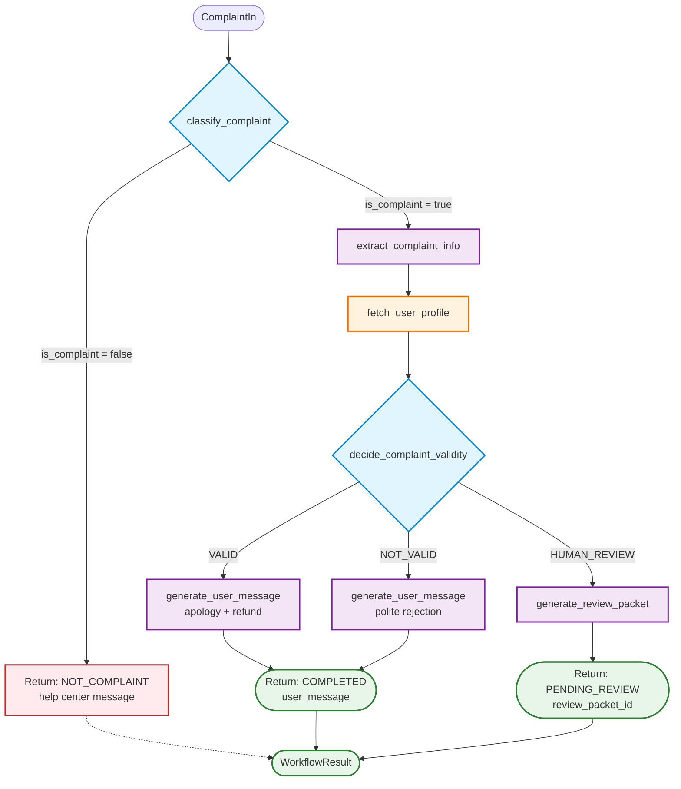

# Lekce 07 - Orchestrace s Temporal

V této lekci navazujeme na předchozí lekce a přidáváme orchestraci dlouhodobě běžících business procesů pomocí **Temporal**. Cílem je spolehlivé víceúrovňové vyřizování stížností - od klasifikace přes extrakci dat, rozhodování podle firemní politiky až po generování odpovědí s automatickými retry, auditováním a schopností pokračovat po výpadku.

## Byznys motivace
Komplexní procesy (stížnosti, objednávky, onboarding) vyžadují spolehlivou orchestraci, která přežije výpadky služeb, restarty a deploymenty. Uživatel potřebuje garantovat, že každá stížnost bude zpracována deterministicky, s plnou auditovatelností a možností lidské eskalace. Temporal zajišťuje perzistenci stavu a automatické opakování při selhání.

## Co je Temporal
**Temporal** je platforma pro orchestraci dlouhodobě běžících procesů (durable workflows). Garantuje:
- Automatické opakování (retry) při selhání
- Perzistentní stav workflow (přežije restarty, deploymenty)
- Deterministické provedení (oddělení logiky od side-effectů)
- Viditelnost do Web UI (http://localhost:8233)

## Architektura workflow
```
Stížnost → Klasifikace (LLM) → Extrakce (LLM) → Fetch profilu → Rozhodnutí (LLM) → Řešení (LLM)
                ↓                    ↓                ↓               ↓                 ↓
          is_complaint?      order_id/produkty    user_score    VALID/NOT_VALID    zpráva/review
```

### Detailed Workflow Diagram



**Activity Mapping:**
| Activity Name | Purpose | Type |
|---------------|---------|------|
| `classify_complaint` | Determine if message is a complaint | LLM |
| `extract_complaint_info` | Extract order_id, products, reason, evidence | LLM |
| `fetch_user_profile` | Retrieve user segment, loyalty, score, history | Mock API |
| `decide_complaint_validity` | Apply company policy + few-shot to decide action | LLM |
| `generate_user_message` | Create customer-facing response (VALID/NOT_VALID) | LLM |
| `generate_review_packet` | Create operator review packet (HUMAN_REVIEW) | LLM |

**Color Legend:**
- 🔵 Blue (decision activities): Classification, Policy-based Decision
- 🟣 Purple (LLM generation): Extraction, Message and Review Packet Generation
- 🟠 Orange (data fetch): User Profile Retrieval
- 🔴 Red (early exit): Termination without processing
- 🟢 Green (final results): Workflow completion states

### Fáze workflow (6 kroků)

| Fáze | Aktivita | Popis | Model výstup |
|------|----------|-------|-------------|
| **1. Klasifikace** | `classify_complaint` | Je to vůbec stížnost? | `is_complaint: bool`, `confidence: float` |
| **2. Extrakce** | `extract_complaint_info` | Struktura ze zprávy (produkty, order_id, datum, důvod, evidence) | `ComplaintExtraction` (všechna pole optional) |
| **3. Profil** | `fetch_user_profile` | Zákaznická data (segment, score, historie) - mockované | `UserProfile` (score 0-100, loyalita, objednávky, stížnosti) |
| **4. Rozhodnutí** | `decide_complaint_validity` | VALID / NOT_VALID / HUMAN_REVIEW podle politiky + few-shot | `ComplaintDecision` (action, reason, confidence) |
| **5a. Zpráva** | `generate_user_message` | Pro VALID/NOT_VALID: omluva nebo zamítnutí | `UserMessage` (subject, message, tone) |
| **5b. Review** | `generate_review_packet` | Pro HUMAN_REVIEW: balíček pro lidského operátora | `ReviewPacket` (summary, pro/proti, doporučení) |

**Workflow logika**:
- Pokud není stížnost (fáze 1) → early exit s informační zprávou.
- Pokud je stížnost → postupně projde všemi fázemi s automatickým retry při selhání.
- Rozhodnutí využívá firemní politiku + kontext zákazníka (loyalita, score).

## Implementace orchestrace
- Každá fáze workflow je implementována jako samostatná Temporal aktivita s deklarovaným retry policy.
- Activities jsou pure funkce s jasným vstupem/výstupem (Pydantic modely) - testovatelné izolovaně.
- Workflow řídí pořadí volání activities a rozhodovací logiku (if stížnost → extractInfo → fetchProfile → decide).
- Azure OpenAI Responses API zajišťuje structured outputs (validované Pydantic schématem) s reasoning effortem.
- Temporal server persistuje stav po každém kroku - při výpadku worker pokračuje od posledního checkpointu.
- Web UI umožňuje live inspekci (vstupy, výstupy, reasoning) každé activity v historii workflow.
- Pro HUMAN_REVIEW aktivita generuje review packet s pro/proti argumenty a doporučením pro operátora.

## Jak vyzkoušet (rychlý start)
0. Instalujte https://learn.temporal.io/getting_started/python/dev_environment/
```bash
brew install temporal
```
1. Spusťte Temporal server (dev režim):
```bash
temporal server start-dev
```
Web UI: http://localhost:8233

1. Vytvořte `.env` soubor v `orchestration/complaint_workflow/`:
```env
OPENAI_BASE_URL=https://api.openai.com/v1/
OPENAI_API_KEY=sk-proj-REDACTED
OPENAI_MODEL=gpt-5
REASONING_EFFORT=minimal
```

**Poznámka k REASONING_EFFORT**:
- `minimal` - Nejrychlejší, bez reasoning (~10-20s na aktivitu)
- `low` - Model používá reasoning interně (~30-45s na aktivitu)
- `medium` - Více reasoning pro lepší odpovědi (~45-60s na aktivitu)
- `high` - Maximální reasoning effort (~60-120s na aktivitu, vyžaduje zvýšený timeout)

⚠️ Pro `REASONING_EFFORT=high` je již nastaven `ACTIVITY_TIMEOUT=120s` v `activities.py`

**⚠️ DŮLEŽITÉ - Reasoning text není dostupný**:
- OpenAI Responses API s `text_format` (structured outputs) **neposkytuje reasoning text**
- Reasoning probíhá interně (vidíte `reasoning_tokens` v usage), ale obsah není exponovaný
- Benefit: Lepší kvalita a přesnost odpovědí díky internímu reasoning
- Trade-off: Nemůžete vidět "chain of thought" modelu
- Pro debugging: Spoléhejte na `confidence` hodnoty a `reason` pole v odpovědích

1. Spusťte demo (self-contained worker):
```bash
cd orchestration/complaint_workflow
uv sync
uv run demo.py
```

## Rychlé demonstrační flow
**Demo run** - automaticky nastartuje worker a zpracuje všechny příklady:

**Co se stane**:
- Načtou se příklady z `complaints/` (complaint1.json, complaint2.json, non-complaint.json)
- Každý projde kompletním workflow (6 fází)
- Výpisy ukazují klasifikaci, extrakci, profil, rozhodnutí a výsledek
- Odkazy na Temporal UI pro live inspekci

**Výstupy**:
- `complaint1.json` (prasklá sklenice, dobrý zákazník) → **VALID** → omluva + refund
- `complaint2.json` (shnilé produkty, podezřelý profil) → **HUMAN_REVIEW** → review packet
- `non-complaint.json` (dotaz na produkty) → **early exit** → informační zpráva

**Krokování v UI**:
1. Otevřete http://localhost:8233
2. Najděte workflow ID (např. `complaint-demo-complaint1`)
3. Klikněte na workflow → vidíte historii events (ClassifyComplaintActivity, ExtractComplaintInfoActivity...)
4. Každá aktivita zobrazí input, output a reasoning (pokud je `REASONING_EFFORT` > minimal)

**Produkční režim** (long-running worker):
```bash
# Terminal 1: worker (běží dlouhodobě)
uv run python worker.py

# Terminal 2: spuštění workflow programově
uv run python client_run.py complaints/complaint1.json
```

## Temporal CLI Commands
```bash
# Describe workflow execution
temporal workflow describe --workflow-id complaint-demo-complaint1

# Show workflow history
temporal workflow show --workflow-id complaint-demo-complaint1

# List all workflows
temporal workflow list

# Query workflow state (if you implement queries)
temporal workflow query --workflow-id complaint-demo-complaint1 --name get_status
```

# Úkol (student branch)
Ve studentském branch je implementována pouze klasifikace, přidejte další části workflow.

## GitHub Copilot - příklady promptů pro začátek

Níže jsou příklady promptů pro GitHub Copilot. Copilot funguje nejlépe s kontextem - vysvětlete mu co chcete dosáhnout, jaké technologie používáte a jaké jsou kroky k řešení.

### Úkol 1: Implementace extrakční aktivity
```markdown
Help me implement the extract_complaint_info Temporal activity that extracts structured complaint data using Azure OpenAI structured outputs.
Create activities/extract.py with extract_complaint_info(text: str) -> ComplaintExtraction activity.
Use @activity.defn with retry policy, Azure OpenAI Responses API with structured outputs, and Pydantic model ComplaintExtraction with optional fields: order_id, product_names (list), complaint_date, reason, evidence_urls (list).
```

### Úkol 2: Implementace rozhodovací aktivity
```markdown
Help me implement the decide_complaint_validity Temporal activity that decides VALID/NOT_VALID/HUMAN_REVIEW based on company policy and user profile.
Create activities/decide.py with decide_complaint_validity(complaint: ComplaintExtraction, profile: UserProfile) -> ComplaintDecision.
Use reasoning model with structured outputs. System prompt should include company policy (refund within 14 days, VIP priority) and few-shot examples for valid issues vs suspicious patterns.
Return ComplaintDecision with action, reason, and confidence fields.
```

### Úkol 3: Implementace generování odpovědi
```markdown
Help me implement generate_user_message Temporal activity for customer-facing responses.
Create activities/generate.py with generate_user_message(decision: ComplaintDecision, complaint: ComplaintExtraction) -> UserMessage.
For VALID: empathetic apology with refund offer. For NOT_VALID: polite decline with policy explanation.
Return UserMessage with subject, message, and tone fields.
```

### Úkol 4: Implementace review podkladů
```markdown
Help me implement generate_review_packet Temporal activity for human operator escalation.
Create generate_review_packet(complaint: ComplaintExtraction, profile: UserProfile, decision: ComplaintDecision) -> ReviewPacket in activities/generate.py.
Generate summary, pros/cons lists, recommendation, and priority level for manual review cases.
```

## Další možné rozšíření (dobrovolně)
- Integrace s ticketing systémem (Jira, ServiceNow) pro automatické vytváření ticketů při eskalaci

