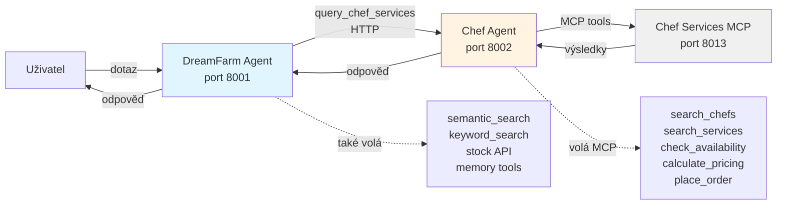

# Lekce 08 – Multi-agent systémy

## Proč (Business Context)

Nový obchodní model přináší na tržiště **kuchaře a cateringové služby** pro oslavy a firemní akce, propojující farmářské produkty se službami přípravy jídla.

**Byznysové přínosy:**
- **Cross-sell**: Zákazník objedná produkty + kuchaře + catering najednou
- **Balíčková řešení**: Kompletní služba (suroviny + příprava + servírování)
- **Diferenciace**: Farm-to-table platforma, ne jen marketplace

---

## Architektura



**Klíčové vlastnosti:**
- **Agent-as-Tool Pattern**: Chef Agent exponován jako function tool v DreamFarm Agentovi
- **HTTP Communication**: Nezávislé služby (porty 8001, 8002, 8013)
- **Specialized Prompts**: Backend agent (Chef) vs. user-facing agent (DreamFarm)
- **Mock Data**: Deterministické ID, konzistentní pricing, in-memory stav

---

## Komponenty

### 1. Chef Services MCP Server
**MCP Nástroje:**
- `search_chefs` – hledání podle specializace/akce
- `search_services` – catering služby
- `check_availability` – kontrola dostupnosti
- `calculate_pricing` – kalkulace ceny
- `place_order` – rezervace

### 2. Chef Agent
- Specializovaný backend agent (port 8002)
- Faktuální, strukturované odpovědi
- Připojení na Chef Services MCP

### 3. DreamFarm Agent Integration
- `ChefAgentClient` – HTTP delegace
- Function tool `query_chef_services`
- Streaming loop handler

---

## Kritické Bug Fixy
1. **Duplicate Message ID**: OpenAI continuation loop → `input_messages = pending_outputs` (replace, ne extend)
2. **Response ID Capture**: Vždy aktualizovat z `final_response.id`
3. **Process Management**: Detekce zombie procesů na portech

---

## Jak spustit

### 1. Konfigurace

**Chef Services MCP** (`tools/mcp_chef_services/.env`):
```env
MCP_API_KEY=your-secret-key
PORT=8013
```

**Chef Agent** (`agents/chef-agent/.env`):
```env
CHEF_AGENT_PORT=8002
OPENAI_API_KEY=<váš-key>
OPENAI_MODEL=gpt-5
CHEF_MCP_SERVER_URL=http://localhost:8013
CHEF_MCP_API_KEY=your-secret-key
```

**DreamFarm Agent** (`agents/dreamfarm-agent/.env`):
```env
CHEF_AGENT_ENABLED=true
CHEF_AGENT_URL=http://localhost:8002
# + konfigurace z předchozích lekcí
```

### 2. Spuštění (4 terminály)

```pwsh
# Terminál 1: MCP Server
cd tools/mcp_chef_services
uv run python main.py

# Terminál 2: Chef Agent
cd agents/chef-agent/src
uv run .\main.py

# Terminál 3: DreamFarm Agent
cd agents/dreamfarm-agent/src
uv run .\main.py

# Terminál 4: Frontend
cd frontend
npm run dev
```

### 3. Health Check
```pwsh
curl http://localhost:8013/health  # MCP: OK
curl http://localhost:8002/health  # Chef: {"status":"healthy"}
curl http://localhost:8001/health  # DreamFarm: {"status":"healthy"}
```

---

## Demo Scénáře

### Scénář 1: Svatební plánování (produkty + kuchař + catering)
```
1. "Potřebuji italského kuchaře na svatbu"
   → Chef Agent: search_chefs → Alessandro Rossi, €120/hod

2. "Skvělé, chci Alessandra na 20. nebo 21. října, je dostupný?"
   → check_availability → vrátí dostupnost + alternativy

3. "Jaké kvalitní italské sýry máte na skladě?"
   → semantic_search + keyword_search + stock API

4. "Cenová nabídka na 3chodové italské menu pro 50 lidí se středně složitým menu zahrnující tyto produkty?"
   → calculate_pricing → chef fee + service + produkty
```

### Scénář 2: Firemní catering (120 lidí, 50% vegetariáni)
```
1. "Catering na firemní akci pro 120 lidí, polovina vegetariánská"
   → search_services + catering balíčky

2. "Které bio zeleniny doporučíte?"
   → semantic_search + VIP filtering

3. "Celková cena včetně produktů a servisu?"
   → calculate_pricing + produkty + agregace
```

### Scénář 3: Soukromá večeře (memory + graph + chef)
```
1. "Soukromá italská večeře pro 8 lidí. Pamatuj: nemám rád kozí sýr"
   → memory_write_profile + query_chef_services

2. "Produkty na italské menu bez kozího sýra?"
   → graph_bfs_taxonomy + semantic_search + profile filtering

3. "Alessandro se dá objednat na příští sobotu?"
   → check_availability + place_order
```

### Scénář 4: BBQ srovnání (multi-step reasoning)
```
1. "Porovnej 3 nejlepší BBQ catering pro 40 lidí"
   → search_chefs + search_services + calculate_pricing × 3

2. "Přidat vegetariánskou alternativu?"
   → recalculate s additional_services

3. "Produkty k doplnění?"
   → semantic + keyword + RRF fusion + stock
```

---

## Ukázkové Prompty

**Chef delegace:**
- "Potřebuji italského kuchaře na svatbu"
- "Hledám catering pro 100 lidí"

**Dostupnost:**
- "Je Alessandro Rossi volný 25. října?"
- "Kdo je dostupný příští víkend?"

**Cenové kalkulace:**
- "Kolik stojí 3chodové menu pro 50 lidí?"
- "Cenová nabídka na BBQ pro 30 osob?"

**Kombinované (produkty + služby):**
- "Italský kuchař + vaše nejlepší italské sýry"
- "Kuchař a produkty na vegetariánskou akci"

**Multi-step:**
- "Porovnej 3 možnosti italských kuchařů a ceny"
- "Najdi kuchaře, zkontroluj dostupnost, dej cenovou nabídku"

---

## Použité Technologie

**Koncepty:**
- Multi-agent systems
- Agent-as-tool pattern
- HTTP-based function calling
- Bounded context separation
- Backend vs. user-facing agent prompts

**Stack:**
- OpenAI GPT-5 (Responses API)
- FastAPI (Python) – 3 služby
- MCP Protocol (Chef Services)
- HTTP async communication (httpx)
- Mock data s deterministickými ID
- Vizuální logging markery

**Port Alokace:**
- 8001: DreamFarm Agent
- 8002: Chef Agent
- 8013: Chef Services MCP
- 8011: Stock API
- 5432: PostgreSQL
- 3000: Frontend

---

## Testování

```bash
# Chef Agent: 32/32 passed (24 unit + 8 integration)
cd agents/chef-agent
uv run pytest tests/ -v

# DreamFarm Agent: 56/56 passed
cd agents/dreamfarm-agent
uv run pytest tests/ -v
```

---

## Co Jsme Se Naučili

**Architektura:**
- Agent-as-Tool pattern pro domain separation
- HTTP function tool hybrid (nezávislost + standard interface)
- Backend agent prompty (faktuální, strukturované)

**OpenAI API:**
- Continuation loop: `input_messages = pending_outputs` (replace!)
- Response ID: vždy zachytávat z `final_response.id`
- Context chain: server-side přes `previous_response_id`

**Multi-Agent:**
- Service independence (proces, port, config)
- Vizuální logging pro debugging
- Graceful degradation při nedostupnosti

---

## Reference

- **Design.md**: Section 19 (Multi-Agent Architecture)
- **ImplementationLog.md**: 2025-10-11 entry
- **CommonErrors.md**: Section 3c (Responses API Continuation)
- **Related**: L02 (Tools), L04 (Agentic Search), L05 (Memory)
