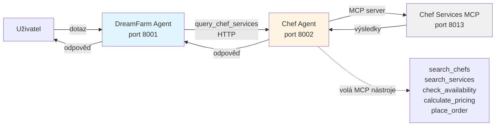

# Lekce 08 - Multi-agent systémy

V této lekci navazujeme na orchestraci (Lekce 07) a přidáváme specializovaného agenta pro kuchařské služby a catering. Cílem je ukázat, jak rozdělit komplexní doménu do více nezávislých agentů, kteří spolu komunikují přes HTTP, a jak implementovat agent-as-tool pattern pro čistou separaci odpovědností.

## Byznys motivace

Nový obchodní model přináší na tržiště **kuchaře a cateringové služby** pro oslavy a firemní akce, propojující farmářské produkty se službami přípravy jídla.

**Byznysové přínosy:**
- **Cross-sell**: Zákazník objedná produkty + kuchaře + catering najednou
- **Balíčková řešení**: Kompletní služba (suroviny + příprava + servírování)
- **Diferenciace**: Farm-to-table platforma, ne jen marketplace

## Architektura



**Klíčové vlastnosti:**
- **Agent-as-Tool Pattern**: Chef Agent exponován jako function tool v DreamFarm Agentovi
- **HTTP Communication**: Nezávislé služby (porty 8001, 8002, 8013)
- **Specialized Prompts**: Backend agent (Chef) vs. user-facing agent (DreamFarm)
- **Mock Data**: Deterministické ID, konzistentní pricing, in-memory stav

## Implementace multi-agent komunikace

### Chef Services MCP Server
**MCP Nástroje:**
- `search_chefs` - hledání podle specializace/akce
- `search_services` - catering služby
- `check_availability` - kontrola dostupnosti
- `calculate_pricing` - kalkulace ceny
- `place_order` - rezervace

### Chef Agent
- Specializovaný backend agent (port 8002)
- Faktuální, strukturované odpovědi
- Připojení na Chef Services MCP
- Systémový prompt optimalizovaný pro backend operace

### DreamFarm Agent Integration
- `ChefAgentClient` - HTTP delegace na Chef Agent
- Function tool `query_chef_services` registrovaný v OpenAI
- Streaming loop handler pro zpracování odpovědí
- Graceful degradation při nedostupnosti Chef Agenta

## Jak vyzkoušet (rychlý start)

1. Spusťte lokální infrastrukturu (PostgreSQL, Keycloak, stock API - pokud již neběží):
```bash
cd deploy/local
docker compose up -d postgres keycloak api-stock
```

2. (Volitelně) Inicializujte data, pokud jste ještě neprošli předchozí lekce:
```bash
cd data/scripts
uv run configure_postgresql.py
uv run import_all.py
```

3. Konfigurace agentů:

**Chef Agent** (`agents/chef-agent/.env`):
```env
CHEF_AGENT_PORT=8002
OPENAI_API_KEY=<váš-key>
OPENAI_MODEL=gpt-5
CHEF_MCP_SERVER_URL=https://ca-mcp-chef-services.grayisland-3e7e5fd0.swedencentral.azurecontainerapps.io
CHEF_MCP_API_KEY=your-secret-key
```

**DreamFarm Agent** (`agents/dreamfarm-agent/.env`):
```env
CHEF_AGENT_ENABLED=true
CHEF_AGENT_URL=http://localhost:8002
```

4. Spusťte agenty a frontend:
```bash
# Terminál 1: Chef Agent
cd agents/chef-agent/src
uv run .\main.py

# Terminál 2: DreamFarm Agent
cd agents/dreamfarm-agent/src
uv run .\main.py

# Terminál 3: Frontend
cd frontend
npm run dev
```

## Rychlý demonstrační flow

**Scénář 1: Svatební plánování (produkty + kuchař + catering)**
1. "Potřebuji italského kuchaře na svatbu"
   - Chef Agent: `search_chefs` → Alessandro Rossi, €120/hod
2. "Skvělé, chci Alessandra na 20. nebo 21. října, je dostupný?"
   - `check_availability` → vrátí dostupnost + alternativy
3. "Jaké kvalitní italské sýry máte na skladě?"
   - `semantic_search` + `keyword_search` + stock API
4. "Cenová nabídka na 3chodové italské menu pro 50 lidí se středně složitým menu zahrnující tyto produkty?"
   - `calculate_pricing` → chef fee + service + produkty

**Scénář 2: Firemní catering (120 lidí, 50% vegetariáni)**
1. "Catering na firemní akci pro 120 lidí, polovina vegetariánská"
   - `search_services` + catering balíčky
2. "Které bio zeleniny doporučíte?"
   - `semantic_search` + VIP filtering
3. "Celková cena včetně produktů a servisu?"
   - `calculate_pricing` + produkty + agregace

**Scénář 3: Soukromá večeře (memory + graph + chef)**
1. "Soukromá italská večeře pro 8 lidí. Pamatuj: nemám rád kozí sýr"
   - `memory_write_profile` + `query_chef_services`
2. "Produkty na italské menu bez kozího sýra?"
   - `graph_bfs_taxonomy` + `semantic_search` + profile filtering
3. "Alessandro se dá objednat na příští sobotu?"
   - `check_availability` + `place_order`

**Scénář 4: BBQ srovnání (multi-step reasoning)**
1. "Porovnej 3 nejlepší BBQ catering pro 40 lidí"
   - `search_chefs` + `search_services` + `calculate_pricing` × 3
2. "Přidat vegetariánskou alternativu?"
   - Recalculate s additional_services
3. "Produkty k doplnění?"
   - `semantic` + `keyword` + RRF fusion + stock

# Úkol (student branch)
Máte k dispozici běžící MCP server chef services případně jeho zdrojový kód pro vlastní nasazení. Vytvořte chef agenta a otestujte samostatně. Pak ho přidejte jako nástroj do dreamfarm agent.

## GitHub Copilot - příklady promptů pro začátek

Níže jsou příklady promptů pro GitHub Copilot. Copilot funguje nejlépe s kontextem - vysvětlete mu co chcete dosáhnout, jaké technologie používáte a jaké jsou kroky k řešení.

### Úkol 1: Implementace chef agent s FastAPI
```markdown
Help me create a specialized Chef Agent as a separate FastAPI service that handles chef and catering service queries using MCP tools.
Requirements:
1. Create a new FastAPI application in agents/chef-agent/ with port 8002 as default.
2. Implement a POST /query endpoint that accepts {"query": "string", "session_id": "string"}
3. Connect to the Chef Services MCP server using environment variables for URL and API key.
4. The agent should have a specialized system prompt optimized for backend operations: factual, structured responses focused on chef search, availability checks, pricing calculations, and order placement.
5. Include basic health check endpoint at /health.
Provide the main application structure, environment configuration template, and instructions for running the agent standalone.

Note we want to use the same style and structure as with our dreamfarm agent.
```

### Úkol 2: Integrace chef agent jako Function Tool
```markdown
Help me integrate the Chef Agent as a function tool in DreamFarm Agent using the agent-as-tool pattern.
Steps:
1. Create an HTTP client for communicating with Chef Agent service using the configured URL.
2. Register a new function tool called query_chef_services in the OpenAI tools list when CHEF_AGENT_ENABLED=true.
3. The tool definition should accept parameters: query (string, required)
4. In the streaming response loop, detect when the tool is called and make an HTTP POST to the Chef Agent /query endpoint.
5. Update the system prompt to explain when and how to use the chef services tool: "Use query_chef_services when users ask about chefs, catering services, availability, pricing, or booking. Pass relevant context like number of guests, event type, dietary requirements, and preferred dates."
6. Implement graceful degradation: if Chef Agent is unavailable, return a friendly message and continue without the tool.

Provide code changes for the OpenAI service integration, HTTP client implementation, and system prompt updates.
```

## Další možné rozšíření (dobrovolně)
- Místo API nabídněte agenta přes A2A protokol
- Přejděte na framework pro zjednodušení práce s agenty (Microsoft Agent Framework, Lang Graph, Crew AI apod.)
